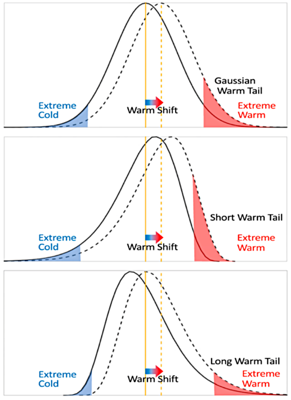
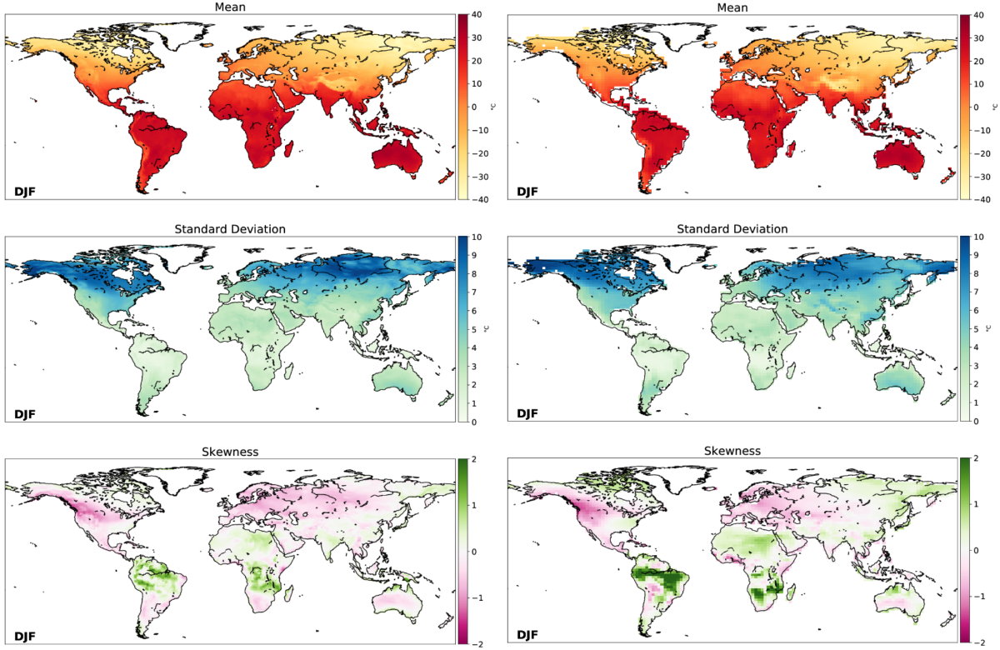
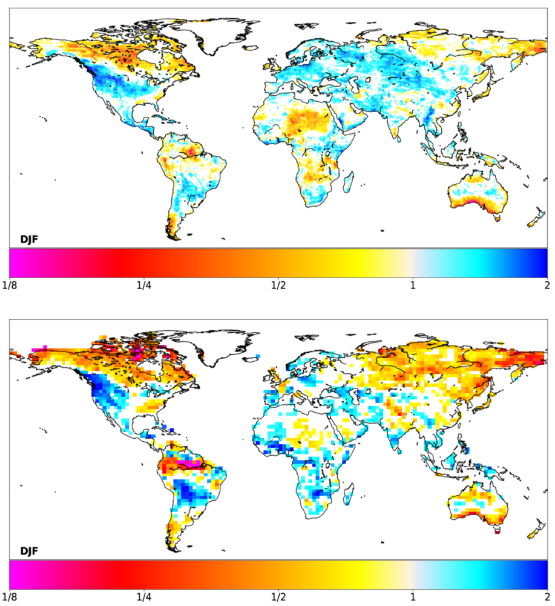
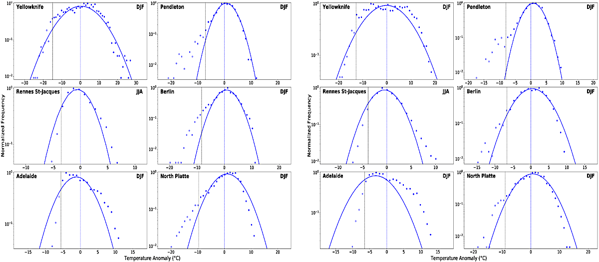
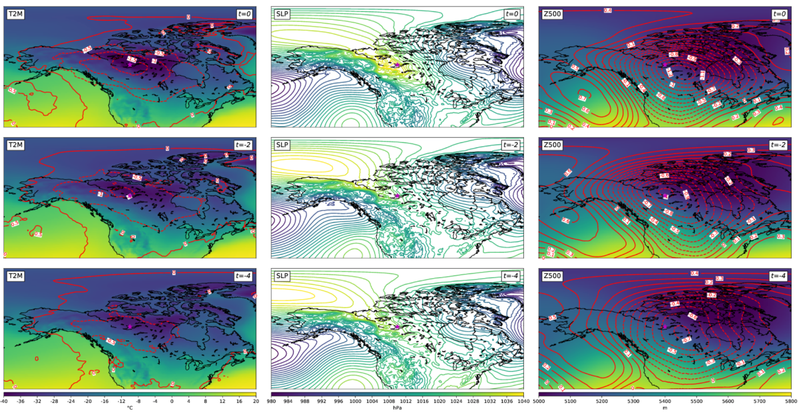
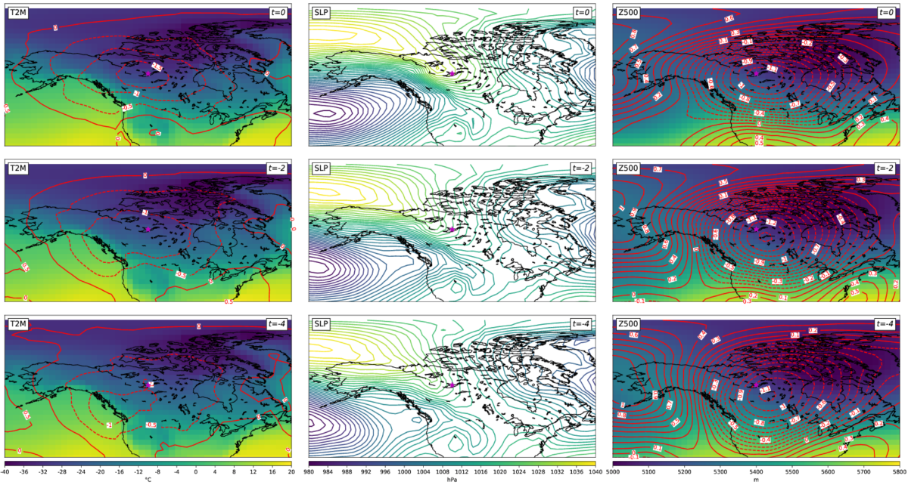

Surface Temperature Extremes and Distribution Shape Package
===========================================================
Last update: 7/7/20

The surface temperature extremes and distribution shape package computes statistics that
relate to the shape of the two-meter temperature distribution and its influence on extreme
temperature exceedances. These metrics evaluate model fidelity in capturing moments of
the temperature distribution and distribution tail properties, as well as the large-scale
meteorological patterns associated with extreme temperature exceedance days. Statistics
include temperature mean, standard deviation, and skewness, along with PDFs of the
underlying temperature distribution and the Gaussian fit to the distribution core of these
values to identify non-Gaussianity at a location. Frequency of exceedances of a fixed
extreme temperature threshold after a uniform warm shift across the distribution, the simplest
prototype for future warming, provides a measure of Gaussianity as well as insight into the
complexity of future changes in temperature extremes.

Version \& Contact Information
------------------------------

- Version 1 07-Jul-2020 Arielle J. Catalano (Portland State University)
- PI: J. David Neelin (UCLA; neelin@atmos.ucla.edu)
- Science lead: Paul C. Loikith (PSU; ploikith@pdx.edu)
- Current developer: Arielle J. Catalano (PSU; a.j.catalano@pdx.edu)

Open Source Copyright Agreement
^^^^^^^^^^^^^^^^^^^^^^^^^^^^^^^

This package is distributed under the LGPLv3 license (see LICENSE.txt).

Functionality
-------------

This package consists of the following functionalities:

1. Moments of Surface Temperature Probability Distribution (TempExtDistShape\_Moments.py)
2. Shifted Underlying-to-Gaussian Distribution Tail Exceedances Ratio (TempExtDistShape\_ShiftRatio.py)
3. Frequency Distributions at Non-Gaussian Tail Locations (TempExtDistShape\_FreqDist.py)
4. Composite Circulation at Non-Gaussian Tail Locations (TempExtDistShape\_CircComps.py)

As a module of the MDTF code package, all scripts of this package can be found under
``../diagnostics/temp_extremes_distshape/`` and predigested observational data under
``../inputdata/obs_data/temp_extremes_distshape/``.

Required Programming Language and Libraries
-------------------------------------------

This package is written in Python 3, and requires the following Python packages: os, json, numpy, scipy, matplotlib, mpl\_toolkits, h5py, netCDF4, netcdftime, cftime, cartopy.

These Python packages are already included in the standard Anaconda installation.

Required Model Output Variables
--------------------------------

The following 3-D (lat-lon-time) model fields at a daily resolution are required:

1. Two-meter temperature (units: K or °C)
2. Sea level pressure (units: hPa or Pa)
3. Geopotential height (units: m)

**Recommended timeseries length** to facilitate statistical robustness for main features:
Preferred is 30 years matching the observational analysis; Minimum is 15 years.

Observational Data Summary
^^^^^^^^^^^^^^^^^^^^^^^^^^

Gridded two-meter temperature, sea level pressure (SLP), and 500 hPa geopotential height
(Z500) data are from the Modern Era Retrospective-Analysis for Research and Applications reanalysis version 2
(MERRA-2; Gelaro et al. 2017, https://doi.org/10.1175/JCLI-D-16-0758.1). Daily means constructed from hourly data at
the native horizontal resolution 0.5° ✕ 0.625° are provided as observational data. Analyses
of MERRA-2 use the 30-year period 1980–2009 following :ref:`Loikith and Neelin 2019 <4>`.

This POD can be run directly on MERRA-2 data when set as the casename and input model
in the default\_tests.jsonc file with netcdf files supplied in the ``../inputdata/model/`` folder
(within its own named folder “temp\_extremes\_distshape” per general usage
instructions). To rerun MERRA-2 data with different default settings (see below) change
variables under “pod\_env\_vars” in settings.jsonc.

Default Settings Options
^^^^^^^^^^^^^^^^^^^^^^^^

**Location:** Frequency distributions and composite circulation maps can be output for user-specified locations. By default, the six selected locations for cold-tail frequency distributions are Yellowknife, Pendleton, Rennes St.-Jacques, Berlin, Adelaide, and North Platte (see :ref:`Loikith and Neelin 2019 <4>`), and the selected location for composite
circulation maps is Yellowknife. Changes to locations for the frequency distributions can
be made in the User Specified Section of the “…usp.py” file (TempExtDistShape\_FreqDist\_usp.py), and the selected location for composite maps can be altered in settings.jsonc (“city”). Note: plotting parameters for composite
circulation maps may need to be altered to encompass the range of data at an alternate
location, and are located in the “..usp.py” file.

**Season:** By default, the POD outputs cold-tail figures for the season spanning the months of
December, January, and February (DJF). To output figures for the season spanning
June, July, and August (JJA), change the “monthstr” and “monthsub” variables in
settings.jsonc. The “monthstr” value is the string of letters corresponding to the names
(‘JJA’ or ‘DJF’), whereas “monthsub” is the array of integers ([6,7,8] or [1, 2, 12]). Note:
this changes the output figures for three of the functionalities only. The figure for cold-tail frequency distributions at non-Gaussian locations includes examples in both seasons
and thus remains unchanged. Changes to locations and seasons in this functionality
must be made within the User Specified Section of the source code (TempExtDistShape\_FreqDist\_usp.py).

**Tail:** By default, the POD outputs figures for the cold-side tail of the surface temperature
distribution, using the 5th percentile as the threshold from which to measure
exceedances. To output figures for the warm-side tail (95th percentile), change the “ptile”
percentile value in settings.jsonc. The only functionalities affected by this change are the
shifted underlying-to-Gaussian distribution tail exceedances ratio and the composite
circulation figure. This is because 1) the moments of the temperature distribution are for
the full distribution and not just the tail, and 2) non-Gaussian tail locations selected for
the frequency distribution function are specifically chosen to represent shorter-than-Gaussian and longer-than-Gaussian cold tails following :ref:`Loikith and Neelin 2019 <4>`.

References
----------

   .. _1:

Ruff, T. W., and J. D. Neelin, 2012: Long tails in regional surface temperature probability
distributions with implications for extremes under global warming. *Geophys. Res.
Lett.*, **39**, L04704, https://doi.org/10.1029/2011GL050610.

   .. _2:

Loikith, P. C., and J. D. Neelin, 2015: Short-tailed temperature distributions over North
America and implications for future changes in extremes. *Geophys. Res. Lett.*, **42**,
https://doi.org/10.1002/2015GL065602.

   .. _3:

Loikith, P. C., J. D. Neelin, J. Meyerson, and J. S. Hunter, 2018: Short warm-side
temperature distribution tails drive hotspots of warm temperature extreme increases
under near-future warming. *J. Climate*, **31**, 9469–9487, https://doi.org/10.1175/JCLID-17-0878.1.

   .. _4:

Loikith, P. C., and J. D. Neelin, 2019: Non-Gaussian cold-side temperature distribution tails
and associated synoptic meteorology. *J. Climate*, **32**, 8399–8414,
https://doi.org/10.1175/JCLI-D-19-0344.1.

   .. _5:

Catalano, A. J., P. C. Loikith, and J. D. Neelin, 2020: Evaluating CMIP6 model fidelity at
simulating non-Gaussian temperature distribution tails. *Environ. Res. Lett.*, **15**,
074026, https://doi.org/10.1088/1748-9326/ab8cd0.

More About This Diagnostic
--------------------------

   A schematic illustrating the effect of non-Gaussian tails on changes in the frequency of exceeding a fixed extreme temperature threshold under a uniform warm shift. Solid curves are the temperature frequency distributions for the pre-shifted climate while dotted curves are the temperature frequency distributions after the warm shift. Vertical yellow lines are pre-shift (solid) and post-shift (dashed) means. The red shaded area represents temperatures above the 95th percentile of the preshifted distribution while the blue shaded area represents the 5th percentile. Illustrations are for (top) a Gaussian, (middle) a distribution with a shorter-than-Gaussian warm tail and a longer-than-Gaussian cold tail, and (bottom) a distribution with a longer-than-Gaussian warm tail and a shorter-than-Gaussian cold tail.

The current version of the surface temperature extremes and distribution shape package produces four sets of figures for both pre-digested observations and model output, including (1) moments of the distribution (i.e. mean, variance, skewness), (2) shift ratio, (3) frequency distributions, and (4) composite large-scale meteorological patterns. The shift ratio is computed by shifting the underlying daily temperature distribution uniformly by a fixed amount, tabulating the frequency of days that exceed a fixed pre-shifted extreme temperature threshold, and dividing that by the expected number of threshold exceedances from shifting a Gaussian by the same amount. For example, if the underlying distribution has a short warm tail, exceedances will be greater under a uniform warm shift than for a Gaussian distribution. Thus, the shift ratio identifies regions with a shorter- or longer-than-Gaussian tail. Locations exhibiting a non-Gaussian tail can be selected for further analysis of frequency distributions and composite circulation maps. In the following, we will show an example set of the figures for a simulation of the GFDL-CM3 model (included in Phase 5 of the IPCC Coupled Model Intercomparison Project) that are produced by the package.

1) Moments of the Surface Temperature Probability Distribution
^^^^^^^^^^^^^^^^^^^^^^^^^^^^^^^^^^^^^^^^^^^^^^^^^^^^^^^^^^^^^^

   Moments for the DJF daily two-meter temperature distributions (°C) including the (top) mean, (middle) standard deviation, and (bottom) skewness. The left column are results from MERRA-2, and the right column are results from GFDL-CM3.

The three moments of the temperature distribution characterize its shape by measuring the central tendency, spread, and symmetry. During DJF, mean temperatures are coolest in the higher latitudes and altitudes of the Northern Hemisphere and warmest in the Southern Hemisphere. The standard deviation is largest in Northern North America and Eurasia owing to synoptic variability. Skewness measures the asymmetry of the full distribution of two-meter temperatures at each location, with positive values generally indicating a longer cold tail and negative indicating a shorter cold tail. Positively skewed regions include northern Africa, eastern Siberia, and the tropical regions of South America and Africa. Negatively skewed regions include South Africa, central Australia, Eurasia, and western North America. There is broad spatial agreement between GFDL-CM3 and MERRA-2 in the mean and standard deviation of two-meter temperature distributions over DJF, although the model does not capture some fine-scale features of standard deviation over Siberia and Yukon, which may be a result of the lower spatial resolution. GFDL-CM3 captures regions of negative skewness over western North America and Europe, and positive skewness in tropical South America and Africa, though the magnitude is higher in GFDL-CM3. Also, the model does not adequately simulate skewness direction over some regions including Northern Russia and Southern India, which may affect how future changes in extreme temperature exceedances are manifested.

2) Shift Ratio
^^^^^^^^^^^^^^

   Shift ratio for cold tails during DJF, using the 5th-percentile as the fixed threshold to measure exceedances, in (*top*) MERRA-2 and (*bottom*) GFDL-CM3. Values greater than one indicate longer-than-Gaussian cold tails and values less than one indicate shorter-than-Gaussian cold tails. Only grid cells where the cold tail deviates from Gaussian with statistical significance at the 5% confidence level are shaded.

While skewness characterizes the asymmetry of the full distribution, the shift ratio provides an understanding of non-Gaussianity specific to the tail. The shift ratio identifies regions of non-Gaussianity and regions statistically indistinguishable from Gaussian based on a ratio of distribution tail exceedances following the application of a uniform shift (0.5σ). This procedure acts as both a pragmatic way of demonstrating the effects of non-Gaussian tails on extremes exceedances and also provides a statistically robust measure of tail departure from Gaussian. Coherent regions with longer-than-Gaussian cold tails during DJF, such as northwestern United States, will experience a smaller decrease in 5th-percentile exceedances under future warming than regions with shorter-than-Gaussian cold tails (e.g., southern Australia). GFDL-CM3 captures spatially coherent short-tailed regions such as southern Australia, Canada, and northeastern Siberia, as well as long-tailed regions such as northwestern United States and central South America, although ratio amplitude is higher in GFDL-CM3. GFDL-CM3 tail shape differs from MERRA-2 over Europe and western Russia, as values are greater than one in MERRA-2 but below or insignificant in the model. This region also differs between datasets in skewness direction (see Moments of the Distribution section above), which is a related measure of asymmetry. These differences suggest that the model may simulate a smaller and potentially slower decline in DJF extreme cold temperatures over this region under future warming.

3) Frequency Distributions
^^^^^^^^^^^^^^^^^^^^^^^^^^

   Frequency distributions of two-meter temperature at grid cells nearest to select non-Gaussian locations in (left) MERRA-2 and (right) GFDL-CM3. Circles represent temperatures binned in 1°C intervals, with open circles identifying the cold tail of the distribution below the 5th percentile (black dashed line). The dashed blue line is the distribution mean, and the solid blue line is the Gaussian curve fit to the core of the distribution (values greater than 0.3 of the maximum). Frequency is provided on a log scale to highlight the tails. Short-tailed locations during respective seasons include: Yellowknife, Canada; Rennes St-Jacques, France; and Adelaide, Australia. Long-tailed locations include: Pendleton, United States; Berlin, Germany; and North Platte, United States. Note, the Gaussian at Yellowknife is fit to the entire distribution rather than the core as the Gaussian core fit was too wide, the result of which masks short-tail behavior (see Loikith et al. 2019 for more details).

Normalized frequency distributions of two-meter temperature anomalies provide a closer
examination of distribution shape at selected locations exhibiting non-Gaussian behavior in
the tail in the MERRA-2 distributions. A Gaussian curve is fit to the core of the underlying
temperature distribution by polynomial regression, with the core being defined as values
exceeding a threshold of 0.3 of the distribution maximum (Ruff and Neelin 2012). The fitted
curve highlights the departures from Gaussianity in tails at select locations for the season
specified. For example, the temperature distribution at Rennes St-Jacques, France exhibits
a shorter-than-Gaussian cold-side tail during JJA, with bin counts (open circles) less than
those estimated from the curve. Conversely, Pendleton, United States exhibits a longer-than-Gaussian cold-side tail during DJF, with binned anomalies in the cold tail nearly 10 degrees
cooler than those estimated from the Gaussian fit. Overall, GFDL-CM3 simulates appropriate
cold-tail non-Gaussianity, but there are some subtle differences in distributions. The
Gaussian curve at Adelaide, Australia is narrower in MERRA-2 than in GFDL-CM3, indicating
a flatter temperature distribution core simulated by the model (to which the curve is fit). Also,
the simulated distribution at Yellowknife, Canada underestimates the extreme temperatures
experienced, as values in MERRA-2 are around ±30°F but closer to ±20°F in GFDL-CM3.
These differences influence the standard deviation of the distribution at each location, which
is integral to the shift applied for computing the ratio of tail exceedances under this simplest
prototype for future warming.

4) Composite Circulation
^^^^^^^^^^^^^^^^^^^^^^^^

   Composite mean of large-scale meteorological patterns in (top) MERRA-2 and (bottom) GFDL-CM3 at Yellowknife (magenta star) for days below the 5th percentile of the temperature distribution (t=0), two days prior to these exceedances (t=-2), and four days prior (t=-4) during DJF. Left column shading represents two-meter temperature (°C), middle column contours represent sea level pressure (hPa), and right column shading represents 500-hPa geopotential heights (m). Red contours in left and right columns are temperature and geopotential height standardized anomalies, respectively.

After identifying areas exhibiting shorter-than-Gaussian or longer-than-Gaussian tails,
composites of large-scale meteorological patterns lagged from tail exceedance days can be
mapped to help diagnose the physical processes underlying the tail behavior. Large-scale
meteorological patterns include surface temperature (T2M) and anomalies, SLP, and Z500
and anomalies for zero, two, and four days prior to tail exceedance days. The inclusion of
these composites in the package is also process-oriented in that it enables the user to
hypothesize possible reasons their model may or may not capture particular features. The
user can specify the location at which to composite (see “Options…” below).

Here, the location example Yellowknife is used, where the DJF temperature distribution
exhibits a shorter-than-Gaussian cold-side tail. Four days prior to an average cold-tail
exceedance day, temperatures in the vicinity of Yellowknife are approximately -30°C, with
anomalies around 0.5σ below the climatological average. An area of high pressure is present
north of Alaska and extending southeastward towards Yellowknife, and Z500 anomalies
indicate a broad trough is present centered east of Yellowknife. By t=0, temperature
anomalies at the location exceed 1.5σ, SLP values have increased substantially, and the
Z500 trough to the southeast has deepened. The progression of these patterns on days prior
to the cold-tail exceedance day indicates that the coldest temperatures within this area of
short tails are not primarily the product of transport of air from much colder places, but rather
conditions that promote the development of anomalously cold air in place (Loikith and Neelin
2019). As Yellowknife is situated near the coldest temperatures in the hemisphere, there is
a limit on advection of highly anomalous cold air, which explains the short tails in this region.

GFDL-CM3 generally captures the features of the circulation and surface temperatures
associated with DJF cold days at Yellowknife at each lag time, which supports the notion that
the model is producing a shorter-than-Gaussian tail for plausible physical reasons. Notable
differences include lower SLP values in the model, particularly at t=0 when the high pressure
is not centered on the location but rather located north of Alaska, as well as the positioning
of the Z500 trough, which is centered over Yellowknife in the model. These discrepancies in
general circulation features could lead to potential biases in distribution shape
characteristics, which influence how temperature extremes are manifested under climate
change.

