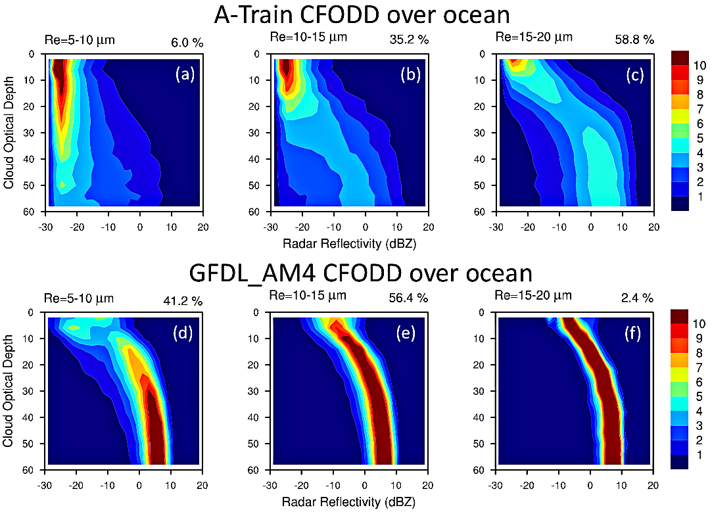

CFODD Warm Rain Microphysics Diagnostic Package
===============================================
Last update: 3/8/2019

The CFODD (Contoured Frequency by Optical Depth Diagram) warm rain microphysics diagnostic
package computes the PDF of radar reflectivity on in-cloud optical depth bins for warm-topped clouds
which are classified based on cloud-top droplet effective radius. By comparing with pre-digested A-Train 
Satellite results, the package reveals biases in modeled warm rain formation process — the
transition from non-precipitating regime to precipitating regime. The statistics are built over oceans.
Cold-topped clouds (cloud top temperature <273.15 K) are excluded. The package requires satellite
simulators (e.g. COSP, the `CFMIP Observation Simulation Package <https://www.earthsystemcog.org/projects/cfmip/>`__) to be implemented in the host model.

Version & Contact info
----------------------

- Version 1.2 (8-Mar-2019, Xianwen Jing, AORI, U-Tokyo)
- PI: Kentaroh Suzuki (AORI, U-Tokyo; ksuzuki@aori.u-tokyo.ac.jp)
- Current developer: Xianwen Jing (AORI, U-Tokyo, jing xw@aori.u-tokyo.ac.jp)

Open source copyright agreement
^^^^^^^^^^^^^^^^^^^^^^^^^^^^^^^

This package is distributed under the LGPLv3 license (see LICENSE.txt).

Functionality
-------------

The currently package consists of following functionalities:

1. Contoured Frequency by Optical Depth Diagram (CFODD) for warm clouds over global ocean (CFODD_warm_rain_microphysics.py)

As a module of the MDTF code package, all scripts of this package can be found under
``diganostics/CFODD_warm_rain_microphysics`` and pre-digested observational data under
``mdtf/inputdata/obs_data/ CFODD_warm_rain_microphysics``.

Required programming language and libraries
-------------------------------------------

The driver of the package is written in Python 2, and requires the following Python packages:
os, glob, json, Dataset, numpy, scipy, matplotlib, networkx, warnings, numba, & netcdf4. 
These Python packages are already included in the standard Anaconda installation.

The computing and plotting functions are written in NCL. The NCL version 6.4 or later is
recommended.

Required model output variables
-------------------------------

The following 4-D (time-pressure-lat-lon) high-frequency (6-hrly snapshot or shorter) model fields are
required:

1. Cloud water mixing ratio (units: kg/kg)
2. Cloud ice mixing ratio (units: kg/kg)
3. Air temperature (units: K)
4. Cloud optical depth at each model layer

The following 4-D (time-pressure-lat-lon) high-frequency fields (6-hrly snapshot or shorter) from sub-column outputs of satellite simulators (e.g. COSP) are required:

5. CloudSat CPR Radar reflectivity (units: dBZ; each sub-column written to a single file)
6. Cloud type (=1: stratiform cloud; =2: convective cloud; each sub-column written to a single file)

Either of the following high-frequency fields (6-hrly snapshot or shorter) is required:

7. 3-D (time-lat-lon) Cloud top droplet effective radius (units: m) 

**or**

8. 4-D (time-pressure-lat-lon) Cloud droplet effective radius profile (units: m)

References
----------

   .. _1:

1. Suzuki, K., Stephens, G.L., Bodas-Salcedo, A., Wang, M., Golaz, J.-C., Yokohata, T., and Tsuyoshi, K.,
2015. Evaluation of the warm rain formation process in global models with satellite observations. *J. Atmos. Sci.*, **72** (10), 3996-4014. https://doi.org/10.1175/JAS-D-14-0265.1.

   .. _2:

Jing, X., Suzuki, K., Guo, H., Goto, D., Ogura, T., Koshiro, T., and Miilmenstadt, J., 2017. A multimodel
study on warm precipitation biases in global models compared to satellite observations. *J. Geophys.
Res.: Atmospheres*, **122**, 11806-11824. http://doi.org/10.1002/2017JD027310.

More about this diagnostic
--------------------------

The CFODD methodology composites the radar reflectivity profiles in the form of the probability
density function normalized at each in cloud optical depth, which is determined by vertically slicing the
cloud optical thickness. The statistics are further classified according to ranges of cloud-top droplet
size to reveal how the vertical microphysical structure of warm-topped clouds tends to transition from
non-precipitating regime to precipitating regime as a fairly monotonic function of the particle size.
Fig. 1 shows an example evaluation of the GFDL AM4 model (:ref:`Zhao et al., 2018a <6>`, :ref:`b <7>`) using this package.

   
   Figure 1. The probability density function (color shading in the unit of %/dBZ) of radar reflectivity (abscissa) normalized as a function of cloud optical depth increasing downward (ordinate), which is further classified according to different ranges of cloud-top droplet effective radius (R\ :sub:`e`\ ) for (left to right) 5-10mm, 10-15mm and 15-20mm obtained from (top) A-Train satellite observations and (bottom) GFDL-AM4 simulation.

The A-Train satellite-based statistics (Figs. 1a-c) show that the observed radar reflectivity (RR) shifts
monotonically from small (RR \< -15 dBZ) to larger values (RR \> 0 dBZ) with increasing droplet effective
radius (R\ :sub:`e`\ ) at the lower parts (optical depth \> 40) of the diagrams. Note that clouds with RR \< -15 dBZ,
-15 dBZ \< RR \< 0 dBZ, and RR \> 0 dBZ are conventionally regarded as containing non-precipitating,
drizzling {i.e. light rain), and raining {i.e. heavy rain) hydrometeors (e.g., :ref:`Haynes et al. 2009 <3>`),
respectively. Fig. 1a shows that when cloud particle sizes are sufficiently small (R\ :sub:`e`\ \< 10 μm, Fig. 1a), RR
is mostly \< -15 dBZ, implying that precipitation is rarely observed even though the cloud optical depth
can reach a considerable magnitude. Clouds with R\ :sub:`e`\ = 10-15 feature intermediate RR (-15 dBZ \< RR \< 0
dBZ) (Fig. 1b), suggesting that precipitation onset is triggered in this R\ :sub:`e`\ range, which is supported by
in situ observations (:ref:`Boers et al. 1998 <4>`; :ref:`Pawlowska and Brenguier 2003 <5>`). The satellite-based results thus illustrate how the vertical microphysical structure of warm clouds tends to transition from non-
precipitating to precipitating profiles as a fairly monotonic function of the cloud-top particle size.

In contrast, the model results (Figs. 1d-f) show virtually no non-precipitation profiles, even for the
smallest R\ :sub:`e`\ range. This suggests that the rain formation process in the model is already quite efficient
even when cloud top droplet sizes are too small to sustain such an efficient collision and coalescence
growth of droplets.

The CFODD methodology provides a direct insight into the coalescence process, parameterized with
autoconversion {collision and coalescence of cloud droplets to form rain drops) and accretion
(collection of cloud droplets by rain drops) formulations.

Additional references:
^^^^^^^^^^^^^^^^^^^^^^

   .. _3:

3. Haynes, J. M., T. L’Ecuyer, G. L. Stephens, S. D. Miller, C. Mitrescu, N. B. Wood, and S. Tanelli, 2009:
Rainfall retrievals over the ocean with spaceborne high-frequency cloud radar. *J. Geophys. Res.*, **114**,
DOOA22, https://doi.org/10.1029/2008)D009973.

   .. _4:

4. Boers, R., J. B. Jensen, and P. B. Krummel, 1998: Microphysical and short-wave radiative structure of
stratocumulus clouds over the Southern Ocean: Summer results and seasonal differences. *Quart. J.
Roy. Meteor. Soc.*, **124**, 151-168, https://doi.org/10.1002/qj.49712454507.

   .. _5:

5. Pawlowska, H., and J.-L. Brenguier, 2003: An observational study of drizzle formation in stratocumulus
clouds for general circulation model (GCM) parameterizations. *J. Geophys. Res.*, **108**, 8630.
https://doi.org/10.1029/2002JD002679.

   .. _6:

6. Zhao., M., and Coauthors, 2018a: The GFDL Global Atmosphere and Land Model AM4.0/LM4.0 - Part I:
Simulation Characteristics with Prescribed SSTs. *J. Adv. Model. Earth Sys.*, **10** (3),
https://doi.org/10.1002/2017MS001208.

   .. _7:

7. Zhao., M., and Coauthors, 2018a: The GFDL Global Atmosphere and Land Model AM4.0/LM4.0 - Part
II: Model Description, Sensitivity Studies, and Tuning Strategies. *J. Adv. Model. Earth Sys.*, **10** (3),
https://doi.org/10.1002/2017MS001209.
