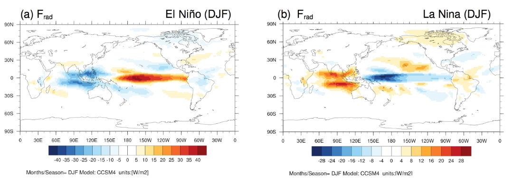
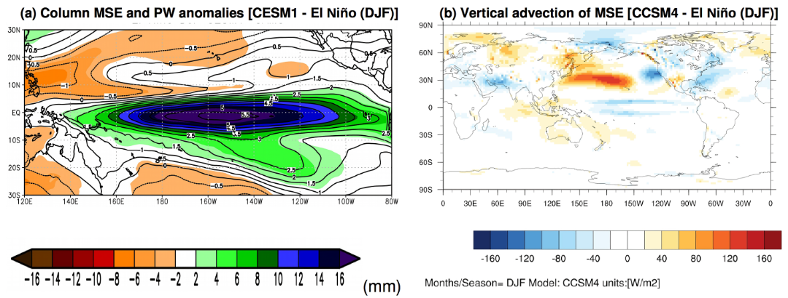
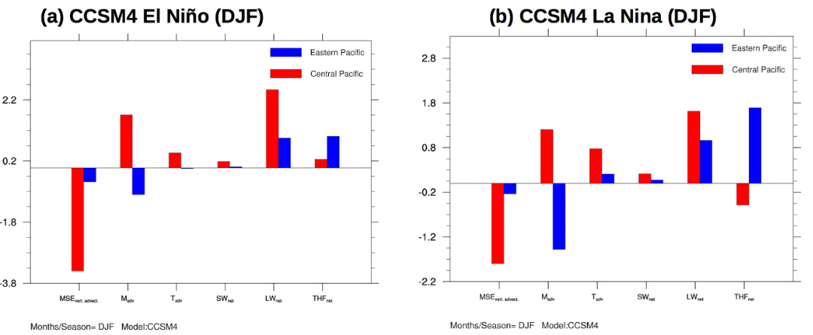
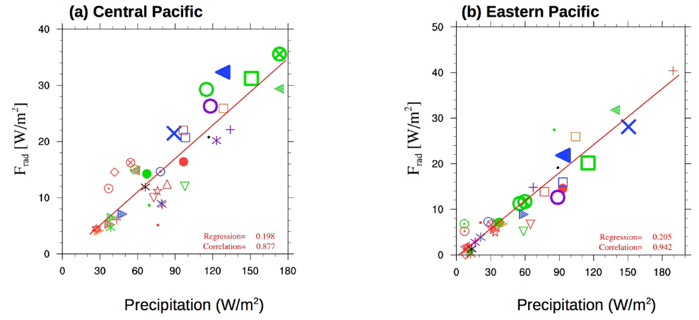

ENSO Moist Static Energy Diagnostic Package
===========================================
Last update 02/22/2019

ENSO moist static energy (MSE) diagnostic package consists of four levels. With a focus on identifying leading processes that determine ENSO-related precipitation anomalies, main module of the POD estimates vertically MSE budget and its variance analysis to account for relative contribution of each MSE term to column MSE. In that pursuit, POD is applied to monthly data (climate model or reanalysis products), and budget terms are estimated for “composite” El Niño or La Nina events. To estimate MSE budget, along with surface and radiation fluxes, 3-dimensional atmospheric variables are required. Hence, ERA-Interim is “considered” as “observations” here, and diagnostics obtained from ERA-Interim are used for model validation. In this general document, brief descriptions of the four levels of the POD are provided but detailed information (e.g., equations and input variables) is provided at each level. For the four levels of diagnostics, selected results are illustrated here.

Version & Contact info
----------------------

- Version 1, 02/22/2019
- PI:  Dr. H. Annamalai (IPRC/SOEST University of Hawaii; hanna@hawaii.edu )
- Current developer: Jan Hafner (IPRC/SOEST University of Hawaii;  jhafner@hawaii.edu)

Open source copyright agreement
^^^^^^^^^^^^^^^^^^^^^^^^^^^^^^^

This package is distributed under the LGPLv3 license (see LICENSE.txt).

Functionality
-------------

The currently package consists of following functionalities:

#. Basic ENSO diagnostics performed by script COMPOSITE.py
#. MSE (Moist Static Energy) budget analysis performed by script MSE.py
#. MSE variance diagnostics performed by script MSE_VAR.py
#. MSE scatter plots performed by script SCATTER.py

Required programming language and libraries
-------------------------------------------

This package is coded in Python  2.7.12  and requires the following packages: scipy, numpy, os, math.

The pre-processing and plotting is coded in NCAR Command Language Version 6.3.0.

Required model output variables
-------------------------------

The following model fields are required as monthly data:

- 4-D variables (longitude, latitude, pressure level, time):

   1. HGT – geopotential height (m)
   2. U wind component [m/s]
   3. V wind component [m/s]
   4. Temperature [K]
   5. Specific Humidity [kg/kg]
   6. Vertical Velocity [Pa/s]

- 3-D variables (longitude, latitude, time):

   7. Precipitation   [kg/m²/s]
   8. Surface Temperature [K]
   9. Sensible Heat Flux [W/m²]
   10. Latent Heat Flux [W/m²]
   11. Net Shortwave Radiative Flux [W/m²]
   12. Net Longwave Radiative Flux [W/m²]

Net radiative fluxes [variables 11 and 12] are estimated from the individual seven radiative flux components, namely: (i) Top Of Atmosphere (TOA) Shortwave down; (ii) TOA Shortwave up; (iii) Surface Shortwave down; (iv) Surface Shortwave up; (v) TOA Longwave up (OLR); (vi) Surface Longwave up and (vii) Surface Longwave down.

References
----------

   .. _1: 
   
1. Annamalai, H., J. Hafner, A. Kumar, and H. Wang, 2014: A Framework for Dynamical Seasonal Prediction of Precipitation over the Pacific Islands. *J. Climate*, **27** (9), 3272-3297,  https://doi.org/10.1175/JCLI-D-13-00379.1.

   .. _2: 
   
2. Annamalai, H., 2019: ENSO precipitation anomalies along the equatorial Pacific: Moist static energy framework diagnostics. Submitted to special collection on Process-based diagnostics (J. Climate).

More about this diagnostic
--------------------------

Level 1 – Basic ENSO diagnostics
^^^^^^^^^^^^^^^^^^^^^^^^^^^^^^^^

Composites, regression and correlation etc: Reference index (e.g., Nino3.4 SST)

- Monthly and seasonal averages
- 2 Year life cycle of ENSO: Year(0) and Year(1)
  Year (0) = developing phase and Year (1) = decaying phase

At this level, POD calculates simple seasonal averages, composites, regression and correlations. Based on a reference ENSO  index (e.g., area-averaged SST anomalies over Nino3.4 region), seasonal composites of variables relevant to MSE budget are constructed for the entire 2-year life cycle of ENSO. Here, Y (0) refers to the developing, and Y (1) the decaying phase of ENSO. Fig. 1 shows composite net radiative flux divergence in the column (F\ :sub:`rad`\ ) for boreal winter (DJF) seasons during El Niño (Fig. 1a) and La Nina (Fig. 1b).

   Figure 1: Boreal winter (DJF) composites of net radiative flux divergence in the column (F\ :subscript:`rad`\ ) constructed from CCSM4 historical simulations (1950-2005): (a) El Niño and (b) La Nina.

More details on Level 1 diagnostics can be found in the README file located in ``diagnostics/ENSO_MSE/doc/README_LEVEL_01.pdf``.

Level 2 – MSE (Moist Static Energy) budget analysis (for composite ENSO)
^^^^^^^^^^^^^^^^^^^^^^^^^^^^^^^^^^^^^^^^^^^^^^^^^^^^^^^^^^^^^^^^^^^^^^^^

In the deep tropics, weak temperature gradient approximation (WTG) implies that precipitation is largely determined by column MSE [or vertically integrated specific humidity or precipitable water (PW)]. Fig. 2a shows that in regions of organized positive and negative precipitation anomalies along the equatorial Pacific, spatial structure and intensity of MSE (contour) and PW (shading) anomalies bear a “close association”. In this view, climate model biases in column MSE and precipitation are clearly linked and models’ fidelity in representing ENSO-related precipitation anomalies along the equatorial Pacific then requires that models accurately represent processes that determine column MSE anomalies. 

In Level 2, for the composites constructed in Level 1, vertically integrated MSE and its budget are estimated (more details on the equations etc are in the README file in Level 2). All the terms are expressed in energy units (W/m²). As an illustration, anomalous MSE export (or vertical advection of MSE) calculated for composite El Niño winter from CCSM4 solutions is shown in Fig. 2b.

   Figure 2: (a) Vertically integrated anomalous MSE (contours, J/m², and scaled by 10E-7) and precipitable water (shaded, mm) and (b) vertical advection of MSE (W/m²). Results are for composite El Niño winters.

More details on Level 2 diagnostics can be found in the README file located in ``diagnostics/ENSO_MSE/doc/README_LEVEL_02.pdf``.

Level 3 – MSE variance diagnostics (for composite ENSO)
^^^^^^^^^^^^^^^^^^^^^^^^^^^^^^^^^^^^^^^^^^^^^^^^^^^^^^^

Once all the individual MSE terms are estimated their relative contributions to column MSE is estimated here. This particular diagnostic is estimated for user-defined regions of interest, and outputs correspond to co- variances scaled by MSE variance (equation details in Level 3 README file). For example, one can estimate this diagnostic for equatorial central and eastern Pacific regions separately to assess the role of different processes in contributing to column MSE anomalies (or precipitation anomalies).

In the current version, the diagnostic is estimated for two “default regions” and one user optional region, and they are:

a) Equatorial Central Pacific 180ᵒ–200ᵒE 10ᵒS – 5ᵒN
b) Equatorial Eastern Pacific 220ᵒ–280ᵒE 5ᵒS – 5ᵒN
c) User prescribed area (for more details see README_LEVEL_03 document)

Here, in Fig. 3 results for both composite El Niño and La Nina winters, and from both equatorial central and eastern Pacific regions obtained from CCSM4 solutions are shown.

   Figure 3: Relative contributions of various MSE terms to column MSE averaged for equatorial central (red) and eastern (blue) Pacific regions estimated from CCSM4 historical solutions for composite: (a) El Niño winter and (b) La Nina winter.

More details on Level 3 diagnostics can be found in the README file located in ``diagnostics/ENSO_MSE/doc/README_LEVEL_03.pdf``.

Level 4 – MSE scatter plots (Metrics)
^^^^^^^^^^^^^^^^^^^^^^^^^^^^^^^^^^^^^

Note that if diagnostics from multiple models are sought to assess systematic errors across all models then the results can be displayed as scatter plots between variables that are physically linked. In this level, one can also estimate “inter-model correlations” and “best fit” regression line, and show them in the plots.

At this level, results from Level 2 (CMIP-era models) are condensed into scatter plots. Specifically, estimates of each MSE budget term (e.g., F\ :subscript:`rad`\ ) is plotted against precipitation, and the example shown here in Fig. 4 suggests that error in representing net radiative flux divergence (F\ :subscript:`rad`\ ) is systematically tied to error in model simulated precipitation over both the equatorial central and eastern Pacific regions.

   Figure 4. Scatter plots between anomalous net radiative flux divergence (F\ :subscript:`rad`\ ) and precipitation for composite El Niño winters estimated from historical simulations of CMIP5 models: (a) Central Pacific and (b) Eastern Pacific. In the panels, inter-model correlations and best regression fit lines are also provided.

More details on Level 4 diagnostics can be found in the README file located in ``diagnostics/ENSO_MSE/doc/README_LEVEL_04.pdf``.

.. |^2| replace:: \ :sup:`2`\ 
.. |^3| replace:: \ :sup:`3`\ 
.. |^-1| replace:: \ :sup:`-1`\ 
.. |^-2| replace:: \ :sup:`-2`\ 
.. |^-3| replace:: \ :sup:`-3`\ 