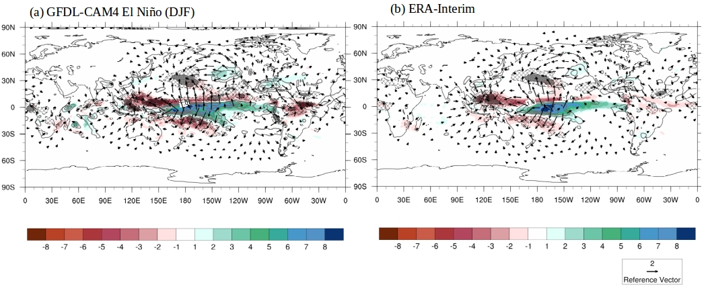
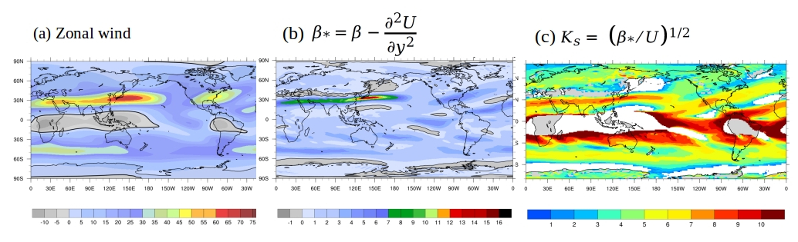
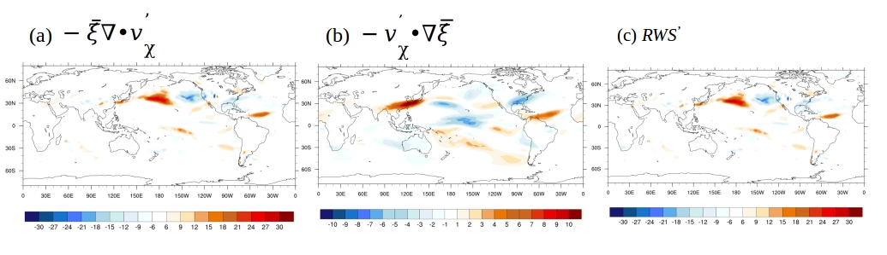
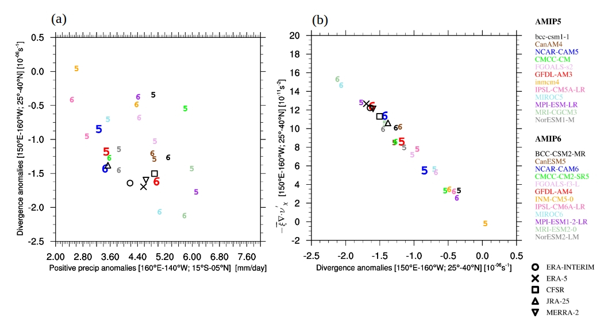
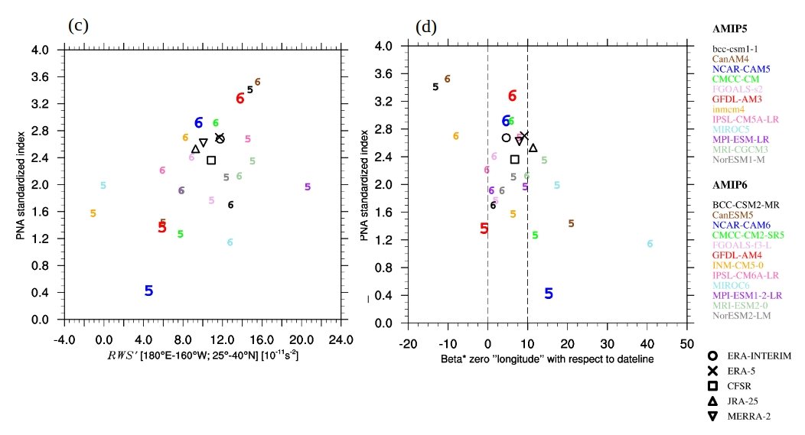

**Rossby Wave Sources Diagnostic Package**

**Last update 04/15/2021**

ENSO Rossby wave sources (ENSO_RWS) diagnostic package consists of four
levels. With a focus on identifying leading processes that determine
ENSO-induced global teleconnection, particularly the Pacific North
American (PNA) pattern, the main module of the POD estimates basic state
flow properties at an appropriate tropospheric upper-level and solves
the barotropic vorticity equation to estimate various terms that contribute
to the total anomalous RWS. In that pursuit, the ENSO-RWS POD is applied to monthly
data (climate model or reanalysis products), and RWS terms are estimated
for “composite” El Niño or La Nina events. To attain robust “composite”
results a reasonable sample of ENSO winters is needed. However, the POD
can be applied even for a single El Niño winter (e.g., when applied to
seasonal prediction models). Similarly, the POD is applicable to any
number of pressure levels (e.g., to identify the level at which maximum
upper-level divergence and associated RWS are located). Here, reanalysis
products (e.g., ERA-Interim) are considered as observations and
diagnostics obtained from ERA-Interim and other reanalysis products are
used for model validation. In this general document, brief descriptions
of the four levels of the POD are provided, and detailed information is
provided at each level. For the four levels of diagnostics, selected
results are illustrated here.

*The POD works efficiently if the model data contain a sufficient number of El
Niño or La Nina events.* Predigested results are available for both El
Niño and La Nina composites.

**Version and contact information**

Version 1, 03/09/2021

PI: Dr. H. Annamalai (IPRC/SOEST University of/ Hawaii; hanna@hawaii.edu
)

Current developer: Jan Hafner (IPRC/SOEST University of Hawaii;
jhafner@hawaii.edu)

**Open source copyright agreement**

The MDTF framework is distributed under the LGPLv3 license (see
LICENSE.txt).

**Functionality**

The current package consists of the following functionalities:

1. Basic ENSO diagnostics performed by script LEVEL_01.py

2. Climatological flow properties script LEVEL_02.py

3. Rossby wave source terms performed by script LEVEL_03.py

4. Scatter plots as metrics to assess models performed by script
   LEVEL_04.py

As a module of the MDTF code package, all scripts to perform the four
levels can be found here: ~/diagnostics/ENSO_RWS/

The pre-digested observational data for model validation can be found
here: ~/diagnostics/inputdata/obs_data/ENSO_RWS/

**Required programming language and libraries**

This package is coded in Python 3.8.5 and requires the following
packages: numpy, os, math, xarray, netcdf4.

The pre-processing and plotting are coded in NCAR Command Language
Version 6.5.0.

**Required model output variables and their corresponding units**

The following model fields are required as monthly data:

4-D variables (longitude, latitude, pressure level, time):

1. *zg*: HGT geopotential height (m)

2. *ua*: U wind component [m/s]

3. *va*: V wind component [m/s]

4. *ta*: Temperature (K)

5. *wap*: Vertical velocity (Pa/s)

3-D variables (longitude, latitude, time):

6. *pr*: Precipitation (k/m\ :sup:`2`/s)

7. *ts*: Surface temperature (K)

More details can be found in the README_general.pdf document.

**References**

1. Annamalai, H., R. Neale and J. Hafner: ENSO-induced teleconnection:
development of PODs to assess Rossby wave sources in climate models (in
preparation).

2. R. Neale and H. Annamalai: Rossby wave sources and ENSO- induced
teleconnections in CAM6 model development versions and associated
vertical processes (in preparation).

   **More about ENSO_RWS**

**Rossby Wave Source POD to assess ENSO-induced teleconnection
(ENSO_RWS)**

The NOAA-MDTF Rossby Wave Source (RWS) Process Oriented Diagnostic (POD)
package fills a critical gap in the diagnostics tools available to
climate model developers. In both basic-state and anomalous conditions,
changes in the response of moist processes in model either
parameterization modifications or tuning and calibration can often
change the nature of the seasonal distributions of tropical
precipitation and associated heating, and by association moistening and
divergence profiles. While validation of precipitation is
straightforward, an understanding of the circulation consequences in the
tropics and the extra-tropics is not. 

The RWS POD developed here will help to address this critical validation
gap by quantifying the roles of changing ambient flow properties (basic
state climatological features), and anomalous upper tropospheric
divergent patterns in the generation and radiation of planetary
stationary Rossby waves. This will be particularly important in coupled
configuration development, since changes to the atmosphere model
configuration can lead to complex coupled feedback modifying not only
the mean climate, but the response during ENSO events. 

A further role this POD plays is in determining the potential for
generated interactions to influence the United States, and whether a
particular model version has prediction utility.

**Few take home messages to model development include:**

-  Ambient flow properties (e.g., restoring force for stationary Rossby
   waves)

-  Perturbations to local Hadley and planetary east-west Walker
   circulations (generation of Rossby wave sources)

-  Location and intensity of anomalous Rossby wave sources and their
   dependence on both ambient and anomalous circulation conditions
   (principal Rossby wave sources)

-  Radiation of Rossby waves in the presence of ambient flow properties
   (great circle path)

-  To infer ENSO-induced seasonal anomalies over North America
   (prediction utility) 

**Level 1 – Basic ENSO diagnostics**

Identify ENSO winters and construct seasonal composite anomalies for
relevant variables (e.g., anomalous precipitation, circulation,
geopotential height to estimate standardized PNA index).

Reference index (e.g., Nino3.4 SST)

-  Seasonal averages

Based on a reference ENSO index (e.g., area-averaged SST anomalies over
the Nino3.4 region), seasonal composites of variables relevant to
ENSO-induced global teleconnection at an appropriate tropospheric
upper-level are constructed. Fig. 1 shows composite anomalous
precipitation (shaded), 200hPa divergence/convergence (contour/hatching)
and 200hPa divergent wind (vector) for boreal winter (DJF) season during
El Niño constructed from GFDL-CAM4 AMIP simulations performed for the
period 1980-2014 (Fig. 1a) and ERA-interim (Fig. 1b).

**Figure 1**: El Niño winter (DJF) composites of precipitation anomalies
(shaded; mm/day), anomalous 200hPa convergence/divergence
(contours/hatching in units of 10\ :sup:`-6` s\ :sup:`-1`) and anomalous
200hPa divergent wind anomalies (m/s) constructed from: (a) AMIP
simulation of GFDL-AM4 performed for the period 1980-2014 and (b)
ERA-interim. Reference wind vector is also shown.

More details on Level 1 diagnostics can be found in the
README_LEVEL_01.pdf document located in ~/diagnostics/ENSO_RWS/doc.

**Level 2 – Climatological flow and wave properties (basic-state/ambient
flow) diagnostics**

Regarding to basic or climatological flow properties, restoring effect
for Rossby waves (*β*\ :sub:`\*`) that is dependent on meridional
gradient in absolute vorticity (*β*) and meridional curvature of the
zonal flow or gradients in relative vorticity :math:`\frac{\partial^{2}{{U}}}{\partial{y}^{2}}` and resultant stationary wave number (:math:`K_{s}`) are diagnosed. These ambient flow properties determine generation and propagation of stationary Rossby waves.

Mathematical expressions for *β*\ :sub:`\*` and :math:`K_{s}` are given
by:

:math:`\beta_{*} = \beta - \frac{\partial^{2}{{U}}}{\partial{y}^{2}}`     (1)

:math:`K_{s} =  \ \Big(  { \beta_{*}} / {U}  \Big)`\ :sup:`1/2`   (2)

where *β* is latitudinal variations in planetary vorticity (:math:`f`),
:math:`\acute{U}` is the basic-state zonal wind velocity, and 
:math:`\frac{\partial^{2}{{U}}}{\partial{y}^{2}}` is the curvature of
the ambient zonal flow. Stationary Rossby waves are possible if the flow
is westerly (:math:`\acute{U}` positive) and :math:`\beta_{*}` is
positive.

**Figure 2:** GFDL-AM4 simulated ambient flow properties at 200hPa for
boreal winter (December – February): (a) zonal wind (m/s); (b)
:math:`\beta_{}`\ (10\ :sup:`-11`\ m\ :sup:`-1`\ s\ :sup:`-1`) and (c)
stationary wavenumber. In (a and b), negative values are shaded gray and
zero contour is shown as thick line. In (c) unspecified or singular
values of wavenumber is shown as white.

More details on Level 2 diagnostics can be found in the
README_LEVEL_02.pdf document located in ~/diagnostics/ENSO_RWS/doc.

**Level 3 – Rossby wave sources (for composite ENSO)**

Explicitly solves barotropic vorticity budget and the leading terms
contributing to the total anomalous Rossby wave sources
(:math:`\text{RW}S^{'}`) are quantified. The mathematical expression for
:math:`\text{RW}S^{'}` is given by:

.. figure:: ./Eqn_3.jpg
   :align: left
   :width: 80 %

Here, :math:`\xi` and :math:`v_{\chi}` correspond to absolute vorticity
and divergent component of the wind, respectively. The overbar
represents seasonal mean and the prime refers to seasonal anomalies. The
first term in :math:`\text{RW}S^{'}`\ corresponds to stretching due to
anomalous divergence, and the second term accounts for advection of
climatological gradient in :math:`\xi` by the anomalous divergent wind.
The third and fourth terms account for transient eddy convergence of
vorticity, and their contributions to :math:`\text{RW}S^{'}` is small
but non-negligible.

**Figure 3:** Anomalous Rossby wave sources
(10\ :sup:`-11`\ s\ :sup:`-2`) due to: (a) stretching term; (b)
anomalous divergent wind advecting gradient in climatological absolute
vorticity and (c) all the four terms (equation 3). Results shown are for
composite El Niño winters (DJF) simulated by GFDL-AM4 AMIP simulations.

More details on Level 3 diagnostics can be found in the
README_LEVEL_03.pdf document located in ~/diagnostics/ENSO_RWS/doc.

**Level 4 – Scatter plots for assessing models’ performance (Metrics).**

Note that if diagnostics from multiple models are sought to assess
systematic errors across all models and/or compare and contrast a
selected model’s performance with other models then the results can be
displayed as scatter plots between variables that are physically linked.
At this level, results from Levels 1-3 are condensed into scatter plots.
Specifically, estimates of leading anomalous RWS terms are plotted
against equatorial precipitation and/or standardized PNA index (defined
from 200hPa height anomalies).

**Figure 4:** Scatter plots between (a) anomalous equatorial Pacific
precipitation (160\ :sup:`o`\ E-140\ :sup:`o`\ W; 15\ :sup:`o`\ S-0) and
200hPa divergence (150\ :sup:`o`\ E-160\ :sup:`o`\ W;
25\ :sup:`o`\ N-40\ :sup:`o`\ N); (b) anomalous 200hPa divergence and
:math:`\text{RW}S`\ due to stretching term
(150\ :sup:`o`\ E-160\ :sup:`o`\ W; 25\ :sup:`o`\ N-40\ :sup:`o`\ N);
(c) anomalous total :math:`\text{RW}S^{'}` east of the dateline
(180\ :sup:`o`\ E-160\ :sup:`o`\ W; 25\ :sup:`o`-40\ :sup:`o`\ N) and
standardized PNA index and (d) 200hPa climatological
:math:`\beta_{}`\ zero value longitude with respect to dateline and
standardized PNA index. Results shown are for composite El Niño winters
(DJF) simulated by AMIP5/6 models. In the panels, number 5 corresponds
to AMIP5 and 6 corresponds to AMIP6 models, and the color of the numbers
correspond to the model’s name.

More details on Level 4 diagnostics can be found in the
README_LEVEL_04.pdf document located in ~/diagnostics/ENSO_RWS/doc.
