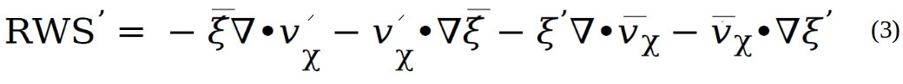

Information about Level 3 – Rossby wave sources diagnostics
===========================================================
At this level the code calculates various terms of anomalous Rossby wave source terms 
for composite El Nino (or La Nina) winters.
The necessary input data are already estimated in **Level 2** and **Level 1.**
In this Level, the POD explicitly solves barotropic vorticity budget and the leading 
terms contributing to the total anomalous Rossby wave sources (:math:`\text{RW}S^{'}`) 
are quantified.

**Level 3** diagnostics are estimated as:

Here, :math:`\xi` and :math:`v_{\chi}`  correspond to absolute vorticity and
divergent component of the wind, respectively. The overbar represents
seasonal mean and the prime refers to seasonal anomalies. The first
term in :math:`\text{RW}S^{'}` corresponds to stretching due to anomalous divergence,
and the second term accounts for advection of climatological  :math:`\xi` by
the anomalous divergent wind. The third and fourth terms account for
transient eddy convergence of vorticity, and their contributions to
:math:`\text{RW}S^{'}` is small but non-negligible.

Final output directories:
============================
The output data are saved in
~/wkdir/MDTF_$model_$first_year_$last_year/ENSO_RWS/model/netCDF .
Graphical output is in : ~/wkdir/MDTF_$model_$first_year_$last_year/ENSO_RWS/model
(e.g., $model = CESM1, $fist_year= 1950, $last_year = 2005)
The calculated individual and total :math:`\text{RW}S^{'}` are shown as spatial maps.

