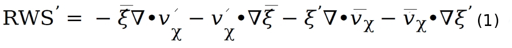

Instructions for Rossby wave sources (RWS) Process-oriented diagnostics (POD)
=============================================================================

The diagnostics package termed RWS-POD consists of four “levels” that
are sequentially performed with monthly variables either from
reanalysis or model integrations. With a focus on identifying leading
processes that determine ENSO-induced global teleconnection,
particularly the Pacific North American (PNA) pattern, main module of
the POD estimates basic state flow properties at an appropriate
tropospheric upper-level and solves barotropic vorticity equation to
estimate various terms that contribute to the total anomalous RWS. To
attain robust “composite” results a reasonable sample of ENSO winters
is needed. However, the POD can be applied even for a single El Niño
winter (e.g., when applied to seasonal prediction models). Similarly,
the POD is applicable to any number of pressure levels (e.g., to
identify the level at which maximum upper-level divergence and
associated RWS are located). Here, reanalysis products (e.g.,
ERA-Interim) is considered as observations and diagnostics
obtained from multitude reanalysis products are used for model
validation. In this general README document, brief descriptions of
the four levels are provided but detailed information is provided at
each level.

Level 1 – Basic ENSO diagnostics
================================

Identify ENSO winters and construct seasonal composite anomalies for
relevant variables (e.g., anomalous precipitation, circulation,
geopotential height to estimate standardized PNA index). Also,
seasonal climatology required for other Levels are computed here.

Reference index (e.g., Nino3.4 SST)

-  Seasonal averages

..

   *Note: Level 1 diagnostics (ENSO-related anomalies and seasonal
   climatology) are required to perform Levels 2-4 diagnostics*

Level 2 – Climatological flow and wave properties (basic-state/ambient flow) diagnostics
========================================================================================

-  Meridional curvature of upper-level zonal wind
      (:math:`\frac{\partial^{2}{{U}}}{\partial{y}^{2}}`) or gradients in relative vorticity
      of the climatological zonal wind

-  Restoring effect for Rossby waves (*β*\ :sub:`\*` - :math:`\frac{\partial^{2}{{U}}}{\partial{y}^{2}}`) where 𝛽 is meridional gradient in planetary vorticity

-  Stationary wave number :math:`K_{s}`

Level 3 – Anomalous Rossby wave source (:math:`\text{RW}S^{'}`) diagnostics
===========================================================================

-  Explicitly solves barotropic vorticity budget and the leading terms
   contributing to the total (:math:`\text{RW}S^{'}`) are quantified.
   :math:`\text{RW}S^{'}` is given by:

   
Here, :math:`\xi` and :math:`v_{\chi}`  correspond to absolute vorticity and
divergent component of the wind, respectively. The overbar represents
seasonal mean and the prime refers to seasonal anomalies. The first
term in :math:`\text{RW}S^{'}` corresponds to stretching due to anomalous divergence,
and the second term accounts for advection of climatological *β* by
the anomalous divergent wind. The third and fourth terms account for
transient eddy convergence of vorticity, and their contributions to
:math:`\text{RW}S^{'}` is small but non-negligible.

Level 4 – RWS scatter plots (Metrics).
======================================

At this level, results from Levels 1-3 (AMIP/CMIP-era models) are
condensed into scatter plots. Specifically, the sequential plots
illustrate the “chain of processes” in ENSO-induced teleconnection.
For example, model simulated equatorial Pacific precipitation
anomalies (forcing) are examined against simulated subtropical
divergence anomalies (response) that are subsequently assessed with
estimates of leading RWS terms. Then, forcing due to RWS on the
models’ efficacy in representing PNA index (response), and the
dependence of PNA index to models’ ambient flow properties are
examined. In summary, these scatter plots reveal models’ fidelity in
representing the essential ingredients that are deemed necessary for
realistic representation of ENSO-induced teleconnection during boreal
winters.

   *Level 4 requires pre-calculated results from Levels 1 - 3.*

Contact Information:
====================

   PI: Dr. H. Annamalai,

   International Pacific Research Center, University of Hawaii at Manoa

   E-mail: hanna@hawaii.edu

   Programming: Jan Hafner

   Email: jhafner@hawaii.edu

References:
===========

1. Annamalai, H., R. Neale and J. Hafner: ENSO-induced teleconnection:
      development of PODs to assess Rossby wave sources in climate
      models (in preparation).

2. R. Neale and H. Annamalai: Rossby wave sources and ENSO- induced
      teleconnections in CAM6 model development versions and associated
      vertical processes (in preparation).
