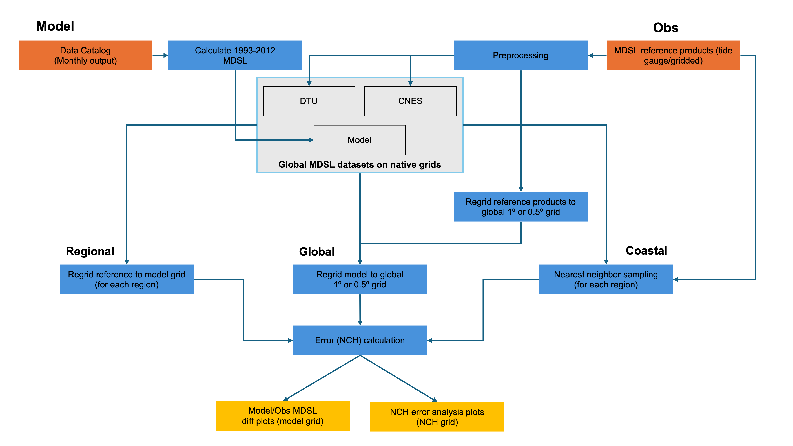
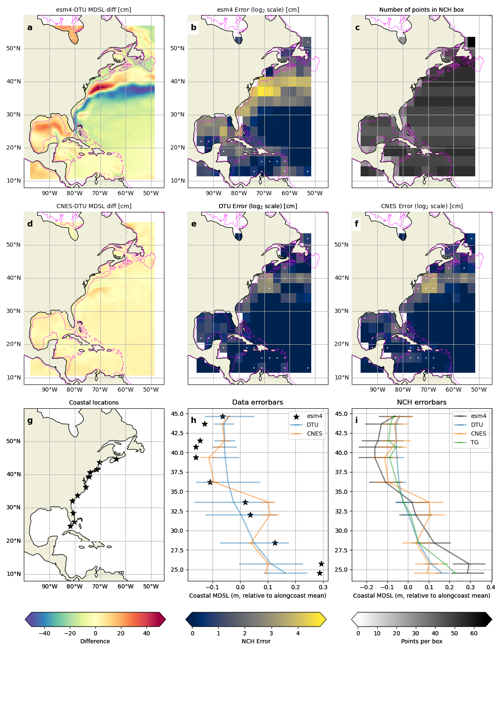
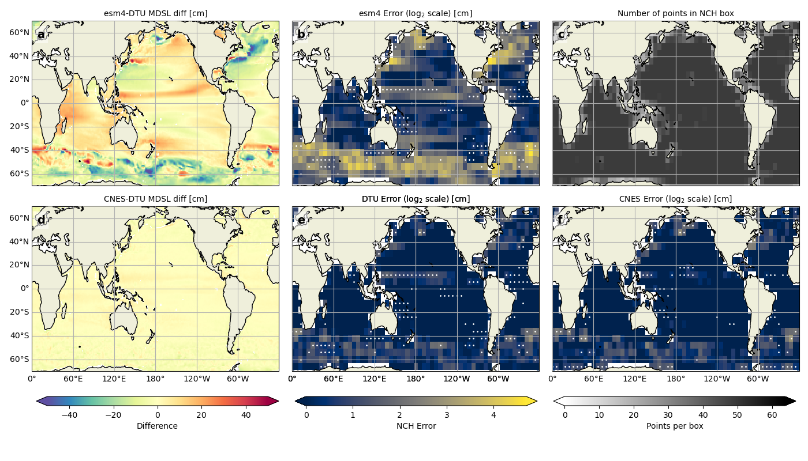

Mean Dynamic Sea Level (MDSL) Package
=====================================
Last Update: 01/24/2025

This POD computes model errors in mean dynamic sea level (MDSL) using an improved aproach called Generalized Tri-Cornered Hat (GTCH). The POD computes MDSL error for alongcoast, regional, and global domains.  

Model Data
----------

The package has been successfully teseted for GFDL's CM4 and ESM4 model data and below HighResMIP model output:

**ECMWF-IFS-HR_e_hist-1950_vl_r1i1p1f1**

In addition the functionality of the POD has been tested successfully for other HighResMIP models of CMIP6 outside the MDTF.

Model output variable - *zos* : sea_surface_height_above_geoid

Model has to be called using a data catalog. We used the MDTF catalog_builder to build
data catalogs for the models that we tested for the package.

Observed/Reference Data
-----------------------

We use two reference MDSL products from National Center for Space Studies (CNES) and Technical University Denmark (DTU). For the alongcoast MDSL we use tide-gauge data as a reference in addition to the above mentioned reference products. The reference datasets (MDSL and Tide Gaude) are available at *~diagnostics/MDSL/Ref_data*

Required Programing Language and Libraries
------------------------------------------
The package was coded in python version 3.12.2

It requires the following packages:
numpy, xarray, matplotlib, pandas, xesmf, os, intake, sys, yaml, 
cartopy.crs, cartopy.features, momlevel, sparse, cf_xarray

The custom functions needed are stored in below files:

-*~diagnostics/MDSL/gfdl_grid_fx.py*

-*~diagnostics/MDSL/other_grid_fx.py*

-*~diagnostics/MDSL/plot_fx.py*

-*~diagnostics/MDSL/nch.py*

Package Functionality
---------------------
The core functionality of the package can be explained by the functionality of the MDSL.py file. The code routine of the MDSL.py file is segmented into **seven sections**.

**Section 1**: Sets up parameters. Here, you can pre-set the parameters for the model data and the NCH calculation. 

**Section 2**: Reads in the "zos" data utilizing the pre-determined data catalog in the runtime configuration file (Several runtime config files are available as examples in ~diagnostics/MDSL/Example_files). Once read in the model data is subset into the reference data time period (1993-2012) and the time mean is computed.

**Section 3**: Reads in the native and re-gridded reference products (DTU and CNES) from the *["OBS_DATA_ROOT"]*.

**Section 4**: This section sets up regions for the regional NCH calculations. The current version of the package sets up six regions that include - California, Leeuwin, Gulf Stream, Kuroshio, East Australia, and Norway.

**Section 5**: First re-grid reference data on regional domains to the model grid.  Then calculates the MDSL error for the regional domain (NCH calculation). Also calculates the coastal NCH using tide gauge information. Finally, plots the outputs for each region (see **Figure 2**).

**Section 6**: First re-grids the model to a global 1-degree or 0.5-degree grid (based on the rez parameter in Section 1). Then calculates the MDSL error globally and produces a plot similar to **Figure 3**.

**Section 7**: Closes the catalog files and disposes of the variable reference.

**Section 8**: Prints the successful run of the package and exits from the system.

**Figure 1**: A schematic showing the MDSL diagnostic's functionality.

Diagnostic Outputs
------------------
The diagnostics provides regional and global MDSL outputs. 

**Figure 2**: MDSL regional/coastal output for the Gulf Stream region. **(a)** MDSL difference between model and DTU referece data. **(b)** MDSL error of the model. **(c)** Number of points in an n-cornered hat box. **(d)** MDSL difference between DTU and CNES reference products. **(e)** MDSL error of DTU. **(f)** MDSL error of DTU. **(g)** Locations of the tide guages used as reference to calculate the coastal NCH. **(h)** Coastal MDSL of tide gauges and reference products relative to alongcoast mean. **(i)** Coastal MDSL error.

**Figure 3**: MDSL global output. A schematic showing the MDSL diagnostic's functionality. **(a)** MDSL difference between model and DTU referece data. **(b)** MDSL error of the model. **(c)** Number of points in an n-cornered hat box. **(d)** MDSL difference between DTU and CNES reference products. **(e)** MDSL error of DTU. **(f)** MDSL error of DTU.

References
----------

   .. _1:

1.  Mengnan's Paper?

Contact info
------------

- PI: Christopher M. Little (clittle@aer.com), Atmospheric and Environmental Research Inc.
- Current Developer: 
- Contributors: Mengnan Zhao, Sara Vannah, & Nishchitha Etige

Open source copyright agreement
^^^^^^^^^^^^^^^^^^^^^^^^^^^^^^^

Link the source file of the open source agreement.
