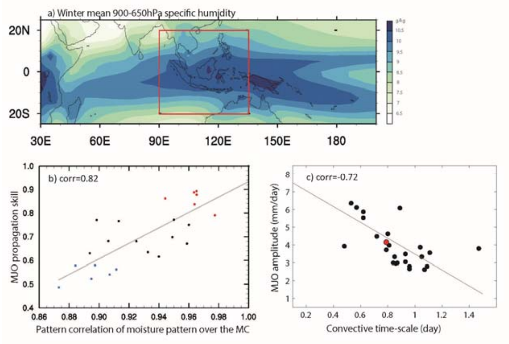

MJO Propagation and Amplitude Diagnostic Package
================================================
Last update: 02/27/2019

This MJO propagation and amplitude diagnostic metrics is mainly motivated by recent multi‐model studies that model skill in representing eastward propagation of the MJO is closely related to model winter mean low‐level moisture pattern over the Indo‐Pacific region, and the model MJO amplitude tends to be tightly associated with the moisture convective adjustment time scale. This package is designed to provide further independent verification of these above processes based on new GCM simulations.

Version & Contact info
----------------------

- Version 2.0.
- PI and POC: Xianan Jiang (UCLA; xianan@ucla.edu)
- Developers: Alex Gonzalez (agon@iastate.edu), Xianan Jiang (xianan@ucla.edu)
- Contributors: E. Maloney (CSU), D. Waliser (JPL), Ming Zhao (GFDL)

Open source copyright agreement
^^^^^^^^^^^^^^^^^^^^^^^^^^^^^^^

This package is distributed under the LGPLv3 license (see LICENSE.txt).

Functionality
-------------

The currently package (mjo_diag.py) consists of following functionalities:

1. Model skill scores of MJO eastward propagation versus winter mean low‐level moisture pattern over Indo‐Pacific;

2. Model amplitude of MJO over the Indian Ocean versus moisture convective adjustment time‐scale.

As a module of the MDTF code package, all scripts of this package can be found under ``mdtf/MDTF_$ver/var_code/mjo_diag``”, and pre‐digested observational data under ``mdtf/inputdata/obs_data/mjo_diag``.

Required programming language and libraries
-------------------------------------------

This package is mainly written in NCAR Command Language (NCL) which is driven by Python 2. A newer version of the NCL above 6.4 is recommended for implementation of this diagnostic package.

Required model output variables
-------------------------------

The following 3D (lat‐lon‐time) or 4D (lat‐lon‐pressure‐time) model fields are required:

1. 3D precipitation rate (units: mm d\ |^-1|; at least at daily interval or higher‐frequency)

2. 4D specific humidity from 1000hPa to 100hPa ( g g\ |^-1|; at least at daily interval or higher‐frequency);

Daily 3D column water vapor (CWV, or precipitable water vapor; units: mm = kg m\ |^-2|) will be calculated from (2) for calculation of moisture convective time‐scale.

References
----------

   .. _1: 
   
1. Jiang, X. (2017), Key processes for the eastward propagation of the Madden‐Julian Oscillation based on multimodel simulations, *JGR‐Atmos*, **122**, 755–770, https://doi.org/10.1002/2016JD025955.

   .. _2: 
   
2. Gonzalez, A. O., and X. Jiang (2017), Winter mean lower tropospheric moisture over the Maritime Continent as a climate model diagnostic metric for the propagation of the Madden‐Julian oscillation, *Geophys. Res. Lett.*, **44**, 2588–2596, https://doi.org/10.1002/2016GL072430.

   .. _3: 
   
3. Jiang, X., M. Zhao, E. D. Maloney, and D. E. Waliser, 2016: Convective moisture adjustment time scale as a key factor in regulating model amplitude of the Madden‐Julian Oscillation. *Geophys. Res. Lett.*, **43**, 10,412‐410,419.

More details about this diagnostic
----------------------------------

   a\) Winter (Nov‐Apr) mean 650‐900hPa specific humidity based on ERA‐Interim reanalysis; b\) Scatter plot of model skill for eastward propagation of the MJO versus model skill of the mean 650‐900hPa moisture pattern over the Maritime Continent (MC; red rectangle in a) based on multi‐model simulations from the MJOTF/GASS project. Model MJO propagation skill is defined by the pattern correlation of Homvöller diagrams of model simulated rainfall anomalies associated with the MJO against its observed counterpart following :ref:`Jiang et al. (2015) <3>`. Red (blue) dots denote good (poor) MJO models. c\) Scatter plot of MJO amplitude and model convective moisture adjustment time scale in models (black dots) and observations (red dots). The MJO amplitude in each model is defined by the standard deviation of 20‐100 day band‐pass filtered rainfall over the Indian Ocean (75‐85oE; 10oS‐10oN) during winter. Convective time scale in a model is defined by the ratio of precipitable water (W) anomaly to precipitation (P) anomaly associated with the MJO and derived by a regression approach. Before conducting the regression, both W and P anomalies are subject to 20‐100 day filtering and averaged over the Indian Ocean (75‐85oE; 10oS‐10oN) region. Adapted from :ref:`Jiang et al. (2016) <3>` and :ref:`Gonzalez and Jiang (2017) <2>`.

This diagnostic metric for MJO propagation is motivated by findings that the horizontal advection of column moist static energy, or equivalently the lower‐tropospheric moisture, plays a critical role in driving the eastward propagation of the winter MJO (e.g., :ref:`Maloney 2009 <13>`; :ref:`Maloney et al. 2010 <14>`; :ref:`Kiranmayi and Maloney 2011 <12>`; :ref:`Sobel et al. 2014 <17>`; :ref:`Chikira 2014 <6>`; :ref:`Kim et al. 2014 <10>`; :ref:`Adames and Wallace 2015 <4>`; :ref:`Jiang 2017 <8>`; :ref:`Kim et al. 2017 <11>`). Under this process, the spatial distribution of the winter mean lower‐tropospheric moisture distribution over the equatorial Indo‐Pacific region (Fig. 1a) is crucial for moistening (drying) to the east (west) of the MJO convection through advection by MJO anomalous winds. The critical role of the mean lower‐tropospheric moisture pattern for the MJO eastward propagation is confirmed by multi‐model simulations from the MJO Task Force / GEWEX GASS MJO model comparison project (:ref:`Jiang 2017 <8>`; :ref:`Gonzalez and Jiang 2017 <2>`). In particular, model skill in representing the 900‐650hPa mean moisture pattern over the Maritime Continent region (red rectangle in Fig. 1a) exhibits a high correlation (about 0.8) with model MJO eastward propagation skill in about 25 GCM simulations (Fig. 1b). 

On the other hand, the convective moisture adjustment time scale (τ) in a model, defined by the ratio of intraseasonal perturbations of precipitable water and surface precipitation (e.g., :ref:`Bretherton et al. 2004 <5>`; :ref:`Peters and Neelin 2006 <15>`; :ref:`Sobel and Maloney 2013 <16>`), is selected as a diagnostic metric for model MJO amplitude, which is motivated by the high anti‐correlation (‐0.72) between τ and model MJO amplitude across multi‐model simulations as indicated in Jiang et al. (2016, Fig. 1c). The convective moisture adjustment time scale depicts how rapidly precipitation must occur to remove excess column water vapor, or alternately the efficiency of surface precipitation generation per unit column water vapor anomaly, and is highly relevant to the convection onset diagnostics described above. 

With this diagnostic packet, relationships between model skill in representing MJO eastward propagation and winter mean lower‐tropospheric moisture as shown in Fig. 1b, and model MJO amplitude and moisture convective adjustment time scale as in Fig. 1c are examined based on specified model simulations.

References
----------

   .. _4: 
   
4. Adames, Á. F. and J. M. Wallace, 2015: Three‐Dimensional Structure and Evolution of the Moisture Field in the MJO. *J. Atmos. Sci.*, **72**, https://doi.org/10.1175/JAS‐D‐15‐0003.1, 3733‐3754.

   .. _5: 
   
5. Bretherton, C. S., M. E. Peters, and L. E. Back, 2004: Relationships between water vapor path and precipitation over the tropical oceans. *J. Clim.*, **17**, 1517‐1528.

   .. _6: 
   
6. Chikira, M., 2014: Eastward‐Propagating Intraseasonal Oscillation Represented by Chikira–Sugiyama Cumulus Parameterization. Part II: Understanding Moisture Variation under Weak Temperature Gradient Balance. *J. Atmos. Sci.*, **71**, https://doi.org/10.1175/JAS‐D‐13‐038.1, 615‐639.

   .. _7: 
   
7. Gonzalez, A. O. and X. Jiang, 2017: Winter Mean Lower‐Tropospheric Moisture over the Maritime Continent as a Climate Model Diagnostic Metric for the Propagation of the Madden‐Julian Oscillation. *Geophys. Res. Lett.*, https://doi.org/10.1002/2016GL072430.

   .. _8: 
   
8. Jiang, X., 2017: Key processes for the eastward propagation of the Madden‐Julian Oscillation based on multimodel simulations. *Journal of Geophysical Research: Atmospheres*, https://doi.org/10.1002/2016JD025955.

   .. _9: 
   
9. Jiang, X., M. Zhao, E. D. Maloney, and D. E. Waliser, 2016: Convective moisture adjustment time scale as a key factor in regulating model amplitude of the Madden‐Julian Oscillation. *Geophys. Res. Lett.*, **43**, https://doi.org/10.1002/2016GL070898, 10,412‐10,419.

   .. _10: 
   
10. Kim, D., J.‐S. Kug, and A. H. Sobel, 2014: Propagating versus Nonpropagating Madden–Julian Oscillation Events. *J. Clim.*, **27**, https://doi.org//10.1175/JCLI‐D‐13‐00084.1, 111‐125.

   .. _11: 
   
11. Kim, D., H. Kim, and M.‐I. Lee, 2017: Why does the MJO detour the Maritime Continent during austral summer? *Geophys. Res. Lett.*, https://doi.org//10.1002/2017GL072643, n/a‐n/a.

   .. _12: 
   
12. Kiranmayi, L. and E. D. Maloney, 2011: Intraseasonal moist static energy budget in reanalysis data. *Journal of Geophysical Research: Atmospheres*, **116**, https://doi.org/10.1029/2011JD016031, D21117.

   .. _13: 
   
13. Maloney, E. D., 2009: The Moist Static Energy Budget of a Composite Tropical Intraseasonal Oscillation in a Climate Model. *J. Clim.*, **22**, 711‐729.

   .. _14: 
   
14. Maloney, E. D., A. H. Sobel, and W. M. Hannah, 2010: Intraseasonal variability in an aquaplanet general circulation model. *Journal of Advances in Modeling Earth Systems*, **2**, https://doi.org/10.3894/james.2010.2.5.

   .. _15: 
   
15. Peters, O. and J. D. Neelin, 2006: Critical phenomena in atmospheric precipitation. *Nat Phys*, **2**, 393‐396.

   .. _16: 
   
16. Sobel, A. and E. Maloney, 2013: Moisture Modes and the Eastward Propagation of the MJO. *J. Atmos. Sci.*, **70**, https://doi.org/10.1175/Jas‐D‐12‐0189.1, 187‐192.

   .. _17: 
   
17. Sobel, A., S. Wang, and D. Kim, 2014: Moist Static Energy Budget of the MJO during DYNAMO. *J. Atmos. Sci.*, **71**, https://doi.org/10.1175/JAS‐D‐14‐0052.1, 4276‐4291.

.. |^2| replace:: \ :sup:`2`\ 
.. |^3| replace:: \ :sup:`3`\ 
.. |^-1| replace:: \ :sup:`-1`\ 
.. |^-2| replace:: \ :sup:`-2`\ 
.. |^-3| replace:: \ :sup:`-3`\ 