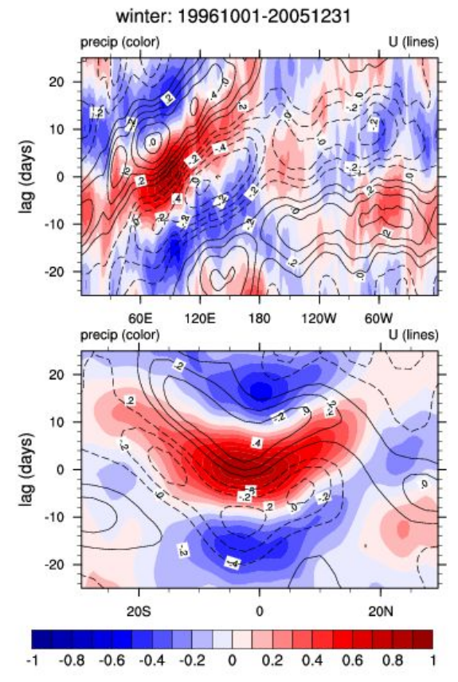
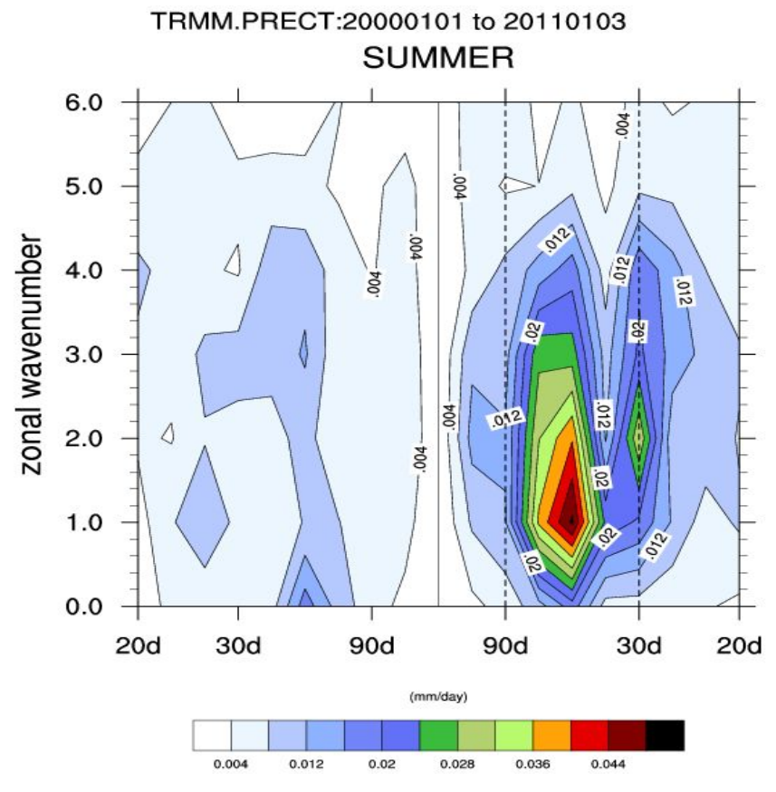
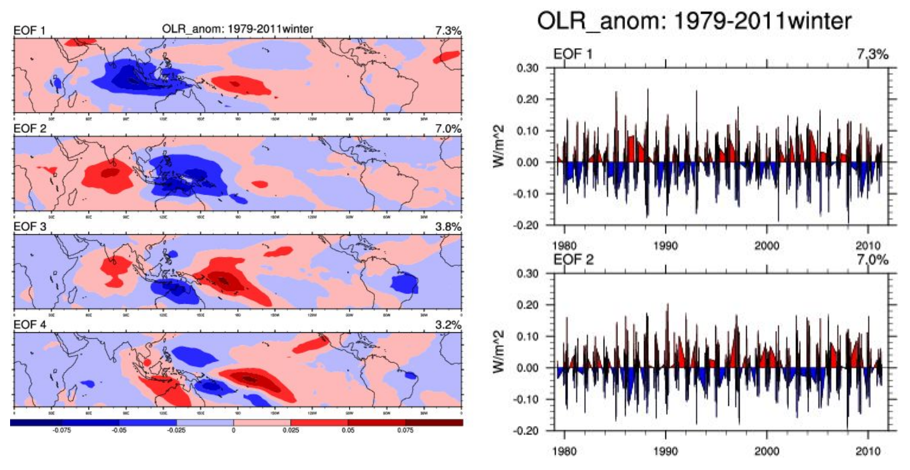
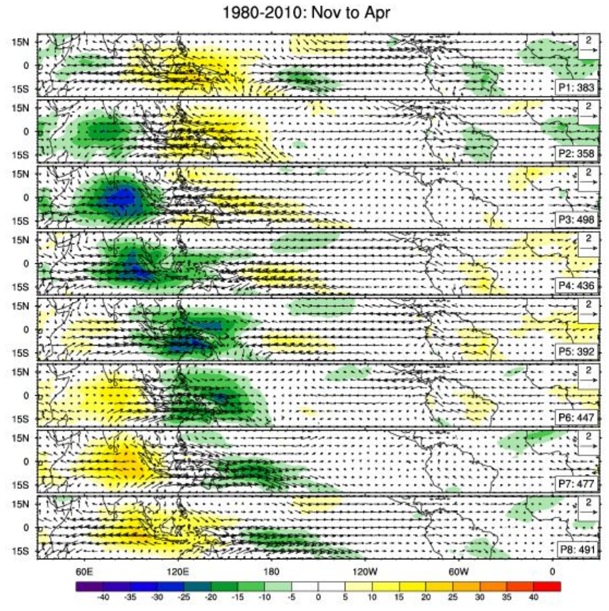

MJO Suite Diagnostic Module From NCAR
=====================================
Last update: 03/11/2019

This module computes many of the diagnostics described by the the ​US-CLIVAR Madden-Julian Oscillation (MJO) working group​ and developed by NCAR’s ​Dennis Shea for observational data​. Using daily precipitation, outgoing longwave radiation, zonal wind at 850 and 200 hPa and meridional wind at 200hPa, the module computes anomalies, bandpass-filters for the 20-100 day period, calculates the MJO Index as defined as the running variance over the bandpass filtered data, performs an EOF analysis, and calculates lag cross-correlations, wave-number frequency spectra and composite life cycles of MJO events.

Contact info
------------

| PI: Rich Neale, NCAR
| Current Developer: Dani Coleman (​bundy@ucar.edu​), NCAR
| Contributors: Dennis Shea, Andrew Gettleman, Jack Chen (NCAR)

Open source copyright agreement
^^^^^^^^^^^^^^^^^^^^^^^^^^^^^^^

This package is distributed under the LGPLv3 license (see LICENSE.txt).

Functionality
-------------

All scripts can be found at: ``mdtf/MDTF_$ver/var_code/MJO_suite``

1. Read in daily model output: daily_netcdf.ncl
2. Computes daily anomalies: daily_anom.ncl
3. Calculates EOFs: mjo_EOF.ncl
4. Creates​ ​MJO lag plots: mjo_lag_lat_lon.ncl
5. Calculates MJO spectra: mjo_spectra.ncl
6. Calculates principle component from EOF analysis: mjo_EOF_cal.ncl
7. MJO life cycle composite: mjo_life_cycle_v2.ncl

| Preprocessed observational data from NCEP, ERA and TRMM are located in ``mdtf/inputdata/obs_data/MJO_suite``.
| Place your input data at: ``mdtf/inputdata/model/$model_name/day``
| index.html can be found at: ``mdtf/MDTF_$ver/wkdir/MDTF_$model_name``

Required Programing Language and libraries
------------------------------------------

| All these scripts required NCAR Command Language Version 6.3.0 or higher
| The following Python packages are required: os, glob

Required input data to the module
---------------------------------

The following five 3-D (lat-lon-time) model fields are required with a daily time output

1. Precipitation rate (units: mm/s = kg/m\ |^2|/s) or mm/day with appropriate conversion
2. Outgoing Longwave radiation (units: W/m\ |^2|)
3. Zonal wind at 850hPa (units: m/s)
4. Zonal wind at 200hPa (units: m/s)
5. Meridional wind at 200hPa (units:m/s)

References
----------

   .. _1:

1. MJO Simulation Diagnostics, Waliser et al, 2009, *J.Clim.*, **​22**:​ 3006-3030, https://doi.org/10.1175/2008JCLI2731.1

More About the Diagnostic
-------------------------

An extensive explanation of the figures and techniques used to achieve them can be found on Dennis Shea’s NCL MJO CLIVAR page​. Some examples are provided below:

.. container:: clearer

|clearfloats|

**Lag Correlation**: Lag correlation diagram using on 20-100 day band-pass filtered daily data. The reference time series is the central Indian Ocean regional precipitation time series, which is correlated with precipitation and zonal wind anomalies in specified regions at different lags. Lag-longitude and lag-latitude plots of correlation values for different regions are shown. Color is for precipitation correlations while the lagged correlations for the zonal winds are the contours. These are analogous the Figures 5 and 6 in the reference article except they are for one season.

.. container:: clearer

|clearfloats|

**Wavenumber-Frequency Spectra**: The wavenumber - frequency spectra for each season, with vertical reference lines indicating at for 30 and 80 days.

.. container:: clearer

|clearfloats|

**EOF analysis (univariate)**: Conventional (covariance) univariate EOF analysis for 20-100 day band-pass filtered data of outgoing longwave radiation over 30S to 30N.

.. container:: clearer

|clearfloats|

**Composite Life-cycles**: The first and second principle components of the EOF analysis are used to derive the appropriate MJO phase category. The size of the reference anomaly wind vector is in the upper right. The phase (eg P3, means "Phase 3") and the number of days used to create the composite are at the lower right.

# https://stackoverflow.com/questions/4550021/working-example-of-floating-image-in-restructured-text

.. |clearfloats| raw:: html

   

.. |^2| replace:: \ :sup:`2`\ 
.. |^3| replace:: \ :sup:`3`\ 
.. |^-1| replace:: \ :sup:`-1`\ 
.. |^-2| replace:: \ :sup:`-2`\ 
.. |^-3| replace:: \ :sup:`-3`\ 