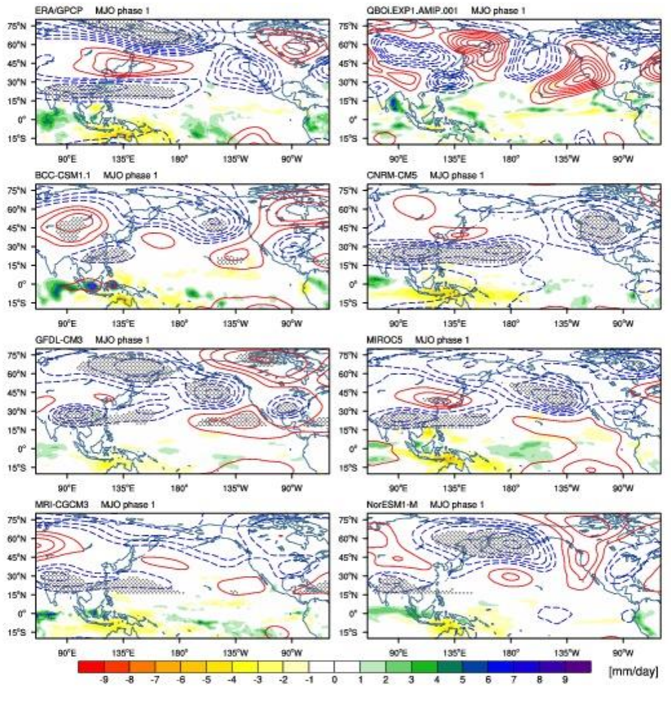
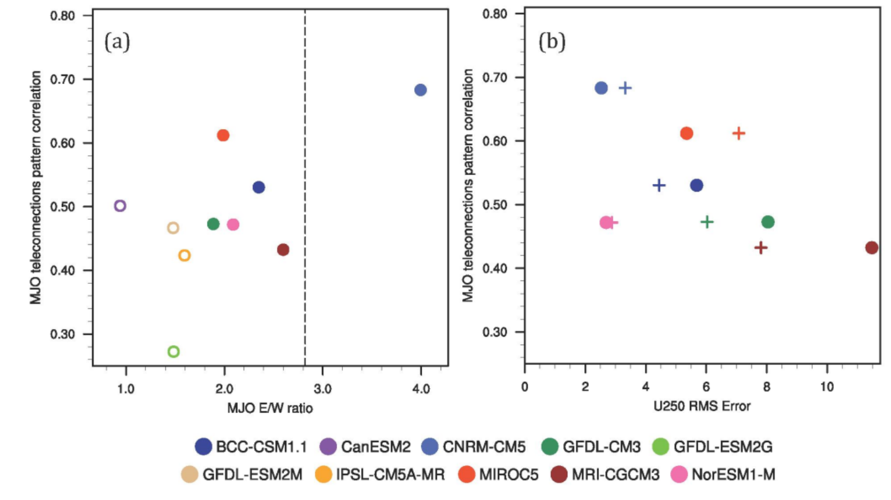

MJO Teleconnection Diagnostic Package
=====================================
Last Update: 2/1/2019

The teleconnection diagnostics first generate maps of MJO phase composites of 250 hPa geopotential height and precipitation for observations and several CMIP5 models, putting behavior of the candidate model within this cloud of models and observations. Then, average teleconnection performance across all MJO phases defined using a pattern correlation of geopotential height anomalies is assessed relative to 1) MJO simulation skill and 2) biases in the North Pacific jet zonal winds to determine reasons for possible poor teleconnections. Performance of the candidate model is assessed relative to a cloud of observations and CMIP5 simulations.

Contact info
------------

- PI: Eric D. Maloney (eric.maloney@colostate.edu), Colorado State University
- Current Developer: Bohar Singh (bohar.singh@colostate.edu), Colorado State University
- Contributors: Stephanie Henderson (University of Wisconsin–Madison), Bohar Singh (CSU)

Open source copyright agreement
^^^^^^^^^^^^^^^^^^^^^^^^^^^^^^^

This package is distributed under the LGPLv3 license (see LICENSE.txt).

Functionality
-------------

1. Calculation of RMM indices for a new model will be saved in ``wkdir/casename/MJO_teleconnection/model/netCDF`` in txt format (mjo_diag_RMM_MDTF.ncl)
2. Z250 phase composite for all MJO phases (mjo_diag_geop_hgt_comp_MDTF.ncl)
3. Pattern correlation with observation (ERA-I Z250) (mjo_diag_Corr_MDTF.ncl)
4. Precipitation (30S-30N) phase composite for all MJO phases (mjo_diag_prec_comp_MDTF.ncl)
5. Extended winter wave number-frequency power spectrum of precipitation to get the ratio of eastward and westward propagation power (mjo_diag_EWR_MDTF.ncl)
6. Area averaged DJF mean U250 error (model-observation) over Pacific Ocean (15N80N,120E-120W) (mjo_diag_U250_MDTF.ncl)
7. ncl script to plot teleconnection skill v/s MJO skill (mjo_diag_fig1_MDTF.ncl)
8. ncl script to plot teleconnection skill v/s basic state skill (mjo_diag_fig1_MDTF.ncl)

All scripts can be found at: ``mdtf/MDTF_$ver/var_code/MJO_teleconnection``

| Preprocessed data for 10 CMIP5 models and observations data is located at``mdtf/MDTF_$ver/obs_data/MJO_teleconnection``
| Keep your input data at: ``mdtf/MDTF__$ver/$model_name/day``
| Index.html can be found at: ``mdtf/MDTF_$ver/ wkdir/MDTF_$model_name``

Required Programing Language and libraries
------------------------------------------

| All these scripts required NCAR Command Language Version 6.3.0 or higher in addition to ncl
| The following Python packages are required: os, glob, json, Dataset, numpy, scipy, matplotlib & networkx, warnings, numba, netcdf4
| Please use Anaconda: These Python packages are already included in the standard installation

Required input data to the module
---------------------------------

The following five 3-D (lat-lon-time) model fields are required:

1. precipitation rate (units: mm/s = kg/m\ |^2|/s) or mm/day with appropriate conversion, daily avg
2. Outgoing Longwave radiation (units: W/m\ |^2|)
3. U850 wind (units: m/s)
4. U250 wind (units: m/s) (Note: U250 wind is used instead of u200 for RMM index calculation)
5. Z250 (units:m)

| Please change the variable names and conversion factor corresponding to your data before running the MJO teleconnection diagnostics at: ``var_code/util/set_variables_CESM.py``
| Please condense each input variable into a single file

References
----------

   .. _1:

1.  Henderson, S. A., Maloney, E. D., & Son, S. W. (2017). Madden–Julian oscillation Pacific teleconnections: The impact of the basic state and MJO representation in general circulation models. *Journal of Climate*, **30** (12), 4567-4587.

More About the Diagnostic
-------------------------

:ref:`Henderson et al (2017) <1>` documented reasons for MJO midlatitude teleconnection errors in CMIP5 models. Since MJO teleconnections have significant impacts on atmospheric rivers, blocking, and other extreme events in the midlatitudes, teleconnection errors in models have important implications for the subseasonal prediction of midlatitude weather extremes (e.g. Henderson et al. 2016; Mundhenk et al. 2018; Baggett et al. 2017). In addition to extended analyses of stationary wavenumber biases and use of a linear baroclinic model to diagnose CMIP model biases, :ref:`Henderson et al (2017) <1>` developed diagnostics linking teleconnection biases to biases in the position and extent of the North Pacific jet.

The first diagnostic in this POD presents MJO composite 250 hPa geopotential height anomalies for ERA-I, the candidate model (upper right), and six other CMIP5 models assessed to have good MJO performance. All composites are generated as a function of MJO phase as defined according to Wheeler and Hendon (2004). An example of this diagnostic is presented in Figure 1 for phase 1 of the MJO.

   Figure 1. MJO phase 1 pentad composites of anomalous 250-hPa geopotential height, where a pentad denotes a 5-day mean, in this case the average of lag days 0 - 4 following an MJO phase. ERA-I is shown in the upper left, and the candidate model in the upper right. Positive geopotential height anomalies are in red solid contours, and negative anomalies are in blue dashed contours. Contours are plotted every 10 m, and the zero contour is omitted. Anomalies found to be 95% significantly different from zero are dotted. The color shading shows the anomalous tropical precipitation composite during MJO phase 1.

The diagnostic next assesses teleconnection performance versus measures of basic state fidelity and MJO skill. Figure 2 from :ref:`Henderson et al (2017) <1>` contains two panels, each having MJO teleconnection performance during December-February on the y-axis. In Figure 2a, the x axis represents an MJO skill metric. While Figure 2a shows a relationship between MJO skill and teleconnection performance, even models with a good MJO can have poor teleconnection performance. For only the models assessed to have a sufficiently good MJO, Figure 2b assesses the relationship between teleconnection performance and biases in the North Pacific zonal flow. Plus signs are a measure of the total root mean squared (RMS) error of the 250 hPa zonal flow over the region 15°N – 60°N, 110°E – 120°W, and the filled circle provides a measure of the RMS error in the length of the North Pacific subtropical jet. Both measures are correlated with MJO teleconnection performance, although biases in the jet provides a somewhat better metric (r =-0.7 versus -0.6 for the total RMS). Subsequent analysis showed that models with a jet that extends too far east tend to have degraded teleconnection performance. Model physics appears to play a key role in the extent of the Pacific jet, as was demonstrated by Neelin et al. (2016) in diagnosing projected California precipitation changes between CMIP3 and CMIP5 models into the late 21st Century. The Pod developed here places the candidate model in question into the cloud of other models on Figure 2, with separate links on the POD site for left and right panels of Figure 2.

   Figure 2. From :ref:`Henderson et al (2017) <1>`. December-February teleconnection performance averaged across all MJO phases (y-axis) versus (a) MJO skill (MJO E/W ratio) and (b) the RMS error of the 250-hPa December-February zonal wind. The observed E/W precipitation (GPCP) ratio is provided (dashed line, left panel). The MJO skill is derived as the ratio of eastward to westward power of equatorial precipitation in the 30-60 day, zonal wavenumbers 1-3 band (e.g. Ahn et al. 2017). Teleconnection performance was determined as pattern correlation of North Pacific and North America (15°S - 80°N, 130°E - 60°W) MJO composite 250 hPa geopotential height anomalies between CMIP models and ERA-i reanalysis averaged over all MJO phases. In panel (b), the crosses show the model 250hPa zonal wind RMS error over the full Pacific basin, while the closed circles indicate the longitudinal RMS error of the subtropical jet.

.. |^2| replace:: \ :sup:`2`\ 
.. |^3| replace:: \ :sup:`3`\ 
.. |^-1| replace:: \ :sup:`-1`\ 
.. |^-2| replace:: \ :sup:`-2`\ 
.. |^-3| replace:: \ :sup:`-3`\ 