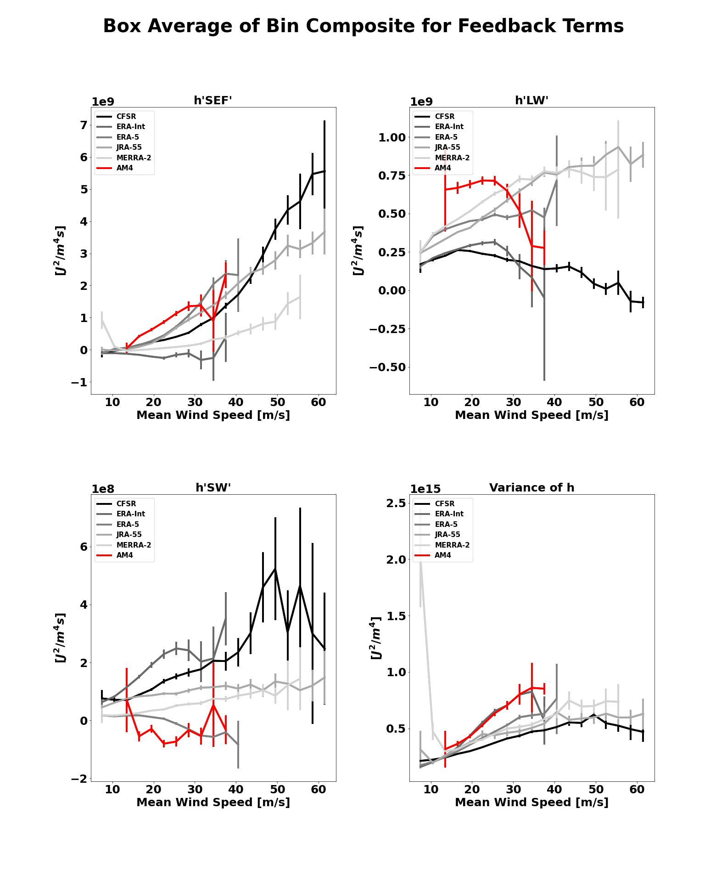

.. This is a comment in RestructuredText format (two periods and a space).

.. Note that all "statements" and "paragraphs" need to be separated by a blank 
   line. This means the source code can be hard-wrapped to 80 columns for ease 
   of reading. Multi-line comments or commands like this need to be indented by
   exactly three spaces.

.. Underline with '='s to set top-level heading: 
   https://docutils.sourceforge.io/docs/user/rst/quickref.html#section-structure

TC MSE Variance Budget Analysis
===============================

Last Update: 2/16/2023

This POD computes the column-integrated mosit static energy (MSE) and its variance budget for
TC snapshots which are generated using track data. These model snapshots are then composited and compared 
to 5 reanalysis datasets which the same above computations have also been completed prior.

.. Underline with '-'s to make a second-level heading.

Version & Contact info
----------------------

- Version/revision information: version 1 (2/16/2023)
- PI: Allison Wing, Florida State University, awing@fsu.edu
- Developer/point of contact: Jarrett Starr, Florida State University, jstarr2@fsu.edu
- Other Contributors: Caitlin Dirkes, Suzana Camargo, Daehyun Kim

.. Underline with '^'s to make a third-level heading.

Open source copyright agreement
^^^^^^^^^^^^^^^^^^^^^^^^^^^^^^^

The MDTF framework is distributed under the LGPLv3 license (see LICENSE.txt). 
Unless you've distributed your script elsewhere, you don't need to change this.

Functionality
-------------

Track data is read in as a .txt file to gather the center latitude and longitude position, maximum velocity (vmax), minimum sea leavel pressure, 
and the date at each timestep. Once the track data is read in, it is then used to create tropical cyclone (TC) snapshots following the storm in 
a 10 degree by 10 degree box. Each snapshot then has the column-integrated moist static energy (MSE) calculated as well as the longwave, shortwave,
and surface flux feedbacks in the MSE variance budget equation. Then, the snapshots are trimmed to only account for times where the TC is intensifying
and is equatorward of 30 degrees. The remaining snapshots are then binned by vmax in 3 meter per second bins and box-averaged values of each snapshot are 
calculated. These binned snapshots and their box averages are composited across the bins. The composites are then used for analysis comparing to 5 reanalysis 
datasets (ERA-5, ERA-Interim, MERRA-2, CFSR, JRA-55) which have already been run through the above framework. Plots of the composite spatial view of feedback 
terms and anomaly of MSE for select bins are made for each reanalysis and model. The composite spatial views are azimuthally-averaged and plotted comparing across 
different bins for each feedback term. The bin composites of box-averaged feedbacks are compared across the various vmax bins, which a feedback-normalized 
version of this plot is made as well. The bin composites of box-averaged feedbacks are also scattered by percent of storms intensifying from one bin to another,
which again a feedback-normalized version of this plot is also created.

When and how each of the scripts are utilized in the driver script (TC_MSE_Driver.py) is as follows:

1. TC_snapshot_MSE_calc.py is called which is where the snapshotting of each TC timestep is done along with the afromentioned calculations
and files are created and saved by year.

2. Binning_and_compositing.py is called which takes all of the files that were created in step 1, concatenates them, and then bins as well as composites each
of the snapshots and its variables by vmax. The budget variables are also box-averaged and normalized in this step as well.

3. Plotting.py is called which imports all of the plotting functions that are in the Plotting_Functions.py script and generates then saves the plots that are 
desired. The user may comment out any of the plotting functions that are called in the Plotting.py script they do not want. 

Required programming language and libraries
-------------------------------------------

Written using conda version 4.10.1 and python version 3.10

matplotlib, numpy, pandas, xarray, scipy, sys

Required model output variables
-------------------------------

The following 3-D (time-lat-lon) and 4-D (time-plev-lat-lon) variables are required:

3-D Variables:

Surface Downwelling LW Flux in Air, Units: W m-2, Frequency: 6-hourly
Surface Downwelling SW Flux in Air, Units: W m-2, Frequency: 6-hourly
Surface Upwelling LW Flux in Air, Units: W m-2, Frequency: 6-hourly
Surface Upwelling SW Flux in Air, Units: W m-2, Frequency: 6-hourly
Surface Upward Latent Heat Flux, Units: W m-2, Frequency: 6-hourly
Surface Upward Sensible Heat Flux, Units: W m-2, Frequency: 6-hourly
Top of Atmosphere Outgoing LW Flux, Units: W m-2, Frequency: 6-hourly
Top of Atmosphere Outgoing SW Flux, Units: W m-2, Frequency: 6-hourly
Top of Atmosphere Incoming SW Flux, Units: W m-2, Frequency: 6-hourly

4-D Variables:

Air Temperature, Units: K, Frequency: 6-hourly
Geopotential Height, Units: m, Frequency: 6-hourly
Specific Humidity, Units: 1.0, Frequency: 6-hourly

References
----------

1. Wing, A. A., Camargo, S. J., Sobel, A. H., Kim, D., Moon, Y., Murakami, H., Reed, K. A., Vecchi, G. A., Wehner, M. F., 
Zarzycki, C., & Zhao, M. (2019). Moist Static Energy Budget Analysis of Tropical Cyclone Intensification in High-Resolution Climate Models, 
Journal of Climate, 32(18), 6071-6095, https://doi.org/10.1175/JCLI-D-18-0599.1.

2. Dirkes, C. A., Wing, A. A., Camargo, S. J., Kim, D. (2022). Process-oriented diagnosis of tropical cyclones in reanalyses using a moist static
energy variance budget, Journal of Climate (In review).

More about this diagnostic
--------------------------

The MSE variance budget has been shown in Wing et al. (2019) to play an important role in the development of TCs. The MSE variance budget equation is shown below:

.. math::

   \frac{1}{2}\frac{\partial \hat{h}'^2}{\partial t} = \hat{h}' F'_{k} + \hat{h}' N'_{L} + \hat{h}' N'_{S} - \hat{h}'(\widehat{\vec{u}\cdot \nabla  h})'.

There are three diabatic feedback terms (on the RHS) which from left to right are the surface flux, longwave, and shortwave feedback respectively. The far right 
feedback is the advective term which we do not calculate in the framework as we focus on the three diabatic terms only. Each of the feedback terms are considered 
sources and sinks of MSE variance. The prime notation indicates the anomaly from the box average value of the given variable. For example, each 10 by 10 degree 
snapshot has column-integrated MSE (:math:`\hat{h}`) calculated at each grid box in the snapshot. To get the anomaly you take the box average of the snapshot and 
take the difference between the snapshot's box average value of column-integrated MSE and the column-integrated MSE at each grid box. Anomalies are also computed 
for the surface enthalpy flux (:math:`F'_{k}`), column longwave radiative flux convergence (:math:`N'_{L}`), and the column shortwave radiative flux 
convergence (:math:`N'_{S}`). When these flux anomalies are multiplied by the column-integrated MSE anomaly, we then have our full diabatic feedback terms which 
tell us the sources and sinks of MSE variance. 

Sources of MSE variance are seen when a feedback term is positive, or when the moist regions get more moist and dry regions get more dry. Sinks of MSE variance 
are seen when a feedback term is negative, or in the case where dry regions are being moistened and moist regions are being dried. In the areas closest to the TC 
center, anomalies of column-integrated MSE will tend to be above the box average value giving a positive value of :math:`\hat{h}'`. In the event that a model or 
reanalysis has the ability to detect an eye-like feature for a TC, the winds will be more calm in the center giving rise to a smaller surface enthalpy flux and a 
negative value of :math:`F'_{k}`. Therefore, in this scenario we would observe the surface flux feedback term being a sink of MSE variance. This can be observed in 
the spatial composite plots of the finer horizontal resolution reanalyses that pick up on the eye-like features which we typically observe in TCs. It has been shown 
in Wing et al. (2019) and Dirkes et al. (2022) that sources of MSE variance play an important role in TC development and its intensification to its lifetime maximum
intensity (LMI).

The binning of these snapshots are done based on vmax so we can keep the snapshot compositing consistent across different storms. Wing et al. (2019) notes that
if we composite based on time leading up to LMI, the strength of the feedbacks will vary in a given snapshot as the LMI and preceding vmax for each storm can be 
vastly different between any given storm. Therefore, by binning in 3 m/s bins we maintain a consistency between snapshots in each storm which allows us to 
composite feedbacks that do not vary greatly in strength or magnitude in a given bin.

Prior work done in Wing et al. (2019) and Dirkes et al. (2022) note the importance of the various plots generated in this POD. The spatial composite panel plotting
allows one to see a given model's spatial representation of the three diabatic feedback terms in comparison with the 5 reanalyses used in this POD for a given bin.
The azimuthal mean plotting gives another vantage point as to how the composited snapshots vary with radial distance from the center by intensity bin. This shows a line plot
of the afromentioned spatial composite plots and calculates the azimuthal average value radially outward from the center to show how the feedback changes as you distance
from the center. What can be noted is that as you distance farther from the center, all the feedbacks tend to approach zero which results from being too far from
the influence of the TC. Using the box-averaged values of the snapshot feedbacks, we can see how those values after being averaged across each bin vary as you increase in 
intensity. It can be noted that as a storm increases in intensity, the areas nearest the TC become more moist so the variance of column-integrated MSE increases as you 
increase in intensity. The three diabatic feedbacks also tend to increase as you increase in intensity. Each bin also has spread between box-averaged values used in the compositing, 
to account for this error bars noting the 5 to 95% confidence interval are calculated and plotted for each feedback in each bin. The starting point for these box-averaged plots is 
the 6 to 9 m/s bin and for a bin to be plotted there must be sufficient sample size (at least two) in the bins used for adequate error bars. An example of this plot can be noted below.

.. _my-figure-tag:

The normalized version of these box-averaged feedbacks are also calculated which is done by dividing each grid point by the column-integrated MSE variance. This is done to remove 
the effect of column-integrated MSE anomalies increasing as a storm is intensifying. This allows one to look at the feedbacks as a growth rate of column-integrated MSE per day. 
The last plots are looking at the percent of storms that intensify from one bin to the next as a function of feedback value. This is done to try and attribute some of the TC 
climatological differences seen in modeling and the reanalyses used to their physical processes represented. These plots also use the same error bars as the previous plots for each of 
the normalized and non-normalized feedbacks.
