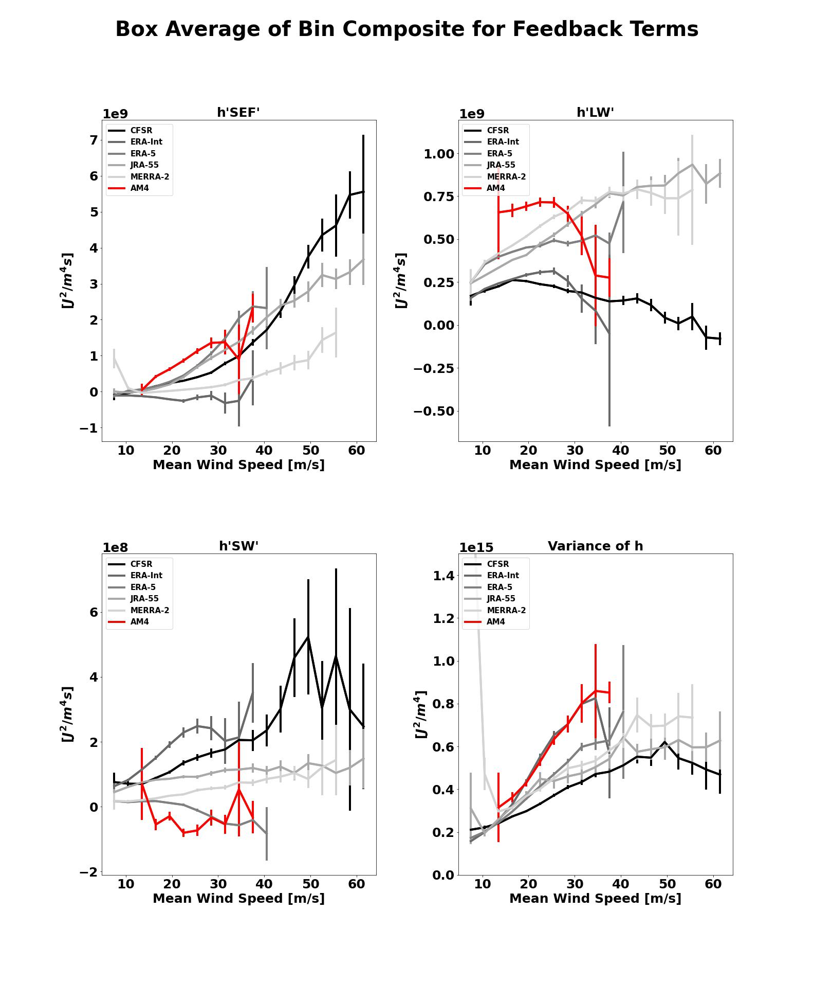

.. This is a comment in RestructuredText format (two periods and a space).

.. Note that all "statements" and "paragraphs" need to be separated by a blank 
   line. This means the source code can be hard-wrapped to 80 columns for ease 
   of reading. Multi-line comments or commands like this need to be indented by
   exactly three spaces.

.. Underline with '='s to set top-level heading: 
   https://docutils.sourceforge.io/docs/user/rst/quickref.html#section-structure

TC MSE Variance Budget Analysis
===============================

Last Update: 2/22/2023

This POD computes the column-integrated moist static energy (MSE) and terms in the budget for its spatial variance for tropical cyclones (TCs). The budget terms are computed along the tracks of individual simulated TCs and them composited as a function of the TC intensity (maximum near-surface wind speed) of each snapshot. The results are compared to equivalent calculations from 5 reanalysis datasets.

.. Underline with '-'s to make a second-level heading.

Version & Contact info
----------------------

- Version/revision information: version 1 (2/22/2023)
- PI: Allison Wing, Florida State University, awing@fsu.edu
- Developer/point of contact: Jarrett Starr, Florida State University, jstarr2@fsu.edu
- Other Contributors: Caitlin Dirkes, Suzana Camargo, Daehyun Kim

.. Underline with '^'s to make a third-level heading.

Open source copyright agreement
^^^^^^^^^^^^^^^^^^^^^^^^^^^^^^^

The MDTF framework is distributed under the LGPLv3 license (see LICENSE.txt). 
.. Unless you've distributed your script elsewhere, you don't need to change this.

Functionality
-------------

In the current implementation of the POD, pre-calcluated tropical cyclone (TC) track data is also required as an input to the POD as obs data. The POD is currently written to accept track data as a formatted .txt file. The code extracts the TC center latitude and longitude, maximum near surface wind speed (vmax), and minimum sea level pressure at each time along the track of each storm. The code then extracts the necessary variables to compute the column-integrated moist static energy (MSE) and the longwave, shortwave, and surface flux feedbacks in the budget for the spatial variance of column-integrated MSE, in 10 x 10 degree boxes along the tracks of each TC. Then, the snapshots are trimmed to only account for times where the TC is intensifying (snapshots prior to each storms lifetime maximum intensity) and is equatorward of 30 degrees. The remaining TC snapshots are then binned by vmax in 3 m/s increment, and then composited over each bin. The model composites are then compared to 5 reanalysis 
datasets (ERA-5, ERA-Interim, MERRA-2, CFSR, JRA-55) which have already been processed through the above framework. The plots include composite TC-relative spatial maps of the feedback terms and MSE anomaly for select bins, azimuthal averages of the feedback terms for select bins, and box-averages of the feedback terms for all bins. A normalized version of the box-average plot is also included, in which the feedbacks at each grid point are normalized by the value of the box-average MSE variance for that snapshot. The normalization is performed prior to compositing. Finally, the box-averaged feedbacks and normalized box-averaged feedbacks in select bins are plotted against the percent of storms intensifying from one bin to another.

When and how each of the scripts are utilized in the driver script (TC_MSE_Driver.py) is as follows:

1. TC_snapshot_MSE_calc.py is called first to extract the data and compute the MSE variance budget along the tracks of all the TCs. The resulting data is saved into a file for each year. 

2. Binning_and_compositing.py is called which takes all of the files that were created in step 1, concatenates them, and then bins as well as composites each
of the snapshots and its variables by vmax. The budget variables are also box-averaged and normalized in this step as well.

3. Plotting.py is called which imports all of the plotting functions that are in the Plotting_Functions.py script and generates and saves the plots that are 
desired. The user may comment out any of the plotting functions that are called in the Plotting.py script they do not want. 

Required programming language and libraries
-------------------------------------------

Written using conda version 4.10.1 and python version 3.10

matplotlib, numpy, pandas, xarray, scipy, sys

Required model output variables
-------------------------------

The following 3-D (time-lat-lon) and 4-D (time-plev-lat-lon) variables are required:

3-D Variables:

Surface Downwelling Longwave Flux in Air (rlds), Units: W m-2, Frequency: 6-hourly 
Surface Downwelling Shortwave Flux in Air (rsds), Units: W m-2, Frequency: 6-hourly
Surface Upwelling Longwave Flux in Air (rlus), Units: W m-2, Frequency: 6-hourly
Surface Upwelling Shortwave Flux in Air (rsus), Units: W m-2, Frequency: 6-hourly
Surface Upward Latent Heat Flux (hfls), Units: W m-2, Frequency: 6-hourly
Surface Upward Sensible Heat Flux (hfss), Units: W m-2, Frequency: 6-hourly
Top of Atmosphere Outgoing Longwave Flux (rlut), Units: W m-2, Frequency: 6-hourly
Top of Atmosphere Outgoing Shortwave Flux (rsut), Units: W m-2, Frequency: 6-hourly
Top of Atmosphere Incoming Shortwave Flux (rsdt), Units: W m-2, Frequency: 6-hourly

4-D Variables:

Air Temperature (ta), Units: K, Frequency: 6-hourly instantaneous
Geopotential Height (zg), Units: m, Frequency: 6-hourly instantaneous
Specific Humidity (hus), Units: g g-1, Frequency: 6-hourly instantaneous

In order to have sufficient samples, we recommend enough years of data to have at least 100 TCs, which is typically 2-5 years of simulation time depending on the resolution of the model.

In the current implementation of the POD, pre-calcluated TC track data is also required as an input to the POD as obs data. If future versions incorporate TC tracking directly, additional model output variables will be required.

References
----------

1. Wing, A. A., Camargo, S. J., Sobel, A. H., Kim, D., Moon, Y., Murakami, H., Reed, K. A., Vecchi, G. A., Wehner, M. F., 
Zarzycki, C., & Zhao, M. (2019). Moist Static Energy Budget Analysis of Tropical Cyclone Intensification in High-Resolution Climate Models, 
Journal of Climate, 32(18), 6071-6095, https://doi.org/10.1175/JCLI-D-18-0599.1.

2. Dirkes, C. A., Wing, A. A., Camargo, S. J., Kim, D. (2022). Process-oriented diagnosis of tropical cyclones in reanalyses using a moist static
energy variance budget, Journal of Climate (In review).

More about this diagnostic
--------------------------

The MSE variance budget has been shown to capture the role of important physical processes in the development of TCs (Wing et al. 2016; Wing et al. 2019; Wing 2022). A budget for the spatial variance of column-integated MSE is given by:

.. math::

   \frac{1}{2}\frac{\partial \hat{h}'^2}{\partial t} = \hat{h}' F'_{k} + \hat{h}' N'_{L} + \hat{h}' N'_{S} - \hat{h}'(\widehat{\vec{u}\cdot \nabla  h})'.

The hat notation indicates a mass-weighted column integral. There are three diabatic feedback terms (on the RHS) which from left to right are the surface flux, longwave, and shortwave feedback respectively. The far right feedback is the advective term which we do not calculate in this POD as we focus on the three diabatic terms only. Each of the feedback terms are considered sources and sinks of MSE variance. The prime notation indicates the anomaly from the average value of the given variable over a box centered on the TC. For example, for each snapshot along the track of each TC, the column-integrated MSE (:math:`\hat{h}`) is calculated as the anomaly of the column-integrated MSE at each grid point within a 10 x 10 degree box centered on the TC from its cosine-latitude weighted mean over that box. Anomalies are also computed for each of the diabatic sources and sinks of column-integrated MSE: surface enthalpy flux (:math:`F'_{k}`), column longwave radiative flux convergence (:math:`N'_{L}`), and the column shortwave radiative flux convergence (:math:`N'_{S}`).  

Sources of MSE variance are seen when a feedback term is positive, which occurs when an individual grid point has anomalies of column-interated MSE and anomalies of its source/sink of the same sign. That is, if there is an anomalous source of column-integrated MSE at the same place where the column-integrated MSE is already anomalously large, this will amplify the MSE anomaly and act to increase the MSE variance. Since the spatial variability of MSE in the tropical atmosphere (even in TCs) is dominated by moisture variability, an increase in MSE spatial variance reflects that the moist regions get moister and the dry regions get drier. Conversely, sinks of MSE variance are termed negative feedbacks, where dry regions are being moistened and moist regions are being dried. 

As an example, in the areas closest to the TC center, column-integrated MSE will tend to be above the box average value giving a positive value of :math:`\hat{h}'`. In the event that a model or reanalysis has the ability to detect an eye-like feature for a TC, the winds will be more calm in the center giving rise to a smaller surface enthalpy flux and a 
negative value of :math:`F'_{k}`. Therefore, in this scenario we would observe the surface flux feedback term being a sink of MSE variance in that location. This can be observed in the spatial composite plots of the finer horizontal resolution reanalyses that pick up on the eye-like features in TCs. Since MSE variance increases with TC intensity, sources of MSE variance play can be interpreted as contributing to TC development (Wing et al. 2019; Dirkes et al. 2022).

In order to compare across TC snapshots of similar intensity, we bin the MSE variance and its diabatic feedbacks based on the maximum near surface wind speed of the TC (vmax). 
Wing et al. (2019) noted that if we composite based on time leading up to LMI, the strength of the feedbacks will vary in a given snapshot as the LMI and preceding vmax for each storm can be vastly different between any given storm, and across models or reanalyses. Therefore, by binning in 3 m/s bins we can compare the feedback representation at a given intensity across different mdels or between models and reanalyses. 

The plots provided as part of this POD follow those from Wing et al. (2019) and Dirkes et al. (2022). The spatial composite panel plotting allows one to see a given model's spatial representation of the three diabatic feedback terms in comparison with 5 modern reanalyses, for one intensity bin. The azimuthal mean plots reduce the dimensionality and reveal how the feedbacks vary with radial distance from the TC center in each intensity bin. What can be noted is that as the distance from the TC center increases, all the feedbacks tend to approach zero which results from being too far from the influence of the TC. Further reducing the dimensionality, the box-averaged feedback intensity bin composites show how the average of the feedback over the entire TC-centered box depend on TC intensity, and for a given intensity, the model can becompared to the reanalyses.  It can be noted that as a storm increases in intensity, the areas nearest the TC become warmer and moister, and thus the variance of column-integrated MSE increases. The three diabatic feedbacks also tend to increase with intensity. Error bars indicate the 5-95% confidence interval for the box-average feedback. The values are only plotted if there are at least two samples in that bin, though in practice more than 50 samples must be present for the error bars to be small. Thus, the first bin that is plotted is the 6 to 9 m/s bin but the models and reanalyses are best compared between intensities of 10 and 30 m/s. An example of this plot is shown below where the CMIP6 GFDL CM4 AMIP simulation (doi:10.22033/ESGF/CMIP6.8494) is compared to the reanalyses.

.. _my-figure-tag:

The normalized version of these box-averaged feedbacks are also calculated which is done by dividing the feedback at each grid point by the box-averaged column-integrated MSE variance, prior to doing the intensity bin composites. This is done to remove the effect of column-integrated MSE anomalies increasing as a storm is intensifying, as well as account for different baseline representations of MSE variability across different models/reanalyses. The normalized feedbacks can be interprted as a growth rate of MSE variance per day. 

The final plot relates the percentage of storms that intensify from one intensity bin to the next to the value of the diabatic feedbacks at the starting intensity. This can be used to help attribute intermodel variability in TC intensification to process representation as quantified by the MSE variance budget feedbacks. For example, Wing et al. 2019 showed that models that had a larger surface flux feedback at a given intensity produced more intense TCs on average. Across reanalyses, Dirkes et al. 2022 showed that reanalyses that had a larger longwave feedback at a given intensity produced a greater fraction of TCs that intensified further. 

Additional References
^^^^^^^^^^^^^^^^^^^^^^^^^^^^^^^
1. Wing, A.A., S.J. Camargo, and A.H. Sobel (2016), Role of radiative-convective feedbacks in spontaneous tropical cyclogenesis in idealized numerical simulations, J. Atmos. Sci., 73, 2633-2642, doi:10.1175/JAS-D-15-0380.1.

2. Wing, A.A. (2022): Acceleration of tropical cyclone development by cloud-radiative feedbacks, J. Atmos. Sci., 79, 2285–2305, doi:10.1175/JAS-D-21-0227.1.
