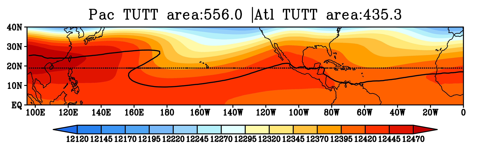

Tropical Upper Tropospheric Trough Diagnostic Documentation
================================

Last update: 6/28/2021

The vertical profiles of diabatic heating have important implications for large-scale dynamics, especially for the coupling between the large-scale atmospheric circulation and precipitation processes. We adopt an objective approach to examine the top-heaviness of vertical motion (Back et al. 2017), which is closely related to the heating profiles and a commonly available model output variable. The diagnostic metric can also be used to evaluate the diabatic heating profile.

Version & Contact info
----------------------

.. '-' starts items in a bulleted list:
   https://docutils.sourceforge.io/docs/user/rst/quickref.html#bullet-lists

- Version/revision information: version 1.0 (5/21/2021)
- PI: Zhuo Wang, zhuowang@illinois.edu, DAS UIUC)
- Developer/point of contact ( , DAS UIUC; Zhuo Wang, zhuowang@illinois.edu, DAS UIUC)

.. Underline with '^'s to make a third-level heading.

Open source copyright agreement
^^^^^^^^^^^^^^^^^^^^^^^^^^^^^^^

The MDTF framework is distributed under the LGPLv3 license (see LICENSE.txt).

Functionality
-------------

The currently package consists of following functionalities:

(1) Calculation of the fractional variance of vertical velocity at each grid point explained by two base functions (i.e., idealized deep convection profile, idealized deep stratiform profile)

(2) Calculation of the top-heaviness ratio (O2/O1)

(3) Other analysis (to be added soon)

(**) cropping.py can be referenced if code is needed to either shift the grid of your data
or to crop your data to a specified region

As a module of the MDTF code package, all scripts of this package can be found under
``mdtf/MDTF_$ver/diagnostics/top_heaviness_ratio``

Required programming language and libraries
-------------------------------------------

Python3 packages: "netCDF4", "xarray", "numpy", "scipy", "matplotlib", "basemap"

Required model output variables
-------------------------------

3-D spatial dimension Omega (units: Pa/s), which can be either the monthly mean in a certain year or the long-term monthly mean (or seasonal) mean.

References
----------

.. _ref-Muñoz1:

Back, L. E., Hansen, Z., & Handlos, Z. (2017). Estimating vertical motion profile top-heaviness: Reanalysis compared to satellite-based observations and stratiform rain fraction. Journal of the Atmospheric Sciences, 74(3), 855-864. https://doi.org/10.1175/JAS-D-16-0062.1

Jiacheng and Zhuo's paper is under developing...

More about this diagnostic
--------------------------

Q1 and Q2 (Figure 1a) are two prescribed base functions. Following Back et al. (2017), Q1 as a half sine function, and Q2 as a full sine function, which represent the idealized deep convection profile and the idealized deep stratiform profile, respectively. The vertical velocity can be approximated by Q1 and Q2:
ω'(x,y,p) = O1(x,y,t) * Q1(p) + O2(x,y,t)*Q2(p)

Holding O1 as positively defined, when the ratio of r=O2/O1 increases from -1 to 1, ω' transitions from a bottom-heavy profile to a top-heavy profile (Figure 1b). 
To assess how well ω' approximates ω, the fractional variance (R2 between the reconstructed Omega and original Omega profiles) is calculated over each grid point. As shown in Figure 2,  ω' explains more than 80% of the vertical variances over most tropical/subtropical oceanic grid points.

   

   Figure 1. Left: Q1 and Q2; Right: Vertical motion profiles constructed from varying top-heaviness ratio (r; r=-1: dark blue, r=1: dark red).
   
your txt name
^^^^^^^^^^^^^

Explain the data inside of your txt file and its writing format 

for example:

TUTT_contour_lat_1979-Ug_2.0.txt
^^^^^^^^^^^^^^^^^^^^^^^^^^^^^^^^^^^^^^

Open source copyright agreement
^^^^^^^^^^^^^^^^^^^^^^^^^^^^^^^

The corrdinates of TUTT contour given by 200 hPa zonal geostrophic wind (Ug) at value 2 m/s.

   

