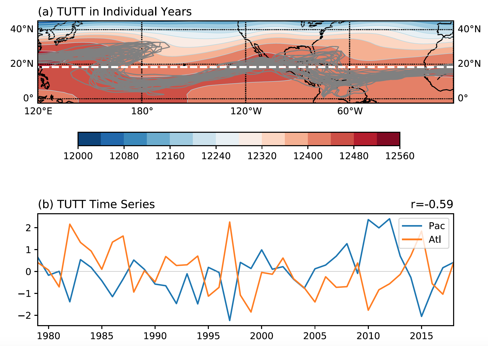

Tropical Upper Tropospheric Trough Diagnostic Documentation
================================

Last update: 7/2/2021

The summertime stationary waves consist of two upper-level monsoon anticyclones and two mid-ocean troughs in the subtropics (Fig. 1). The latter are also known as tropical upper-tropospheric troughs (TUTTs). The summertime stationary waves are modulated by various climate modes (e.g., the ENSO, AMO, PDO and PMM) and are associated with monsoon variability (Chang et al. 2021). In addition, TUTTs are the preferred regions for extratropical Rossby wave breaking. Wang et al. (2020) showed that summertime stationary waves integrate tropical and extratropical impacts on tropical cyclone activity. In particular, a TUTT index provides a useful metric to represent the collective impacts (Table 1) and can be used to assess climate model representation of subtropical stationary waves. 

As shown in Fig. 1, a TUTT is characterized by enhanced westerly flow in its south. A TUTT index is defined based on the geostrophic zonal flow as described below. This diagnostic package can be used to evaluate 200-hPa TUTT area in both climate models and reanalysis datasets.

Version & Contact info
----------------------

.. '-' starts items in a bulleted list:
   https://docutils.sourceforge.io/docs/user/rst/quickref.html#bullet-lists

- Version/revision information: version 1.0 (7/2/2021)
- PI: Zhuo Wang, zhuowang@illinois.edu, DAS UIUC)
- Developer/point of contact (Zhuo Wang, Gan Zhang, Chuan-Chieh Chang, and Jiacheng Ye/Zhuo Wang, zhuowang@illinois.edu, DAS UIUC)

.. Underline with '^'s to make a third-level heading.

Open source copyright agreement
^^^^^^^^^^^^^^^^^^^^^^^^^^^^^^^

The MDTF framework is distributed under the LGPLv3 license (see LICENSE.txt).

Functionality
-------------

The package consists of the following functionalities:

1.	Calculates constant-f geostrophic zonal winds (Ug) using 200-hPa geopotential height for a fixed Coriolis parameter at 15N.

2.	Identifies the circumglobal contour of the long-term seasonal mean Ug = 1.0 m/s. The zonal-mean latitude of this circumglobal contour is chosen as the reference latitude. The value of Ug can be adjusted by the user, usually ranging from 0.5 to 2.0 m/s. A small positive number is used because the associated Ug contour is more robust than the zero contour.

3.	The TUTT index is defined as the area where the circumglobal contour of seasonal mean Ug extends southward of the reference latitude. Two TUTT areas are calculated, one for the North Pacific and one for the North Atlantic.

4.	In addition to TUTT area, the centroid locations of TUTTs (i.e., latitude and longitude) are also calculated.

5.	The reference latitude, area, and centroid location of two TUTTs are output as .txt files, and figure is plotted showing the year-to-year variability TUTTs (Fig. 2).

(**) cropping.py can be referenced if code is needed to either shift the grid of your data
or to crop your data to a specified region

As a module of the MDTF code package, all scripts of this package can be found under
``mdtf/MDTF_$ver/diagnostics/TUTT

Required programming language and libraries
-------------------------------------------

Python3 packages: "netCDF4", "skimage", "numpy", "scipy", "shapely.geometry", "cartopy"

Required model input variables
-------------------------------

Monthly mean 200-hPa geopotential height field for multiple years (e.g., 1979.01-2018.12) in the netCDF format is the only required input variable. Horizontal resolution of the geopotential height field can be decided by the user, but it is recommended to use a resolution of 2.0 degrees or coarse to ensure the smoothness of the Ug contours. Note that the longitude index of the data goes from west to east (0-360E).

References
----------

.. _ref-Muñoz1:

Wang, Z., Zhang, G., Dunkerton, T. J., & Jin, F. F. (2020). Summertime stationary waves integrate tropical and extratropical impacts on tropical cyclone activity. Proceedings of the National Academy of Sciences of the United States of America, 117(37), 22720-22726. https://doi.org/10.1073/pnas.2010547117

Chang, C.-C., Z. Wang and coauthrs, 2021: Summertime Subtropical Stationary Waves: Variability and Impacts on the Tropical Cyclone Activity. In preparation.

More about this diagnostic
--------------------------

1.	Weak westerly wind sometimes extends southward of the equator and connects to the westerlies over the Southern Hemisphere in reanalysis datasets. We therefore choose to use the zonal geostrophic wind with a fixed Coriolis parameter instead of the total zonal wind.
2.	Pacific TUTT and Atlantic TUTT sometimes are connected to each other in some CMIP models. This happens during the years when the 200-hPa anticyclone over the Central America is weak, especially in the CMIP models that underestimate the North American monsoon strength. The longitude of 95W is used to divide the two TUTTs in this situation. 
   

   
   Figure 1. The 200-hPa wind vectors and streamlines during June-August in 1967 (Krishnamurti 1970). The colored lines highlight the monsoon anticyclones and TUTTs. 
   

   
Figure 2. (a) Long-term mean 200-hPa geopotential height (shading; units: m), the reference latitude for TUTTs (white dashed line), and the contours of 𝑢g=1.0 𝑚 𝑠* for individual years from 1979-2018; (b) the time series of the normalized TUTT_Pac and TUTT_Atl indices. The correlation between TUTT_Atl and TUTT_Pac is shown at the upper right corner of panel (b) (From Wang et al. 2020). 
   

   
   Table 1. Correlation coefficients between different TUTT indices and the TC activity indices over three basins during JASO 1979–2018. The correlations between the Nino3.4 index and TC indices are also shown for comparison. TCF: tropical cyclone frequency; HURR: hurricane frequency; ACE: accumulated cyclone energy. Asterisk denotes correlations below the 95% confidence level. (From Wang et al. 2020). 
   

Descriptions of outputted .txt files:

TUTT_contour_lat_1958-Ug_2.0.txt/TUTT_contour_lon_1958-Ug_2.0.txt
^^^^^^^^^^^^^^^^^^^^^^^^^^^^^^^^^^^^^^
The coordinates (latitude and longitude) of TUTT contour given by 200 hPa zonal geostrophic wind (Ug) at value 2 m/s.

TUTT_ref_lat_1958-Ug_2.0.txt/TUTT_contour_lon_1958-Ug_2.0.txt
^^^^^^^^^^^^^^^^^^^^^^^^^^^^^^^^^^^^^^
The coordinates (latitude and longitude) of reference latitude.

TUTT_contour_length_1958-Ug_2.0.txt
^^^^^^^^^^^^^^^^^^^^^^^^^^^^^^^^^^^^^^
Length (i.e., number of points) of TUTT contour.

tutt_Area_lat-1958-1958JASO-Ug_2.0.txt/tutt_Area_lon-1958-1958JASO-Ug_2.0.txt
^^^^^^^^^^^^^^^^^^^^^^^^^^^^^^^^^^^^^^
The central locations (latitude and longitude) of Pacific and Atlantic TUTTs. When calculating averaged latitude/longitude, each grid point has the same weighting.

tutt_UG.wt_lat-1958-1958JASO-Ug_2.0.txt/tutt_UG.wt_lon-1958-1958JASO-Ug_2.0.txt
^^^^^^^^^^^^^^^^^^^^^^^^^^^^^^^^^^^^^^
The central locations (latitude and longitude) of Pacific and Atlantic TUTTs. When calculating averaged latitude/longitude, each grid point is weighted by the value of Ug.

tutt_area-1958-1958JASO-Ug_2.0.txt
^^^^^^^^^^^^^^^^^^^^^^^^^^^^^^^^^^^^^^
The area of Pacific and Atlantic TUTTs.

tutt_intensity-1958-1958JASO-Ug_2.0.txt
^^^^^^^^^^^^^^^^^^^^^^^^^^^^^^^^^^^^^^
The intensity/strength of Pacific and Atlantic TUTTs.

tutt_ref.latitude-1958-1958JASO-Ug_2.0.txt
^^^^^^^^^^^^^^^^^^^^^^^^^^^^^^^^^^^^^^
The value of reference latitude.
