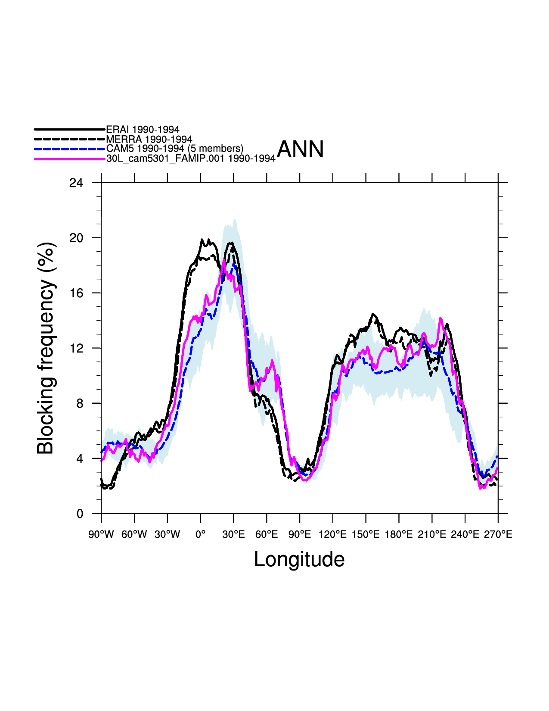
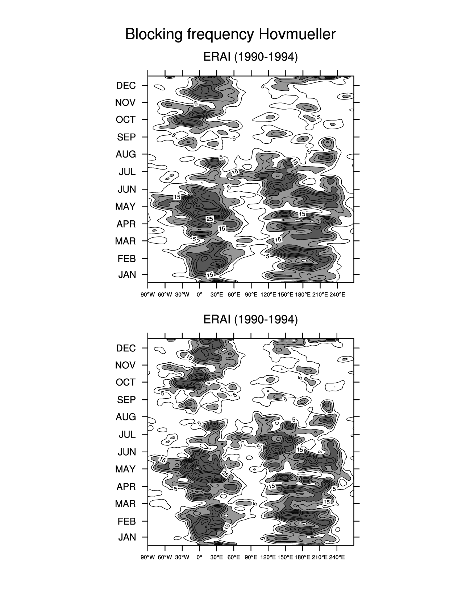
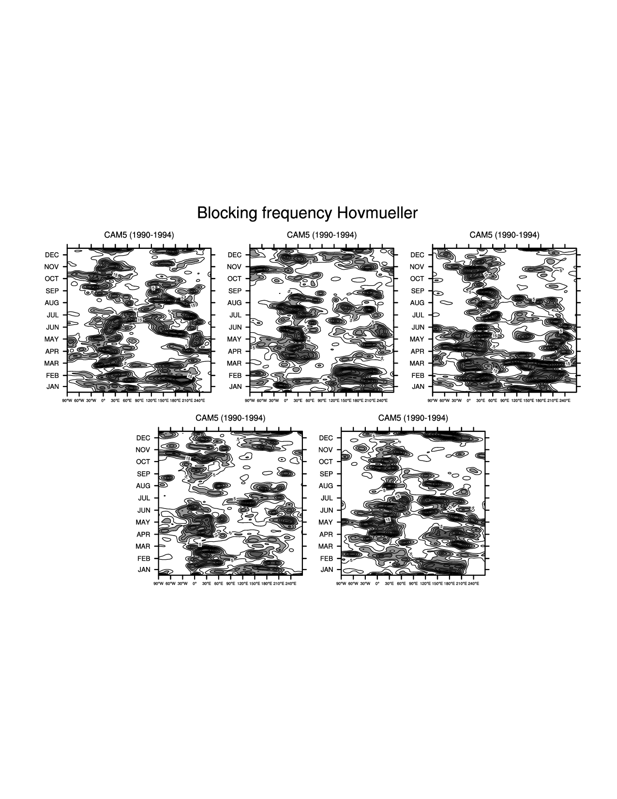

.. Format guides/tools:
   https://docutils.sourceforge.io/docs/user/rst/quickref.html
   https://sublime-and-sphinx-guide.readthedocs.io/en/latest/code_blocks.html
   Rendered MDTF diagnostics/*/doc/example.rst https://mdtf-diagnostics.readthedocs.io/en/latest/sphinx_pods/example.html)
   Online editor at https://livesphinx.herokuapp.com/ 

   NOTE: Emacs makes bad line breaks, edit in https://livesphinx.herokuapp.com/ and copy entire text
   Also, there is a more_about.rst locally that needs equation formation
   before going in here

Rich Neale's Blocking Diagnostic Documentation
==============================================

Evaluate blocking frequency by season as determined by the meridional
gradient above a threshold value of daily 500mb height following
:ref:`D'Andrea et al (1998) <ref-DAndrea>`
and a 2D variant of the above where lat and lon daily 500-mb thresholds are
considered :ref:`Davini et al <ref-Davini>`

Version & Contact info
----------------------
| Version 2.0, implemented in MDTF v3.0beta3
| PI: Rich Neale, NCAR,  rneale@ucar.edu
| Contact: Dani Coleman, NCAR, bundy@ucar.edu

Open source copyright agreement
^^^^^^^^^^^^^^^^^^^^^^^^^^^^^^^
The MDTF framework is distributed under the LGPLv3 license (see LICENSE.txt)
  

Functionality
-------------

Required programming language and libraries
^^^^^^^^^^^^^^^^^^^^^^^^^^^^^^^^^^^^^^^^^^^

- Python 3
- NCL (usual NCAR/CESM packages: contributed, gsn_code, gsn_csm)

Required model output variables
^^^^^^^^^^^^^^^^^^^^^^^^^^^^^^^

Geopotential height at 500 milibars or 3D field with air pressure available

Settings/Environment Variables
^^^^^^^^^^^^^^^^^^^^^^^^^^^^^^^
There are two sets of environment variables that can be set in the input
jsonc file:

1) What to compare input case(s) against: 

   - observational products from ERAI & MERRA. Can be turned on or off together. Default: On
     Years used can be controlled individually

   - three CESM 5-member ensembles (CAM3, CAM4, CAM5) which can be turned on or off individually. Default: CAM5 only. (Note that the code runs with these but the html file does not yet respond to this. Therefore the POD will fail to link the figures if non-default options are used)

     ==================                  ====================  
     Variable name                       Default  
     ==================                  ====================  

     "MDTF_BLOCKING_OBS"               : "True",  //both ERA & MERRA (not possible to choose individually yet)
     "MDTF_BLOCKING_OBS_USE_CASE_YEARS": "False", //if False, must set ERA/MERRA/CAM5 FIRST/LAST-YRS below
     "MDTF_BLOCKING_OBS_ERA_FIRSTYR"   : 2010,    
     "MDTF_BLOCKING_OBS_ERA_LASTYR"    : 2014,  
     "MDTF_BLOCKING_OBS_MERRA_FIRSTYR" : 2009,  
     "MDTF_BLOCKING_OBS_MERRA_LASTYR"  : 2011,  
     "MDTF_BLOCKING_OBS_CAM5_FIRSTYR"  : 1979,     
     "MDTF_BLOCKING_OBS_CAM5_LASTYR"   : 2007,  
     "MDTF_BLOCKING_CAM3"              : "False", //if True, will run but doesn't show on webpage
     "MDTF_BLOCKING_CAM4"              : "False", //if True, will run but doesn't show on webpage
     "MDTF_BLOCKING_CAM5"              : "True",  
     "MDTF_BLOCKING_READ_DIGESTED"     : "True",     // if True, files must be available
     "MDTF_BLOCKING_WRITE_DIGESTED"    : "False",    // if True, writes out case data as digested. requires READ_DIGESTED = False
     "MDTF_BLOCKING_WRITE_DIGESTED_DIR": "",         // default output directory for digested data
     "MDTF_BLOCKING_DEBUG"             : "False"      // reduces number of ensemble members to 2 for quicker execution

REMOVED:  
      "MDTF_BLOCKING_COMPARE_LONG_YEARS"         use instead the more detailed variables above

2) Variables to control reading or writing of digested data 

   - ``MDTF_BLOCKING_READ_DIGESTED (Default True)``
     If True, the POD looks for digested data for the obs & CAM ensembles 
     Digested means the data has been processed by this POD into the `block_time` variable name and format
     (see ``MDTF_BLOCKING_WRITE_DIGESTED`` below)
     ``(MDTF_BLOCKING_READ_DIGESTED = False)``
     If False, the POD looks for raw data (Z500(time,lat,lon)).

     The POD is not currently capable of running with a mix of digested and undigested (other than the undigested MDTF input case). If the user desires this, it is recommended to run only the components that are not digested, and write out digested. Then re-running with MDTF_BLOCKING_READ_DIGESTED will work.

     It is not yet possible to run the MDTF input case with digested data, although it is possible to write it out.

     | OBS/CAM file name & dir expectations:
     | Digested:   obs_data/blocking/ERAI/ERAI.z500.day. *digested* .nc
     | Undigested: obs_data/blocking/*undigested*/ERAI/ERAI.z500.day.nc

   - ``MDTF_BLOCKING_WRITE_DIGESTED (Default False)``
     If True, whatever data was read in raw will be written out digested. This is how a user can make a new digested file, whether obs, a new case or ensemble, or a previous MDTF input case to compare against.

    
Code Overview
-------------
The POD is called by a python wrapper script, ``blocking_neale.py`` which
calls ``blocking.ncl``.

``blocking.ncl`` summary:

1. Read all case data from environmental variables and store it in ``all_cases`` structure

   ``all_cases = blocking_get_all_case_info()``
   is a data structure defined in blocking_funcs.ncl which
   contains arrays of length number of cases (mdtf case + obs cases + comparison models) and contains the following components:

   - ``case_names`` (short names; for ensembles these are the group name repeated length ncase)
   - ``file_names`` (paths to files for each case (distinct for each ensemble member))
   - ``var_names`` (what the variables are named in the datasets)
   - ``years_run0, years_run1`` (start and stop years for each case)
   - ``plot_colors`` hard-coded for consistency from run to run

2. Sets up figures that need to be done before each season is processed *To be done*

3. Loops over seasons (tested on ANN. DJF & JJA not tested)

   * Loops over files. File settings obtained by ``file_opts = extract_file_opts(all_cases,ifile)``

      1. If ``MDTF_BLOCKING_READ_DIGESTED = True`` 

         * Calls ``blocking_digested.ncl:open_digested()`` to open 
           ``file_opts@file_name`` (set in ``blocking_funcs.ncl:set_and_check_file_names()``)
           reads  ``block_time = f_dig->$var_name$(idays,:)`` 
    
         * ``else`` reads raw Z500 data using ``var_in_p = blocking_readfile_orig``
           and computes the blocking index as ``block_time(lon)``
           following :ref:`Tibaldi and Molteni (1990) <ref-Tibaldi-Molteni>`

      2. If ``MDTF_BLOCKING_WRITE_DIGESTED`` Optionally writes ``block_time`` out as digested data 

      3. computes ``block_days`` as sum of all days that were blocked over the
         entire time period, as a function of longitude (as well as std for
         ensembles) ``block_std`` and ``block_freq`` to be blocked/all days. 

      4. for season ``ANN`` (annual) only, calculate daily frequency
         ``block_freq_yr(ndoys,nlons)`` for Hovmüllers, smoothed by `smth9_Wrap
         <https://www.ncl.ucar.edu/Document/Functions/Built-in/smth9.shtml>`__

   * Loops over ensemble groups for figures

      1. Store data in arrays ``block_freq_aves_p, block_freq_min_p/max_p`` 

      2. Set more plotting resources ``res_m``

      3. Individual (Hovmueller figures) 
         ``plot_t(ifile) = gsn_csm_hov(wks_ens_page, lonPivot(block_freq_yr,270.), res_t)``

      4. Combined seasonal figure (one figure with a line for each dataset)
         ``plot(ip) = gsn_csm_xy (wks,block_freq_aves_p&lon,block_freq_aves_p,res_m)``

Figures
^^^^^^^

References
----------

.. _ref-Tibaldi-Molteni: 

   1. Tibaldi and Molteni (1990): On the operational predictability of
   blocking. *Tellus A: Dynamic Meteorology and Oceanography*, **42** (3), 
   343-365, `doi:10.3402/tellusa.v42i3.11882 <https://doi.org/10.3402/tellusa.v42i3.11882>`__.

.. _ref-DAndrea:

   2. D’Andrea, F., Tibaldi, S., Blackburn, M. et al. (1998): Northern
   Hemisphere atmospheric blocking as simulated by 15 atmospheric general
   circulation models in the period 1979–1988. *Climate Dynamics*, **14**,
   385–407 `doi:10.1007/s003820050230 <https://doi.org/10.1007/s003820050230>`__.

.. _ref-Davini:

   3. Davini, P., Cagnazzo, C., Neale, R., and Tribbia, J. (2012): Coupling
   between Greenland blocking and the North Atlantic Oscillation pattern,
   *Geophys. Res. Lett.*, **39**, L14701, `doi:10.1029/2012GL052315
   <https://doi:10.1029/2012GL052315>`__.

