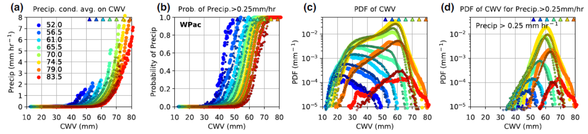
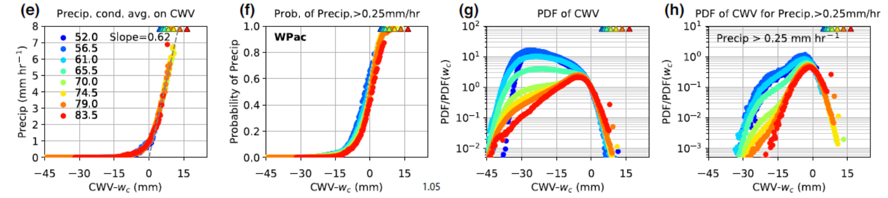
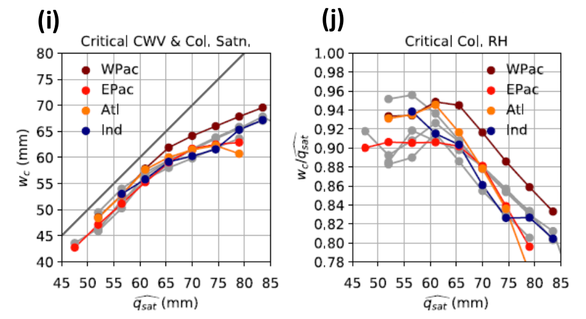

Convective Transition Diagnostic Package
========================================
Last update: 2/26/2019

The convective transition diagnostic package computes statistics that relate precipitation to measures of tropospheric temperature and moisture, as an evaluation of the interaction of parameterized convective processes with the large-scale environment. Here the basic statistics include the conditional average and probability of precipitation, PDF of column water vapor (CWV) for all events and precipitating events, evaluated over tropical oceans. The critical values at which the conditionally averaged precipitation sharply increases as CWV exceeds the critical threshold are also computed (provided the model exhibits such an increase).

Version & Contact info
----------------------

- Version 1 revision 3 13-Nov-2017 Yi-Hung Kuo (UCLA)
- PI: J. David Neelin (UCLA; neelin@atmos.ucla.edu)
- Current developer: Yi-Hung Kuo (yhkuo@atmos.ucla.edu)
- Contributors: K. A. Schiro (UCLA), B. Langenbrunner (UCLA), F. Ahmed (UCLA), C. Martinez (UCLA), and C.-C. (Jack) Chen (NCAR)

Open source copyright agreement
^^^^^^^^^^^^^^^^^^^^^^^^^^^^^^^

This package is distributed under the LGPLv3 license (see LICENSE.txt).

Functionality
-------------

The currently package consists of following functionalities:

#. Convective Transition Basic Statistics (convecTransBasic.py)
#. Convective Transition Critical Collapse (convecTransCriticalCollape.py)
#. (\*) Moisture Precipitation Joint Probability Density Function (cwvPrecipJPDF.py)
#. (\*) Super Critical Precipitation Probability (supCriticPrecipProb.py)

More on the way... (\* under development)

As a module of the MDTF code package, all scripts of this package can be found under the `convective_transition_diag <https://github.com/NOAA-GFDL/MDTF-diagnostics/tree/main/var_code/convective_transition_diag>`__ directory and pre-digested observational data under ``inputdata/obs_data/convective_transition_diag``.

Required programming language and libraries
-------------------------------------------

The is package is written in Python 2, and requires the following Python packages:
os, glob, json, Dataset, numpy, scipy, matplotlib, networkx, warnings, numba, & netcdf4. These Python packages are already included in the standard Anaconda installation.

Known issue with matplotlib
^^^^^^^^^^^^^^^^^^^^^^^^^^^

The plotting scripts of this POD may not produce the desired figures with the latest version of matplotlib (because of the default size adjustment settings). The matplotlib version comes with the Anaconda 2 installer, version 5.0.1 has been tested. The readers can switch to this older version.

Depending on the platform and Linux distribution/version, a related error may occur with the error message "... ImportError: libcrypto.so.1.0.0: cannot open shared object file: No such file or directory". One can find the missing object file ``libcrypto.so.1.0.0`` in the subdirectory ``~/anaconda2/pkgs/openssl-1.0.2l-h077ae2c_5/lib/``, where ``~/anaconda2/`` is where Anaconda 2 is installed. The precise names of the object file and openssl-folder may vary. Manually copying the object file to ``~/anaconda2/lib/`` should solve the error. 

Required model output variables
-------------------------------

The following three 3-D (lat-lon-time) high-frequency model fields are required\:

1. Precipitation rate (units\: mm s\ |^-1| = kg m\ |^-2| s\ |^-1|; **6-hrly avg. or shorter**)

2. Column water vapor (CWV, or precipitable water vapor; units\: mm = kg m\ |^-2| )

3. Column-integrated saturation humidity (units\: mm = kg m\ |^-2|) or mass-weighted column average temperature (units\: K), column\: 1000-200 hPa by default. Since variables in (3) are not standard model output, this package will automatically calculate (3) if the following 4-D (lat-lon-pressure-time) model field is available\:

4. Air temperature (units\: K)

References
----------

   .. _1: 
   
1. Kuo, Y.-H., K. A. Schiro, and J. D. Neelin, 2018: Convective transition statistics over tropical oceans for climate model diagnostics: Observational baseline. *J. Atmos. Sci.*, **75**, 1553-1570, https://doi.org/10.1175/JAS-D-17-0287.1.

   .. _2: 
   
2. Kuo, Y.-H., and Coauthors: Convective transition statistics over tropical oceans for climate model diagnostics: GCM performance. In preparation. 

See http://research.atmos.ucla.edu/csi//REF/pub.html for updates.

More about this diagnostic
--------------------------

The current version of the convective transition diagnostic package produces three sets of figures for both pre-digested observations and model output, including (1) basic statistics, (2) collapsed statistics, and (3) critical column water vapor. In the following, we will show an example set of the figures for an uncoupled simulation of the 1° version of the GFDL AM4 (configuration AM4-G9; :ref:`Zhao et al., 2018a <5>`, :ref:`2018b <6>`; see also :ref:`Kuo et al., in prep <2>`) that are produced by the package.

1) Basic statistics
^^^^^^^^^^^^^^^^^^^

   Basic statistics computed using events over tropical western Pacific (20°S-20°N, west to 180°), including (a) conditionally averaged precipitation rate, (b) conditional probability of precipitation > 0.25 mm hr\ |^-1|, (c) PDF of CWV, and (d) PDF of CWV for precipitating events, all as a function of CWV. Here the large markers represent results simulated by the model, and small markers represent the corresponding observations at 1°. The colors indicate the column-integrated saturation humidity which is used as a bulk measure of tropospheric temperature (also shown as triangles). The PDFs in (c) together represent the normalized joint PDF of CWV and bulk temperature. Multiplying (b) and (c) results in PDFs in (d) (not normalized).

The observed (small markers) and simulated precipitation (large markers) in panel (a) sharply picks up as CWV exceeds a certain threshold, known as the critical CWV [see panel (e) below for how it is defined, and panel (i) for the values]. Here, the column integrated saturation humidity :math:`\widehat{q_{sat}}` (units: mm) is used as a bulk measure of the tropospheric temperature. As the bulk tropospheric temperature increases, the pickup of precipitation occurs at higher CWV. The probability of precipitation in panel (b) exhibits a similar pickup behavior. The AM4 model examined here can reasonably simulate the observed pickup of precipitation, with slightly higher probability than observed.

In panel (c), the observed PDFs of CWV display characteristic shapes that depend on the bulk tropospheric temperature. At low temperature, the PDF peaks at a low CWV value, below which the PDF drops rapidly, and above which the PDF decreases slowly until reaching a cutoff . As temperature increases, another peak around critical develops with the low-CWV peak diminishing. The rapid drop of PDF for CWV above critical [see panel (g) below] is consistent with the pickup of precipitation, i.e., precipitation becomes an effective moisture sink in this regime. It has been noted that low-level convergence tends to be associated with high-CWV events, while low-level divergence is associated with low-CWV events. The AM4 model reasonably reproduces the observed CWV PDF with noticeably more above-critical events. However, given the uncertainty associated with the CWV retrievals used here (RSS TMI data products, version 7.1; :ref:`Wentz et al. 2015 <4>`), especially at high values, we cannot conclude that the model misbehaves in the high-CWV regime.

2) Collapsed statistics
^^^^^^^^^^^^^^^^^^^^^^^

   Same as the statistics in panels (a)-(d), respectively, but for each bulk tropospheric temperature, shift the CWV by the corresponding critical CWV :math:`w_{c}`. Here, only the results from observations are presented. In panels (g)-(h), the PDF values are rescaled.

In practice, we define the critical CWV to be value at which the best-fit line to the conditionally averaged precipitation intersects with the CWV axis, as shown in panel (e) [see panels (i)-(j) below for the observed and simulated critical values]. When expressed as a function of CWV − :math:`w_{c}`, the conditional average and probability of precipitation [panels (e)-(f)] collapse without exhibiting dependence on the bulk temperature (and ocean basin). The rescaled PDFs in panel (g) also collapse for CWV above critical. For the most relevant temperature bins in the tropics (:math:`\widehat{q_{sat}}` ≥ 70 mm or the mass-weighted column average temperature ≥ 271 K), the PDF of CWV for precipitating events share a common near-Gaussian core near the critical CWV.

   \(i\) Critical CWV :math:`w_{c}` and (j) the corresponding critical column relative humidity :math:`w_{c}/\widehat{q_{sat}}`. The colored markers represent the results simulated by the AM4 model and observed values in gray.

Compared to the observations, the slope of the best-fit line simulated by the AM4 model is slightly higher than observed [0.76 vs. 0.62 in panel (e); :ref:`Kuo et al., in prep <2>`], but within the uncertainty range of observations (:ref:`Kuo et al. 2018 <1>`). The simulated statistics are more sensitive to the tropospheric temperature and ocean basin and indicate that there are more above critical events for highest temperature bins in the model. The functional form of the PDFs for precipitating events deviates from Gaussian. The simulated critical values are consistent with the observed values [panels (i)-(j)]. It has been noted that the dependence of critical values on tropospheric temperature (i.e., critical CWV increases with tropospheric temperature but the corresponding critical column RH :math:`w_{c}/\widehat{q_{sat}}` decreases) is a generic consequence of including entrainment in the buoyancy/conditional instability calculation (:ref:`Sahany et al. 2012 <3>`).

Additional references
---------------------

   .. _3: 
   
3. Sahany, S., J. D. Neelin, K. Hales, and R. B. Neale, 2012: Temperature–moisture dependence of the deep convective transition as a constraint on entrainment in climate models. *J. Atmos. Sci.*, **69**, 1340–1358, https://doi.org/10.1175/JAS-D-11-0164.1.

   .. _4: 
   
4. Wentz, F.J., C. Gentemann, K.A. Hilburn, 2015: Remote Sensing Systems TRMM TMI Daily, 3-Day Environmental Suite on 0.25 deg grid, Version 7.1. Remote Sensing Systems, Santa Rosa, CA. Available online at https://www.remss.com/missions/tmi.

   .. _5: 
   
5. Zhao., M., and Coauthors, 2018a: The GFDL Global Atmosphere and Land Model AM4.0/LM4.0 - Part I: Simulation Characteristics with Prescribed SSTs. *Journal of Advances in Modeling Earth Systems*, **10(3)**, https://doi.org/10.1002/2017MS001208.

   .. _6: 
   
6. Zhao., M., and Coauthors, 2018b: The GFDL Global Atmosphere and Land Model AM4.0/LM4.0 - Part II: Model Description, Sensitivity Studies, and Tuning Strategies. *Journal of Advances in Modeling Earth Systems*, **10(3)**, https://doi.org/10.1002/2017MS001209.

.. |^2| replace:: \ :sup:`2`\ 
.. |^3| replace:: \ :sup:`3`\ 
.. |^-1| replace:: \ :sup:`-1`\ 
.. |^-2| replace:: \ :sup:`-2`\ 
.. |^-3| replace:: \ :sup:`-3`\ 