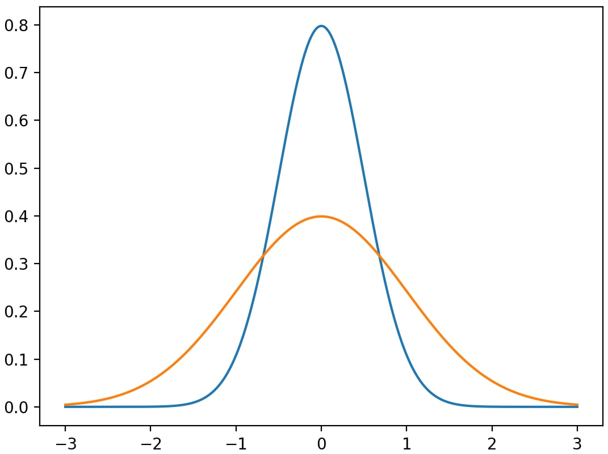

<!--- This is a comment in markdown format. --->

<!--- Header: one "#" sets a top-level header, 
two "##"s set a second-level header, etc. --->

# Example Diagnostic Documentation

Last update: 5/06/2020

This is an example document that you can use as a template for your diagnostics'
own documentation: it describes what information you should provide in each 
section. For example, if this were a real POD, you'd place a one-paragraph 
synopsis of your diagnostic here (like an abstract).

It also serves as an example of the markdown (.md) format used to generate this 
page: compare this output with the input 
[source file](https://raw.githubusercontent.com/NOAA-GFDL/MDTF-diagnostics/develop/diagnostics/example/doc/example.md).

For more info on markdown syntax, see this 
[cheat sheet](https://www.markdownguide.org/cheat-sheet/) and GitHub's 
[reference](https://guides.github.com/features/mastering-markdown/). There are
multiple web-based editors that give you immediate feedback, such as 
<https://dillinger.io/>. 

## Version & Contact info

<!--- '-' starts items in a bulleted list: --->

Here you should describe who contributed to the diagnostic, and who should be
contacted for further information:

- Version/revision information: version 1 (5/06/2020)
- PI (name, affiliation, email)
- Developer/point of contact (name, affiliation, email)
- Other contributors

### Open source copyright agreement

The MDTF framework is distributed under the LGPLv3 license (see LICENSE.txt). 

## Functionality

In this section you should summarize the stages of the calculations your 
diagnostic performs, and how they translate to the individual source code files 
provided in your submission. This will, e.g., let maintainers fixing a bug or 
people with questions about how your code works know where to look.

## Required programming language and libraries

In this section you should summarize the programming languages and third-party 
libraries used by your diagnostic. You also provide this information in the 
`settings.jsonc` file, but here you can give helpful comments to human 
maintainers (eg, "We need at least version 1.5 of this library because we call
this function.")

## Required model output variables

In this section you should describe each variable in the input data your 
diagnostic uses. You also need to provide this in the `settings.jsonc` file, 
but here you should go into detail on the assumptions your diagnostic makes 
about the structure of the data.

## Reference

Here you should cite the journal articles providing the scientific basis for 
your diagnostic. The .rst format provides support for citations but places them
at the end of the page. To keep the documentation format used in version 2.0 of
the framework, we list references "manually":

```
1. E. D. Maloney et al. (2019): Process-Oriented Evaluation of Climate 
and Weather Forecasting Models. *BAMS*, **100** (9), 1665–1686, 
[doi:10.1175/BAMS-D-18-0042.1](https://doi.org/10.1175/BAMS-D-18-0042.1).
```

which produces

1. E. D. Maloney et al. (2019): Process-Oriented Evaluation of Climate and 
Weather Forecasting Models. *BAMS*, **100** (9), 1665–1686, 
[doi:10.1175/BAMS-D-18-0042.1](https://doi.org/10.1175/BAMS-D-18-0042.1).

There's no clean way to make links to list items in markdown, so you'll need to
use .rst format for that. Because references are split between this section 
and the following "More about this diagnostic" section, unfortunately you'll 
have to number references manually.

We don't enforce any particular bibliographic style, but please provide a 
hyperlink to the article's DOI for ease of online access. Hyperlinks are written
as `[link text](URL)` (text in square brackets, URL in parentheses).

## More about this diagnostic

In this section, you can go into more detail on the science behind your 
diagnostic. It's especially helpful if you're able to teach users how to use 
your diagnostic's output, by showing how to interpret example plots.

Instead of doing that here, we provide more examples of markdown syntax that 
you can customize as needed.

A good online editor that gives immediate feedback is at <https://dillinger.io/>. 
Also see this [cheat sheet](https://www.markdownguide.org/cheat-sheet/) and 
GitHub's [reference](https://guides.github.com/features/mastering-markdown/).

### Links to external sites

To include a link, enclose the URL in angle brackets: `<https://ncar.ucar.edu/>`
gives <https://ncar.ucar.edu/>. 

To use custom text for the link, use the syntax 
`[link text](https://www.noaa.gov/)` (text in square brackets, URL in 
parentheses). This produces [link text](https://www.noaa.gov/).

### More references and citations

Here's another reference:

2. Charney, Jule; Fjørtoft, Ragnar; von Neumann, John (1950). Numerical 
Integration of the Barotropic Vorticity Equation. *Tellus* **2** (4) 237–254, 
[doi:10.3402/tellusa.v2i4.8607](https://doi.org/10.3402/tellusa.v2i4.8607).

### Figures

You can include an image in markdown with ``,
which produces



There's no clean way (ie without adding HTML) to implement the alignment, size
and captioning features available in .rst.

Unfortunately, images **must** be in either .png or .jpeg formats in order to be
displayed properly in both the html and pdf output.

### Equations

Accented and Greek letters can be written directly using Unicode: é, Ω. 
(Make sure your text editor is saving the file in UTF-8 encoding).

More complicated math can be written using standard 
[latex (PDF link)](https://www.reed.edu/academic_support/pdfs/qskills/latexcheatsheet.pdf)
syntax inside a code block with the word `math`:

```math
\frac{\partial \rho}{\partial t} + \rho \nabla \cdot v = 0
```
