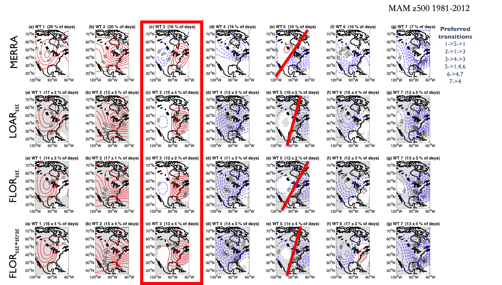
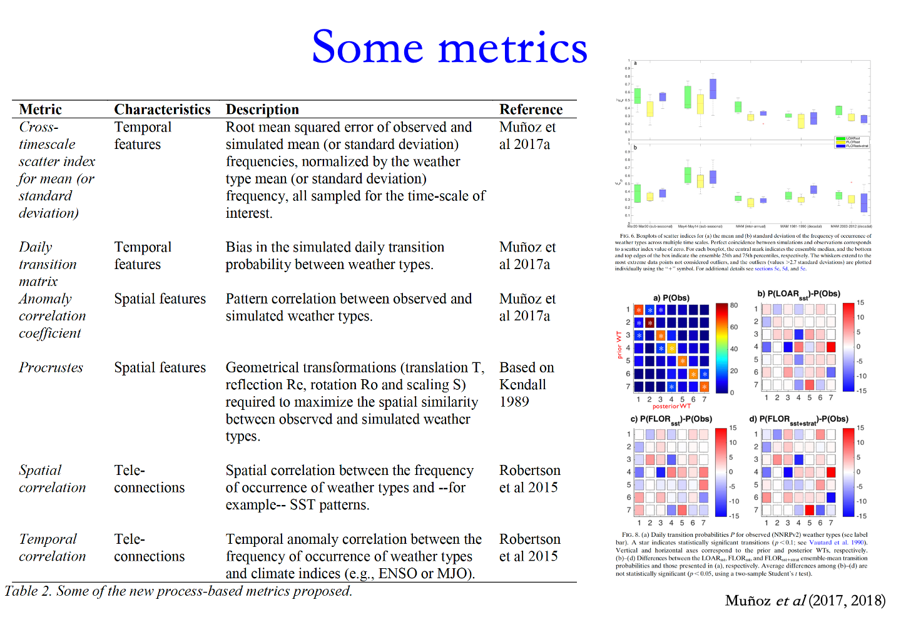
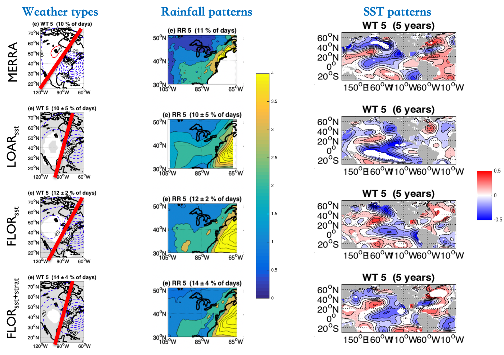

Flow-Dependent Model Diagnostic Documentation
================================

Last update: 5/14/2021

The flow-dependent model diagnostics compares daily atmospheric circulation patterns, or weather types, characteristics in reanalyses and models to analyze misrepresented physical processes related to spatiotemporal systematic errors in those models. Relationships between these biases and climate teleconnections (e.g., SST patterns, ENSO, MJO, etc.) can be explored in different models.

Version & Contact info
----------------------

.. '-' starts items in a bulleted list:
   https://docutils.sourceforge.io/docs/user/rst/quickref.html#bullet-lists

- Version/revision information: version 1 (5/14/2021)
- PI (Ángel G. Muñoz, IRI Columbia University, agmunoz@iri.columbia.edu)
- Developer/point of contact (Ángel G. Muñoz, agmunoz@iri.columbia.edu and Andrew W. Robertson, awr@iri.columbia.edu, IRI Columbia University)
- Other contributors (Drew Resnick, IRI Columbia University, drewr@iri.columbia, James Doss-Gollin)

.. Underline with '^'s to make a third-level heading.

Open source copyright agreement
^^^^^^^^^^^^^^^^^^^^^^^^^^^^^^^

The MDTF framework is distributed under the LGPLv3 license (see LICENSE.txt).

Functionality
-------------

The currently package consists of following functionalities:

(1) Calculation of climatologies and anomalies for the input fields (ClimAnom_func.py)

(2) Calculation of weather types spatial patterns (WeatherTypes.py)

(3) Calculation of weather types temporal characteristics (to be added soon)

(4) Procrustes analysis (to be added soon)

As a module of the MDTF code package, all scripts of this package can be found under
``mdtf/MDTF_$ver/diagnostics/flow_dep_diag``

.. and pre-digested observational data under mdtf/inputdata/obs_data/convective_transition_diag


Required programming language and libraries
-------------------------------------------

Python3 packages: "netCDF4", "xarray", "numpy", "pandas", "sklearn", "cartopy", "matplotlib",
"numba", "datetime", "typing"

Required model output variables
-------------------------------

(1) Geopotential height anomalies at 500 hPa (units: HPa, daily resolution)

(2) Rainfall (units: mm/day, daily resolution)

(3) Temperature (units: Celsius, daily resolution)


References
----------

.. _ref-Muñoz1:

Muñoz, Á. G., Yang, X., Vecchi, G. A., Robertson, A. W., & Cooke, W. F. (2017): PA Weather-Type-Based
Cross-Time-Scale Diagnostic Framework for Coupled Circulation Models. *Journal of Climate*, **30** (22),
8951–8972,
`doi:10.1175/JCLI-D-17-0115.1 <https://doi.org/10.1175/JCLI-D-17-0115.1>`__.

.. _ref-Muñoz2:

Muñoz, Á.G., Robertson, A.W., Vecchi, G.A., Zhang, M., Chourio, X., Yang, J., (2020): Going with the Flow?
Flow-dependent Multi-timescale Model Diagnostics. AGU Fall Meeting. Dec 2020.

More about this diagnostic
--------------------------

Common approaches to diagnose systematic errors involve the computation of metrics aimed at providing
an overall summary of the performance of the model in reproducing the particular variables of interest
in the study, normally tied to specific spatial and temporal scales.

However, the evaluation of model performance is not always tied to the understanding of the physical
processes that are correctly represented, distorted or even absent in the model world. As the physical
mechanisms are more often than not related to interactions taking place at multiple time and spatial scales,
cross-scale model diagnostic tools are not only desirable but required. Here, a recently proposed
circulation-based diagnostic framework is extended to consider systematic errors in both spatial and temporal
patterns at multiple timescales.

The framework, which uses a weather-typing dynamical approach, quantifies biases in shape, location and tilt of
modeled circulation patterns, as well as biases associated with their temporal characteristics, such as frequency
of occurrence, duration, persistence and transitions. Relationships between these biases and climate
teleconnections (e.g., ENSO and MJO) are explored using different models.

FIGURE1

Here's the syntax for including a figure in the document:

The tag lets you refer to figures in the text, e.g.
``:ref:`Figure 1 <my-figure-tag>``` → :ref:`Figure 1 <my-figure-tag>`.

.. code-block:: restructuredtext

   .. _my-figure-tag: [only needed for linking to figures]

   .. figure:: [path to image file, relative to the source.rst file]
      :align: left
      :width: 75 % [these both need to be indented by three spaces]

      Paragraphs or other text following the figure that are indented by three
      spaces are treated as a caption/legend, eg:

      Figure 1. Weather types (WT, or “flows”) in the MERRA reanalysis and in a suite of GFDL model experiments
      (for details, see Muñoz et al 2017). Some biases in magnitude and spatial rotation in WT3 and WT5 are indicated.

.. _figure1:



   Figure 1. Weather types (WT, or “flows”) in the MERRA reanalysis and in a suite of GFDL model experiments
   (for details, see Muñoz et al 2017). Some biases in magnitude and spatial rotation in WT3 and WT5 are indicated.

For example, :ref:`Figure 1 <figure1>` exhibits atmospheric circulation patterns for North Eastern North America,
as analyzed by :ref:`Muñoz (2017) <ref-Muñoz1>`, in a reanalysis and in different model experiments produced using GFDL models
LOAR and FLOR. The POD permits for the calculation of the atmospheric circulation patterns :ref:`Figure 1 <figure1>` as well as
for the rainfall and temperature anomaly fields related to each “flow”, computed via a composite analysis.
It’s also possible to identify the typical sea-surface temperature patterns related to the occurrence of each
pattern :ref:`Figure 2 <figure2>`.

Beyond the analysis of spatial biases in the modeled atmospheric circulation patterns, the POD can help assess biases
in temporal characteristics. A variety of metrics have been suggested by Muñoz et al (2017), and are summarized
in :ref:`Figure 3 <figure3>`.

FIGURE2

.. _figure2:



   Figure 2. Atmospheric circulation, rainfall and sea-surface temperature (SST) patterns associated to weather type 5 (WT5).

FIGURE3

.. _figure3:



   Figure 3. A brief list of suggested metrics to evaluate flow-dependent temporal characteristics in models.
