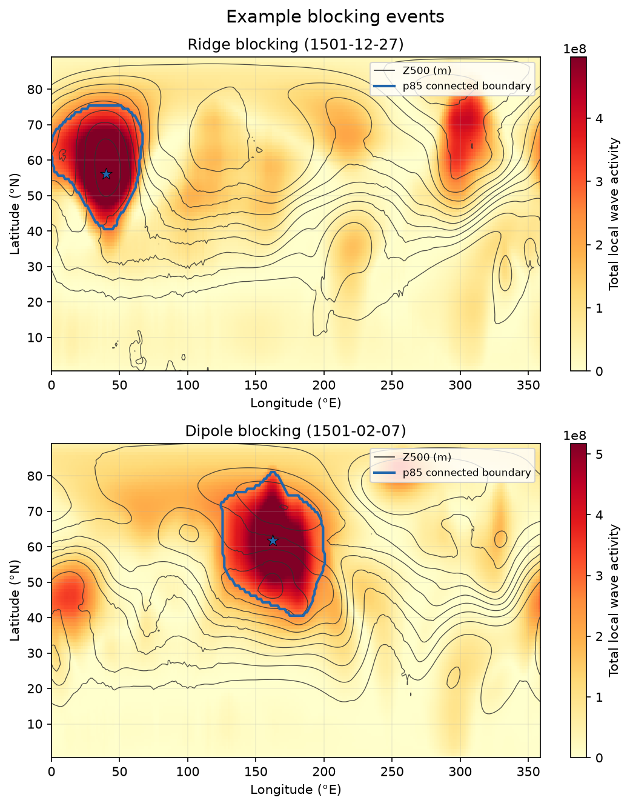

LWA-Based Blocking Detection and Classification
================================================

Last update: September 2026

This POD identifies persistent, large-amplitude atmospheric wave events from
daily 500-hPa geopotential height produced by a climate or weather model. It
calculates total, anticyclonic, and cyclonic local wave activity (LWA), tracks
events in both hemispheres, and reports each event's location, duration, peak
date and position, horizontal size, strength, translation speed, and
ridge/trough/dipole structure. The POD produces event-resolved catalogs and
horizontal peak-date maps; it does not calculate annual or seasonal blocking
statistics.

Version and contact information
-------------------------------

* Version 1.2.0 (September 2026)
* Scientific PI: **Lei Wang, wanglei@purdue.edu**
* Developer and email: **Yuan-Bing Zhao, dr.yuanbingzhao@gmail.com**

Open-source copyright agreement
^^^^^^^^^^^^^^^^^^^^^^^^^^^^^^^

The MDTF-diagnostics framework is distributed under the GNU Lesser General
Public License v3.0 (see ``LICENSE.txt`` in the framework repository).

Functionality
-------------

``src/lwa_block_detect.py`` is the POD driver. It reads the case metadata written by
MDTF, queries the framework's postprocessed ESM-intake catalog, and calls the
analysis stages. It also supports a standalone NetCDF path for development and
scientific verification.

``src/compute_lwa.py`` and ``src/lwa_z500.py`` select Z500, normalize its coordinates
and units, and calculate the three LWA components in bounded time chunks.
``src/process_blocking.py`` detects contiguous regions, connects them across the
cyclic longitude boundary, tracks them through consecutive days, classifies
their structure, and writes the gridded masks and event catalogs.
``plots/scripts/plot_block_maps.py`` draws fixed-name PNG panels for the MDTF results page
and a PDF event atlas.

Running the POD
---------------

MDTF runs the driver automatically when ``lwa_block_detect`` is included in
the runtime configuration's ``pod_list``. Starting from the MDTF source
directory, a typical framework invocation is::

   python mdtf_framework.py -f /path/to/runtime_config.jsonc

The runtime configuration supplies the model cases, dates, data catalog,
working directory, and output directory. The framework preprocesses the
requested ``zg500`` field before invoking ``src/lwa_block_detect.py``.

For development, the driver can also process a standalone model NetCDF file.
For example, the following command analyzes one year in both hemispheres using
the default p85 threshold::

   python diagnostics/lwa_block_detect/src/lwa_block_detect.py \
      --input /path/to/model_daily_z500.nc \
      --variable zg \
      --start-date 2000-01-01 \
      --end-date 2000-12-31 \
      --hemisphere both \
      --threshold-method percentile_max \
      --threshold-percentile 85 \
      --output-dir /path/to/output/lwa_block_detect

Replace ``zg`` with the variable name in the input file. The driver discovers
coordinate names and dimension order from CF metadata when possible. List all
command-line options with::

   python diagnostics/lwa_block_detect/src/lwa_block_detect.py --help

Required programming language and libraries
-------------------------------------------

* Python 3.12 or newer
* NumPy, SciPy, pandas, xarray, netCDF4, and matplotlib
* intake-esm and PyYAML for the MDTF v4 catalog interface

All dependencies are present in the current MDTF ``python3_base`` environment;
the POD does not require a separate Conda environment or network access.

Required model output variables
-------------------------------

The POD requests daily mean geopotential height at 500 hPa:

* internal variable ID: ``zg500``
* CF standard name: ``geopotential_height``
* units delivered to the POD: ``m``
* dimensions delivered to the POD: ``time``, ``lat``, and ``lon``
* modeling realm: ``atmos``

The request in ``settings.jsonc`` uses a 500-hPa scalar pressure coordinate,
so the MDTF preprocessor can extract the level from a model's four-dimensional
``zg`` field or translate a native three-dimensional Z500 field. The framework
performs convention translation and unit conversion before the driver runs.
Consequently, the POD analyzes model output rather than opening reanalysis
files directly. ERA5 is used only as an independent one-year development test.

Input-grid and calendar support
^^^^^^^^^^^^^^^^^^^^^^^^^^^^^^^

The numerical code accepts any dimension order and discovers coordinates from
CF ``standard_name`` and ``axis`` attributes before trying common aliases. It
supports ascending or descending latitude, longitude in either common range,
nonstandard variable names, Pa or hPa pressure coordinates, singleton extra
dimensions, standard and nonstandard CF calendars, and both regular and
nonuniform rectilinear latitude-longitude grids. Longitude must cover one
complete cycle and the latitude grid must reach both polar regions. Duplicate
longitudes, missing dates, subdaily input, regional domains, curvilinear grids,
staggered grids, and unstructured meshes are rejected with explicit messages.
Those restrictions are consistent with the current MDTF model-data framework,
which supports rectilinear latitude-longitude input.

Method
------

Equivalent-latitude contours of Z500 define total, anticyclonic, and cyclonic
LWA on every day. In each hemisphere, the default detection contour is the
85th percentile over time and longitude of the meridional maximum total LWA.
Using an upper-tail percentile instead of the former median prevents ordinary
wave activity from joining distinct blocking cores into unrealistically broad
regions while retaining adaptation to each model case and hemisphere. Regions
above the contour are joined across the 0/360-degree boundary and associated
between adjacent days. A track is retained when it remains poleward of 30 degrees,
satisfies the original displacement limits (less than 18 degrees longitude,
13.5 degrees latitude, and 31.5 degrees combined), is wider than 15 degrees on
the required number of days, and lasts at least five consecutive days by
default.

At the event's peak date, integrated anticyclonic and cyclonic LWA within the
event mask determine its structure. The event is a ridge when anticyclonic LWA
exceeds ten times cyclonic LWA, a trough when cyclonic LWA exceeds twice
anticyclonic LWA, and a dipole otherwise. These thresholds reproduce the
provided original implementation.

Output and interpretation
-------------------------

For each hemisphere, ``model/netCDF/lwa_block_detect_<HEMISPHERE>.nc`` contains
daily ``blocking_event_id`` and ``blocking_type`` fields. Type values are 0
(none), 1 (ridge), 2 (trough), and 3 (dipole).

``model/events/<HEMISPHERE>/blocking_events_<HEMISPHERE>.csv`` contains one row
per event. Fields include start and end date and position, duration, mean and
peak position, peak date, circular longitude width, grid-cell and physical
area, mean and peak LWA, translation speed, component LWA sums, and event
class. ``blocking_tracks_<HEMISPHERE>.csv`` gives position, intensity, width,
and area on each day. ``event_id`` joins both tables to the gridded mask.

``model/lwa_block_detect_<HEMISPHERE>.png`` is a browser-ready 2-by-1 example of
the strongest ridge and dipole events. LWA is shaded, Z500 is contoured, the
blue line marks the detected event boundary, and the star marks the peak
location. The PDF atlas contains one map per selected event. When an intake
catalog contains multiple model cases, the driver writes
``model/lwa_block_detect_cases.html`` with a section and links for every case.

The threshold is diagnosed independently for each model case and hemisphere,
so LWA strength and event counts should be interpreted relative to that run.
``LWA_BLOCK_DETECT_THRESHOLD_PERCENTILE`` controls the default upper-tail contour
(85 by default). ``LWA_BLOCK_DETECT_THRESHOLD_METHOD=median_max`` reproduces the
original implementation, while ``absolute`` together with
``LWA_BLOCK_DETECT_THRESHOLD_VALUE`` supports a scientifically calibrated fixed
contour. Sensitivity to the percentile should be reported when comparing
models with substantially different resolutions.
A one-year interval is useful for software and cross-format testing but is too
short to establish a blocking climatology. Resolution sensitivity should be
quantified before comparing models on substantially different grids.

Representative model output
---------------------------

   Northern Hemisphere examples from the supplied CESM model simulation. The
   upper panel is ridge blocking on 27 December 1501 and the lower panel is
   dipole blocking on 7 February 1501. Shading is total LWA, gray lines are
   Z500, the blue line is the p85 connected boundary, and the star is the peak
   location.

References
----------

#. Huang, C. S. Y., and N. Nakamura, 2016: Local finite-amplitude wave
   activity as a diagnostic of anomalous weather events. *Journal of the
   Atmospheric Sciences*, **73**, 211--229,
   `doi:10.1175/JAS-D-15-0194.1 <https://doi.org/10.1175/JAS-D-15-0194.1>`__.

#. Chen, G., J. Lu, D. A. Burrows, and L. R. Leung, 2015: Local
   finite-amplitude wave activity as an objective diagnostic of midlatitude
   extreme weather. *Geophysical Research Letters*, **42**, 10,952--10,960,
   `doi:10.1002/2015GL066959 <https://doi.org/10.1002/2015GL066959>`__.

#. Liu, Z., and L. Wang, 2025: Blocking diversity causes distinct roles of
   diabatic heating in the Northern Hemisphere. *Nature Communications*,
   **16**, 5613,
   `doi:10.1038/s41467-025-60811-4 <https://doi.org/10.1038/s41467-025-60811-4>`__.

More about this diagnostic
--------------------------

The strongest-event panels are an entry point to the event catalogs, not a
frequency climatology. Use the catalog for event selection and the companion
track table for lifecycle analysis. The gridded event ID supports composites
with other model fields without rerunning detection.
