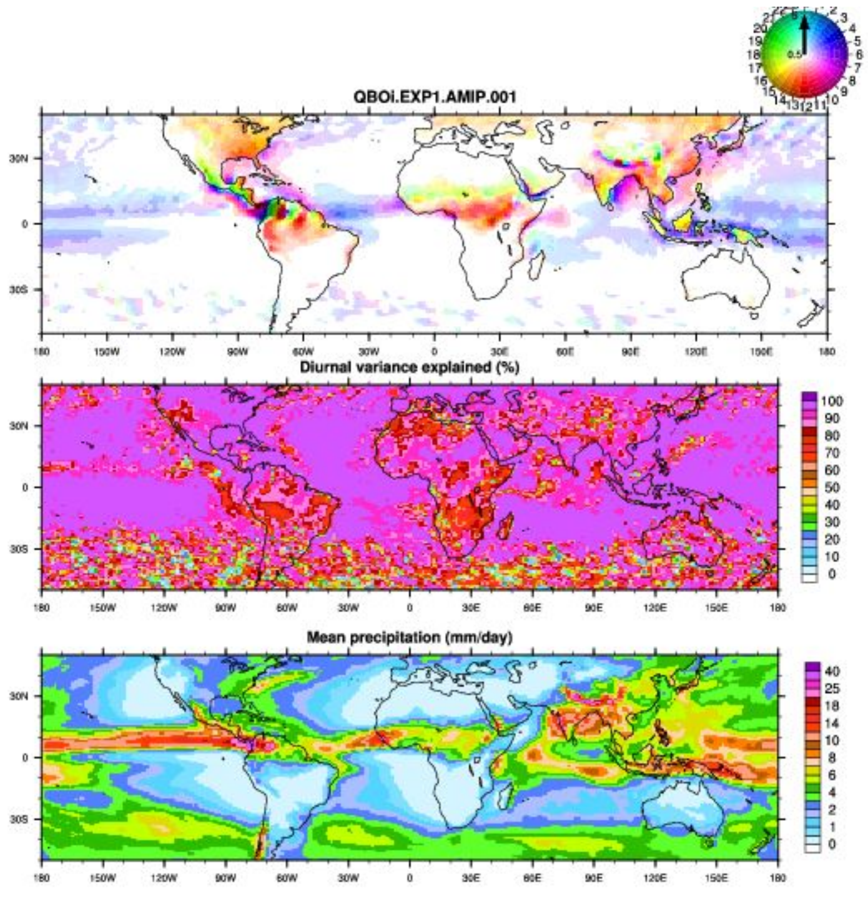

Phase and Amplitude of Precipitation Diurnal Cycle
==================================================
Last update: 03/11/2019

The diurnal cycle package generates a simple representation of the phase (in local time) and
amplitude (in mm/day) of total precipitation, comparing a lat-lon model output of total precipitation
with observed precipitation derived from the Tropical Rainfall Measuring Mission (TRMM:
https://pmm.nasa.gov/TRMM/mission-overview) satellite derived 3B42 product.

Version & Contact info
----------------------

| Version 1:
| Current Developer: Rich Neale

Open source copyright agreement
^^^^^^^^^^^^^^^^^^^^^^^^^^^^^^^
This package is provided under the LGPLv3 license (see LICENSE.txt).

Functionality
-------------

a) Computation of the diurnal cycle (local time phase) and amplitude of the first diurnal harmonic
of total precipitation from TRMM (a 3-hourly product) with 3-hourly mean or instantaneous
output from a model
b) Plotting of a lat lon field of phase (with a cyclic color label) and hue (saturation of phase color)
for a number of pre-specified regions and seasons.
c) Computation of the variance explained by the diurnal harmonic on a gridded lat lon
d) Computation of the mean precipitation over the analysis period on a gridded lat lon

Required programming language and libraries
-------------------------------------------

Requires NCAR Command Language (NCL) and associated numerical and graphical capabilities. License agreement ​https://www.ncl.ucar.edu/Download/NCL_binary_license.shtml​ and licenses therewithin.

Required model output variables
-------------------------------

Code requires the input of total precipitation either as a single variable or one that can be derived from
a convective and large-scale combination.

References
----------

   .. _1:

1. Gervais, M., J. R. Gyakum, E. Atallah, L. B. Tremblay, and R. B. Neale, 2014: How Well Are the Distribution and Extreme Values of Daily Precipitation over North America Represented in the Community Climate System Model? A Comparison to Reanalysis, Satellite, and Gridded Station Data. *Journal of Climate*, **27**, 5219–5239, https://doi.org/10.1175/jcli-d-13-00320.1.

   .. _2:

2. Gettelman, A., P. Callaghan, V. E. Larson, C. M. Zarzycki, J. T. Bacmeister, P. H. Lauritzen, P. A. Bogenschutz, and R. B. Neale, 2018: Regional Climate Simulations With the Community Earth System Model. *Journal of Advances in Modeling Earth Systems*, **10**, 1245–1265, https://doi.org/10.1002/2017ms001227.

More about this diagnostic
--------------------------

   Figure 1\: ​Diurnal precipitation analysis for the tropics in June/July/August for output from a default CESM case, showing (a) the local timing maximum of the peak in the first harmonic of diurnal rainfall, (b) the variance explained by the first harmonic of the diurnal rainfall variability (%), and the mean precipitation over the analysis period (mm/day).

This diagnostic set provides an analysis of the variation in diurnal peak of rainfall over both land and ocean. The land analysis in particular gives insight into the mechanisms of rainfall production during the day. A recognized bias of many climate models is that they produce a peak in rainfall that is too early in the day (~noon) when the peak should be later in the evening. This is frequently interpreted as being due to shortcomings in the representations of the atmospheric physics and land-atmosphere interactions. Additionally, there is more detail relating to the impact of orographic and coastal regions that can amplify, weaken and in a number of other ways, modify the precipitation diurnal cycle.
