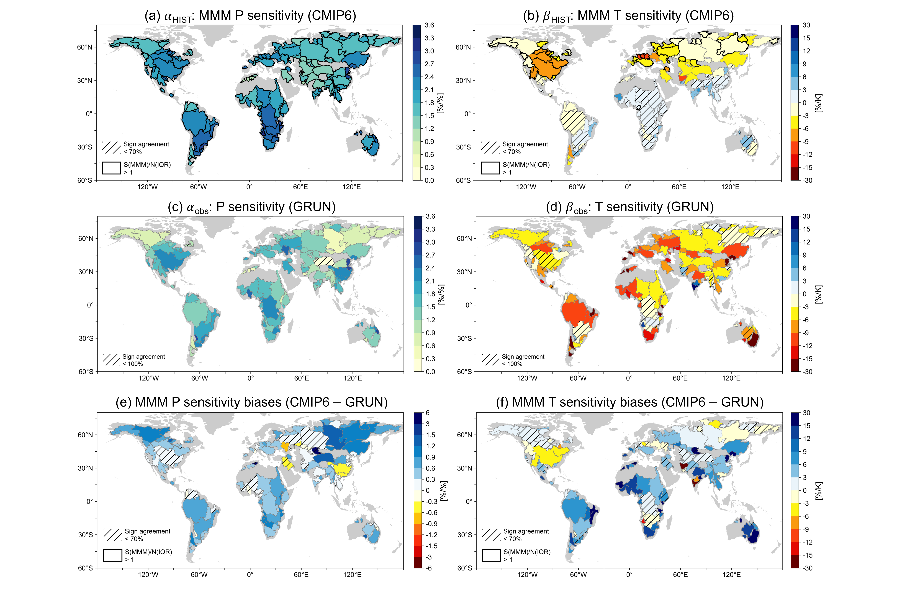
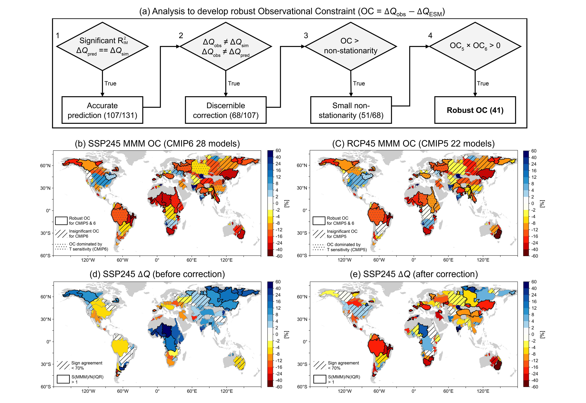

Runoff Sensitivities Diagnostic Documentation
=============================================

Last update: 04/07/2025

Introduction to runoff sensitivity
----------------------------------

Runoff projections are essential for future water security. While Earth System Models (ESMs) are now being used to inform water resource assessments, the substantial model uncertainty has undermined the reliability of ESM projections. The primary source of the runoff projection uncertainty is the model's climate forcing of the land surface, namely inter-model differences in precipitation (P) and surface air temperature (T) trends.

However, runoff projections are generally more uncertain than either P and T projections, implying that additional uncertainties arise at the terrestrial interface (:ref:`Lehner et al., 2019 <ref-Lehner>`; :ref:`Wang et al., 2022 <ref-Wang>`). These additional uncertainties stem from differences in the sensitivity of runoff to climate change - how runoff responds to a given set of climate forcings. Previous studies have measured this using runoff sensitivity, a metric that quantifies runoff (Q) changes in response to changes in precipitation (P sensitivity; δQ/δP, %/%) and temperature (T sensitivity; δQ/δT, %/K) (:ref:`Tang and Lettenmaier, 2012 <ref-Tang>`; :ref:`Hoerling et al., 2019 <ref-Hoerling>`; :ref:`Lehner et al., 2019 <ref-Lehner>`; :ref:`Milly and Dunne, 2020 <ref-Milly>`). 

Uncertainty in this runoff sensitivity, inherent to each ESM, can contribute to the projection uncertainty as much as the uncertainty in meteorological forcings (Kim et al. 2025, *in preparation*). In addition, the runoff sensitivity is often biased in ESMs, such that ESMs tend to underestimate future runoff declines in several global basins (:ref:`Zhang et al., 2023 <ref-Zhang>`; :ref:`Douville et al., 2024 <ref-Douville>`; Kim et al. 2025, *in preparation*). Therefore, reducing the runoff sensitivity bias is important for producing more reliable projections of terrestrial climate change.

Calculation of runoff sensitivity
---------------------------------

In this diagnostics package, we quantify the runoff sensitivity of a target model using multiple linear regression. The historical timeseries (1945-2014) are averaged for each water year (Oct.-Sep.) and 131 global river basins.
Then, the annual timeseries is smoothed with a 5-year moving window to minimize the storage effect of runoff from previous years. Eventually, the runoff sensitivity is calculated as:

.. math::

   \delta{Q} = {\alpha}\delta{P} + {\beta}\delta{T} + {\gamma}\delta{P}\delta{T}

where α and β are estimates of P and T sensitivity respectively, δ represents 5-year averaged anomalies relative to long-term mean, δQ and δP are percent anomalies in runoff and precipitation, δT is temperature anomalies, δPδT is an interaction term. Note that the interaction term is usually negligible and does not affect the values of α and β in CMIP5/6 models.

The calculated runoff sensitivity for a target model is then compared to a pre-calculated observational estimate and a set of CMIP5/6 models. For the observational estimate, we used the machine learning-based global runoff reanalysis (GRUN-ENSEMBLE; Ghiggi et al. 2021). We used 100 realizations of GRUN-ENSEMBLES to sample observational uncertainty. For CMIP models, we used historical simulation from 1945 to 2014. For CMIP5, we extended the timeseries to 2014 using the RCP4.5 scenario. The diagnostic page shows the ranges from observational uncertainty, inter-model spread, and uncertainty of regression coefficients for specific river basins.

Version & Contact info
----------------------

- Version/revision information: version 2 (04/07/2025)
- PI: Flavio Lehner, Cornell University, flavio.lehner@cornell.edu
- Developer/point of contact: Hanjun Kim, Cornell University, hk764@cornell.edu
- Other contributors: Andy wood, David Lawrence, Katie Dagon, Sean Swenson, Nathan Collier

Open source copyright agreement
^^^^^^^^^^^^^^^^^^^^^^^^^^^^^^^

The MDTF framework is distributed under the LGPLv3 license (see LICENSE.txt). 

Functionality
-------------

The main driver code (runoff_sensitivities_diag.py) includes all functions, codes for calculations and figures.

0) Functions are pre-defined for further analysis.
1) The code will load data and calculate averages for each water year and 131 global river basins (Basin Mask source: GRDC Major River Basins of the World).
2) Water budget closure (precipitation - evapotranspiration == runoff) in a long-term average sense is checked.
3) Using the pre-defined function "runoff_sens_reg", runoff sensitivities are calculated.
4) Calculated runoff sensitivities for target models are saved as .nc files.
5) The diagnostic figures will be plotted with the pre-calculated OBS and CMIP data.

Required programming language and libraries
-------------------------------------------

Python 3 is used to calculate and draw the figures.

- All libraries used in this diagnostic are available in MDTF conda environment "_MDTF_python3_base".
- Used libraries: "scipy", "numpy", "matplotlib", "netCDF4", "cartopy", "sklearn"    
- To deal with the shapefile, "cartopy.io.shapereader" and "matplotlib.path" are used.
- For multi-linear regression, "sklearn.linear_model" is used.    

**Caution**: In Oct. 2023, the diagnostic did not work after an update in "pydantic" library.
Below commands for downgrading "pydantic" solved the problem for us.

.. code-block:: restructuredtext
   
   conda activate _MDTF_base
   conda install -c conda-forge pydantic==1.10.9

Required model output variables
-------------------------------

The monthly mean output from historical simulations, including period 1945-2014, are needed.
(Model outputs are assumed to have the same naming convention as CMOR-ized CMIP output.)

Target variables:
   - ``tas`` (surface air temperature, K), [time, lat, lon]
   - ``pr`` (precipitation, kg m-2 s-1), [time, lat, lon] 
   - ``hfls`` (latent heat flux, W m-2), [time, lat, lon]
   - ``mrro`` (runoff, kg m-2 s-1), [time, lat, lon]

Lon-lat grids for all variables have to be the same. In CMIP, there are some models in which grids are slightly different between land and atmospheric variables. Checking and interpolation to a common grid is recommended.

More about this diagnostic
--------------------------
Runoff sensitivity biases
^^^^^^^^^^^^^^^^^^^^^^^^^
.. _my-figure-tag:

   Fig. 1. CMIP6 multi-model median (MMM) (a) P sensitivity and (b) T sensitivity. Observational estimate of (c) P sensitivity and (d) T sensitivity. (e,f) The CMIP6 MMM sensitivity biases. Note that all sensitivities are calculated for the historical period from 1947 to 2017.

The ESM's P sensitivity is positive across all basins, ranging from 1%/% to 3.5%/% with consistent values among ESMs (Fig. 1a). T sensitivity is negative for most basins and models in the northern mid-latitudes, while in the tropics and Southern Hemisphere its sign is varied and not consistent across models (Fig. 1b). A negative T sensitivity indicates more evapotranspiration per amount of warming and thus lower runoff, triggered by greater energy input at the surface. Additional factors, such as the phase shift from snow to rain and increased water use due to vegetation greening, can further contribute to negative T sensitivity. On the other hand, factors like enhanced stomatal closure, increased extreme precipitation events, and glacier melt can contribute to relatively more positive T sensitivity. These competing effects and their imperfect representations in models result in a wide range of T sensitivities across models.

The observed P and T sensitivities generally range from 1%/% to 3.5%/% and -30%/K to slightly positive, respectively (Fig. 1c,d). CMIP6 models show significantly different P sensitivities in 106 out of 131 basins, overestimating the sensitivities in 102 of those 106 basins (Fig. 1e). On the other hand, CMIP6 models’ T sensitivities differ significantly from the observations in 90 out of 131 basins, underestimating the negative sensitivities in 75 of those 90 basins (Fig. 1f). **Overall, climate models tend to exhibit more positive P sensitivity and less negative T sensitivity compared to the observational estimates.**

Impact on the future runoff projections
^^^^^^^^^^^^^^^^^^^^^^^^^^^^^^^^^^^^^^^
.. _my-figure-tag:

   Fig. 2. (a) Algorithm for testing the statistical significance of an observational constraint based on the models' runoff sensitivity biases. Observational constraining effect on MMM runoff projection in (b) CMIP6 SSP2-4.5 scenario and (c) CMIP5 RCP4.6 scenario (% change, 2030-2070 vs. 1947-2017). MMM runoff projection (d) before and (e) after correction by the observational constraint.

How does such runoff sensitivity bias affect future projections? This motivates an observational constraint: the use of the observed runoff sensitivity to constrain the ESM runoff projections. We do this by convolving the observational sensitivity with the ESM's projection in T and P:

.. math::

   \Delta{Q}_{obs} = {\alpha}_{obs}\Delta{P}_{ESM} + {\beta}_{obs}\Delta{T}_{ESM}

where {\alpha}_{obs} and {\beta}_{obs} are observational estimate of P and T sensitivity, \Delta{P}_{ESM} and \Delta{T}_{ESM} represent the ESM projection in P and T, and \Delta{Q}_{obs} is the observationally-constrained runoff projection.

The difference between this observationally-constrained projection and the unconstrained ESM projection is the observational constraining effect. We developed a systematic approach to test the significance and robustness of the constraining effect (Fig.2a; see details in Kim et al., 2025, *in preparation*). The observationally-constrained projections indicate a drier future than the unconstrained projections (Fig. 2b,c). The downward correction is significant for 41 of 131 global river basins. Specifically, in CMIP6, the modest runoff reductions in regions like the Amazon, Eastern Europe, and Australia are intensified (Fig. 1d,e). Moreover, the originally projected runoff increases over North Africa and Southeast Asia become weaker or are even reversed. The downward correction mainly arises from the T sensitivity bias (Fig. 2b,c). **In other words, the ESMs underestimate the future runoff decline mainly because negative T sensitivity is too weak compared to observations.** This systematic underestimation of runoff decline is consistent with previous studies that have adjusted runoff projections downward using other observational datasets and statistical methods (:ref:`Zhang et al., 2023 <ref-Zhang>`; :ref:`Douville et al., 2024 <ref-Douville>`).

The causes of the models’ runoff sensitivity biases are not identified here and warrant further investigation. A sensitivity analysis of mean state climate variables for each basin shows that P sensitivity generally exhibits an inverse relationship with mean runoff and runoff ratio (Q/P). In contrast, temperature sensitivity generally displays no systematic inter-model correlation with any mean state variables (Kim et al. 2025, *in preparation*). Depending on the basins, a significant correlation to certain mean state variables exists, but it is difficult to identify a more global culprit. **This suggests that traditional modeling approaches, which focus on improving mean state biases, may improve predictions related to P sensitivity but are unlikely to resolve the more critical T sensitivity biases.** These challenges motivated the development of the metrics package, which can be used and expanded by the broader scientific community to diagnose model biases and aid model development.

References
----------   
.. _ref-Lehner:

1. Lehner et al. (2019): The potential to reduce uncertainty in regional runoff projections from climate models. *Nature Climate Change*, **9** (12), 926-933, `doi:10.1038/s41558-019-0639-x <https://doi.org/10.1038/s41558-019-0639-x>`__.

.. _ref-Wang:

2. Wang et al. (2022): Future Changes in Global Runoff and Runoff Coefficient From CMIP6 Multi‐Model Simulation Under SSP1‐2.6 and SSP5‐8.5 Scenarios. *Earth’s Future*, **10** (12), e2022EF002910, `doi:10.1029/2022EF002910 <https://doi.org/10.1029/2022EF002910>`__.

.. _ref-Tang:

3. Tang, Q., & Lettenmaier, D. P. (2012): 21st century runoff sensitivities of major global river basins. *Geophysical Research Letters*, **39** (6), 2011GL050834, `doi:10.1029/2011GL050834 <https://doi.org/10.1029/2011GL050834>`__.

.. _ref-Hoerling:

4. Hoerling et al. (2019): Causes for the Century-Long Decline in Colorado River Flow. *Journal of Climate*, **32** (23), 8181–8203, `doi:10.1175/JCLI-D-19-0207.1 <https://doi.org/10.1175/JCLI-D-19-0207.1>`__.

.. _ref-Zhang:

5. Zhang et al. (2023): Future global streamflow declines are probably more severe than previously estimated. *Nature Water*, **1** (3), 261–271, `doi:10.1038/s44221-023-00030-7 <https://doi.org/10.1038/s44221-023-00030-7>`__.

.. _ref-Milly:

6. Milly, P. C. D., & Dunne, K. A. (2020): Colorado River flow dwindles as warming-driven loss of reflective snow energizes evaporation. *Science*, **367** (6483), 1252–1255, `doi:10.1126/science.aay9187 <https://doi.org/10.1126/science.aay9187>`__.

.. _ref-Douville:

7. Douville, H. (2024): Observational Constraints on Basin-Scale Runoff: A Request for Both Improved ESMs and Streamflow Reconstructions. * Geophysical Research Letters*, **51** (13), e2024GL108824, `doi:10.1029/2024GL108824 <https://doi.org/10.1029/2024GL108824>`__.

.. _ref-Ghiggi:

8. Ghiggi et al. (2021): G‐RUN ENSEMBLE: A multi‐forcing observation‐based global runoff reanalysis. *Water Resources Research*, **57** (5), e2020WR028787, `doi:10.1029/2020WR028787 <https://doi.org/10.1029/2020WR028787>`__.
