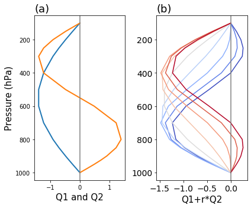
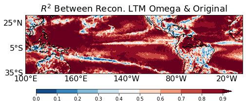
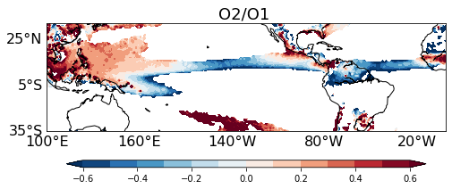

Top-Heaviness Metric Diagnostic Documentation
=============================================

Last update: 5/30/2021

The vertical profiles of diabatic heating have important implications for large-scale dynamics, especially for the coupling between the large-scale atmospheric circulation and precipitation processes. We adopt an objective approach to examine the top-heaviness of vertical motion (Back et al. 2017), which is closely related to the heating profiles and a commonly available model output variable. The diagnostic metric can also be used to evaluate the diabatic heating profile.

Version & Contact info
----------------------

.. '-' starts items in a bulleted list:
   https://docutils.sourceforge.io/docs/user/rst/quickref.html#bullet-lists

- Version/revision information: version 1.0 (6/28/2021)
- Developer/point of contact (Jiacheng Ye, jye18@illinois.edu, DAS UIUC; Zhuo Wang, zhuowang@illinois.edu, DAS UIUC)

.. Underline with '^'s to make a third-level heading.

Open source copyright agreement
^^^^^^^^^^^^^^^^^^^^^^^^^^^^^^^

The MDTF framework is distributed under the LGPLv3 license (see LICENSE.txt).

Functionality
-------------

The current package consists of following functionalities:

(1) Calculation of the fractional variance of vertical velocity at each grid point explained by two base functions, Q1 (~idealized deep convection profile) and Q2 (~idealized deep stratiform profile)

(2) Calculation of the top-heaviness ratio (O2/O1)

As a module of the MDTF code package, all scripts of this package can be found under
``mdtf/MDTF_$ver/diagnostics/top_heaviness_ratio``

Required programming language and libraries
-------------------------------------------

Python3 packages: "netCDF4", "xarray", "numpy", "scipy", "matplotlib", "cartopy"

Required model output variables
-------------------------------

1) wap (plev x lat x lon) : Vertical Velocity [Pa/s], which can be either the monthly mean for a certain year or the long-term monthly/season mean.

References
----------

.. :

Back, L. E., Hansen, Z., & Handlos, Z. (2017). Estimating vertical motion profile top-heaviness: Reanalysis compared to satellite-based observations and stratiform rain fraction. Journal of the Atmospheric Sciences, 74(3), 855-864. https://doi.org/10.1175/JAS-D-16-0062.1

Jiacheng and Zhuo's paper is in preparation.

More about this diagnostic
--------------------------

Q1 and Q2 (Figure 1a) are two prescribed base functions. Following Back et al. (2017), Q1 as a half sine function, and Q2 as a full sine function, which represent the idealized deep convection profile and the idealized stratiform profile, respectively. The vertical velocity can be approximated by Q1 and Q2:

      ω'(x,y,p) = O1(x,y) * Q1(p) + O2(x,y)*Q2(p) 

where O1 and O2 are the coefficients of Q1 and Q2, respectively. Back et al. (2017) showed that Q1 and Q2 resemble the first two EOF modes of vertical velocity profile variability. Then  O1 and O2 can be approximately regarded as the corresponding principal component time series. 

For O1>0, ω' transitions from a bottom-heavy profile to a top-heavy profile when the ratio of r=O2/O1 increases from -1 to 1 (Figure 1b). The ratio r is thus defined as the top-heaviness ratio.

To assess how well ω' approximates ω, the fractional variance is calculated over each grid point. The fractional variance is defined as the square of the pearson correlation between ω' and ω. As shown in Figure 2,  ω' explains more than 80% of the vertical variance over most tropical/subtropical oceanic grid points. 

The top-heaviness ratio (r) is presented in Figure 3. The Western Pacific is dominated by more top-heavy vertical profiles while the Eastern Pacific and Atlantic are characterized by more bottom-heavy profiles, exhibiting a great contrast.   

   
   Figure 1. (a) Q1 and Q2; (b) Vertical velocity profiles constructed from the varying top-heaviness ratio (r; r=-1: dark blue, r=1: dark red).
   

   Figure 2. The fractional variance of ω explained by ω'.
   

   
   Figure 3. Long-term mean Top-Heaviness Ratio in July (2000-2019). The ratio is presented only for the grid points with O1 no less than 0.01.
