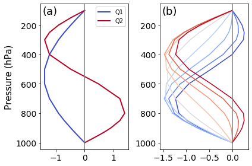

Top-Heaviness Metric Diagnostic Documentation
================================

Last update: 5/27/2021

The vertical profiles of diabatic heating have important implications for large-scale dynamics, especially for the coupling between the large-scale atmospheric circulation and precipitation processes. We adopt an objective approach to examine the top-heaviness of vertical motion (Back et al. 2017), which is closely related to the heating profiles and a commonly available model output variable. The diagnostic metric can also be used to evaluate the diabatic heating profile.

Version & Contact info
----------------------

.. '-' starts items in a bulleted list:
   https://docutils.sourceforge.io/docs/user/rst/quickref.html#bullet-lists

- Version/revision information: version 1.0 (5/21/2021)
- Developer/point of contact (Jiacheng Ye, jye18@illinois.edu, DAS UIUC; Zhuo Wang, zhuowang@illinois.edu, DAS UIUC)

.. Underline with '^'s to make a third-level heading.

Open source copyright agreement
^^^^^^^^^^^^^^^^^^^^^^^^^^^^^^^

The MDTF framework is distributed under the LGPLv3 license (see LICENSE.txt).

Functionality
-------------

The currently package consists of following functionalities:

(1) Calculation of percentage of variance explained by two base functions (idealized deep convection profile, idealized deep stratiform profile)

(2) Calculation of top-heaviness ratio (O2/O1)

(3) Other analysis (to be added soon)

(**) cropping.py can be referenced if code is needed to either shift the grid of your data
or to crop your data to a specified region

As a module of the MDTF code package, all scripts of this package can be found under
``mdtf/MDTF_$ver/diagnostics/top_heaviness_ratio``

Required programming language and libraries
-------------------------------------------

Python3 packages: "netCDF4", "xarray", "numpy", "scipy", "matplotlib", "basemap"

Required model output variables
-------------------------------

Monthly 3-D spatial dimension Omega (units: Pa/s)

References
----------

.. _ref-Muñoz1:

Back, L. E., Hansen, Z., & Handlos, Z. (2017). Estimating vertical motion profile top-heaviness: Reanalysis compared to satellite-based observations and stratiform rain fraction. Journal of the Atmospheric Sciences, 74(3), 855-864. https://doi.org/10.1175/JAS-D-16-0062.1

Jiacheng and Zhuo's paper is under developing...

More about this diagnostic
--------------------------

Q1 and Q2 (Figure 1) are two prescribed base functions. Q1 is characterized by idealized deep convection profile and Q2 is characterized by idealized deep stratiform profile. The concept of percentage of explained variance is similar to that of EOF analysis where we can regard Q1 and Q2 as two leading EOFs. Top-heaviness ratio in figure 2 shows that the WP is characterized by more top-heavy circulation while EP and ATL are described by more bottom-heavy circulation.  Through approximating monthly mean vertical motion profile by Q1 and Q2, figure 3 and figure 4 reveal that using these two base functions can help to explain most of the tropical and subtropical ocean. 

The top-heaviness is a useful tool to diagnose the coupling between diabatic process and large-scale circulation. If the model is not able to reproduce correct pattern of top-heaviness ratio, this would imply potential deficiencies in deep convection and stratiform scheme. In the future POD develop, we are considering adding shallow convection as a third base function. By doing so will enable us to further investigate the bias source of tropical and subtropical predicability. 

   

   Figure 1. Left: Q1 and Q2; Right: Vertical motion profiles constructed from varying top-heviness ratio (r; r=-1: dark blue, r=1: dark red).
   

.. figure:: Top_Heaviness_Ratio.png
   :align: center
   :width: 75 %

   Figure 2. Top-Heaviness Ratio in July (2000-2019).  
   

.. figure:: Proportion_of_explained_Interannual_Variance.png
   :align: center
   :width: 75 %

   Figure 3. Proportion of Interannual Variance Explained by Q1 and Q2.png.

   Figure 4. R U+33A1 Between Reconstructed LTM Omega & Original profile.
