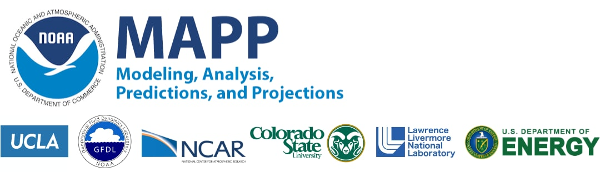

.. MDTF-diagnostics documentation main file, created by
   sphinx-quickstart on Fri Aug 30 11:07:25 2019.
   You can adapt this file completely to your liking, but it should at least
   contain the root `toctree` directive.

Welcome to the documentation for the MDTF diagnostics!
======================================================

.. figure:: img/CPO_MAPP_MDTF_Logo.jpg
   :align: center
   :width: 100 %

This site contains documentation for the MDTF Diagnostics framework. The code is fully open-source and hosted on  `GitHub <https://github.com/NOAA-GFDL/MDTF-diagnostics>`__. 

.. toctree::
   :maxdepth: 2

   sphinx/start_toc
   sphinx/ref_toc
   sphinx/pod_toc
   sphinx/site_toc
   sphinx/dev_toc
   sphinx/ref_dev_toc
   sphinx/fmwk_toc

Acknowledgements
----------------

Development of this code framework for process-oriented diagnostics was supported by the `National Oceanic and Atmospheric Administration <https://www.noaa.gov/>`__ (NOAA) Climate Program Office `Modeling, Analysis, Predictions and Projections <https://cpo.noaa.gov/Meet-the-Divisions/Earth-System-Science-and-Modeling/MAPP>`__ (MAPP) Program (grant # NA18OAR4310280). Additional support was provided by `University of California Los Angeles <https://www.ucla.edu/>`__, the `Geophysical Fluid Dynamics Laboratory <https://www.gfdl.noaa.gov/>`__, the `National Center for Atmospheric Research <https://ncar.ucar.edu/>`__, `Colorado State University <https://www.colostate.edu/>`__, `Lawrence Livermore National Laboratory <https://www.llnl.gov/>`__ and the US `Department of Energy <https://www.energy.gov/>`__.

Many of the process-oriented diagnostics modules (PODs) were contributed by members of the NOAA `Model Diagnostics Task Force <https://cpo.noaa.gov/Meet-the-Divisions/Earth-System-Science-and-Modeling/MAPP/MAPP-Task-Forces/Model-Diagnostics-Task-Force>`__ under MAPP support. Statements, findings or recommendations in these documents do not necessarily reflect the views of NOAA or the US Department of Commerce.

Indices and tables
------------------

* :ref:`genindex`
* :ref:`search`
