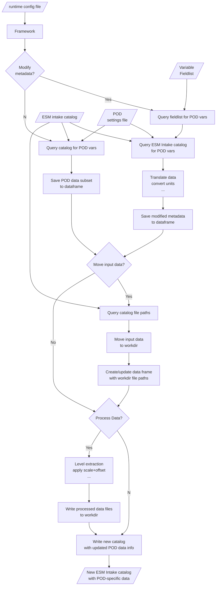

```mermaid
  flowchart TD
    rtConfig[/runtime config file/]-->fw[framework]
    fw[Framework]-->modMetadataYN{Modify\n metadata?}
    modMetadataYN-- Yes -->queryFieldlist[Query fieldlist for POD vars]
    fieldlist[/Variable\n Fieldlist/]-->queryFieldlist
    queryFieldlist-->queryCatVar[Query ESM Intake catalog\n for POD vars]
    cat1[/ESM intake catalog/]-->queryCatVar
    podSet[/POD\n settings file/]-->queryCatVar
    queryCatVar-->doMetadataMod[Translate data\n convert units\n ...]
    doMetadataMod-->addDF[Save modified metadata\n to dataframe]
    addDF-->moveFilesYN{Move input data?}
    modMetadataYN-- No-->queryCatVarOnly[Query catalog for POD vars]
    podSet-->queryCatVarOnly
    cat1-->queryCatVarOnly
    queryCatVarOnly-->addDF2[Save POD data subset\n to dataframe]
    addDF2-->moveFilesYN
    moveFilesYN-- Yes-->queryCatFiles[Query catalog file paths]
    cat1-->queryCatFiles
    queryCatFiles-->moveFiles[Move input data\n to workdir]
    moveFiles-->modDF[Create/update data frame\n with workdir file paths]
    moveFilesYN-- No -->ppYN{Process Data?}
    modDF-->ppYN
    ppYN-- No-->makeNewCat[Write new catalog\n with updated POD data info]
    ppYN-- Yes-->doPP[Level extraction\n apply scale+offset\n ... ]
    doPP-->writePPFiles[Write processed data files\n to workdir]
    writePPFiles-->makeNewCat
    makeNewCat-->cat2[/New ESM Intake catalog\n with POD-specific data/]
```
