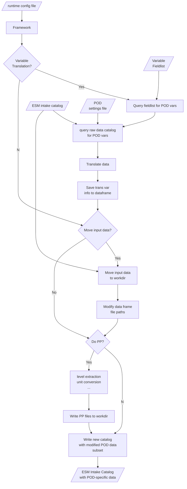

```mermaid
  flowchart TD
    rtconfig[/runtime config file/]-->fw[framework]
    fw[Framework]-->translateyn{Variable\n Translation?}
    translateyn-- Yes -->queryfieldlist[Query fieldlist for POD vars]
    fieldlist[/Variable\n Fieldlist/]-->queryfieldlist
    queryfieldlist-->querycatvar[query raw data catalog\n for POD vars]
    cat1[/ESM intake catalog/]-->querycatvar
    podset[/POD\n settings file/]-->querycatvar
    querycatvar-->dotranslate[Translate data]
    dotranslate-->adddf[Save trans var\n info to dataframe]
    adddf-->movefilesyn{Move input data?}
    translateyn-- No-->movefilesyn
    movefilesyn-- Yes-->movefiles[Move input data\n to workdir]
    cat1-->movefiles
    movefiles-->moddf[Modify data frame\n file paths]
    movefilesyn-- No -->ppyn{Do PP?}
    moddf-->ppyn
    ppyn-- No-->newcat[Write new catalog\n with modified POD data subset]
    ppyn-- Yes-->dopp[level extraction\n unit conversion\n ... ]
    dopp-->writeppfiles[Write PP files to workdir]
    writeppfiles-->newcat
    newcat-->cat2[/ESM Intake Catalog\n with POD-specific data/]
```
