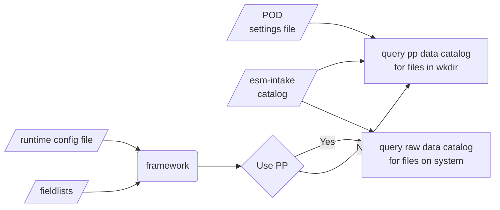

```mermaid
  flowchart LR
      podset[/POD\n settings file/]-->idchkwkdir
      idc2[/runtime config file/]-->idfw(framework)
      idcat1[/esm-intake\n catalog/]-->idchkwkdir
      idfield[/fieldlists/]-->idfw
      idfw-->idppyn{Use PP}
      idppyn-- Yes-->querycat[query raw data catalog\n for files on system]
      idcat1-->querycat
      idppyn-- No -->idchkwkdir[query pp data catalog \n for files in wkdir]
```
