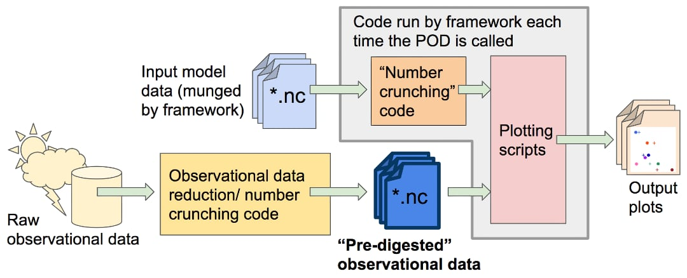

Extra tips for POD implementation
=================================

Scope of your POD’s code
------------------------

As described above, your POD should accept model data as input and express the results of its analysis in a series of figures, which are presented to the user in a web page. Input model data will be in the form of one NetCDF file (with accompanying dimension information) per variable, as requested in your POD’s :doc:`settings file <dev_settings_quick>`. Because your POD may be run on the output of any model, you should be careful about the assumptions your code makes about the layout of these files (e.g., range of longitude, `positive <http://cfconventions.org/faq.html#vertical_coords_positive_attribute>`__ for vertical coordinates). Supporting data may be in any format and will not be modified by the framework.

The above data sources are your POD’s only input: you may provide options in the settings file for the user to configure when the POD is installed, but these cannot be changed each time the POD is run. Furthermore, your POD should not access the internet or other networked resources.

The output of your POD should be a series of figures in vector format (.eps or .ps), written to a specific working directory (described below). Optionally, we encourage POD developers to also save relevant output data (e.g., the output data being plotted) as netcdf files, to give users the ability to take the POD’s output and perform further analysis on it.

Observational and supporting data; code organization.
-----------------------------------------------------

In order to make your code run faster for the users, we request that you separate any calculations that don’t depend on the model data (e.g., pre-processing of observational data), and instead save the end result of these calculations in data files for your POD to read when it is run. We refer to this as “digested observational data,” but it refers to any quantities that are independent of the  model being analyzed. For purposes of data provenance, reproducibility, and code maintenance, we request that you include all the pre-processing/data reduction scripts used to create the digested data in your POD’s code base, along with references to the sources of raw data these scripts take as input (yellow box in the figure).

Digested data should be in the form of numerical data, not figures, even if the only thing the POD does with the data is produce an unchanging reference plot. We encourage developers to separate their “number-crunching code” and plotting code in order to give end users the ability to customize output plots if needed. In order to keep the amount of supporting data needed by the framework manageable, we request that you limit the total amount of digested data you supply to no more than a few gigabytes.

In collaboration with PCMDI, a framework is being advanced that can help systematize the provenance of observational data used for POD development. Some frequently used datasets have been prepared with this framework, known as PCMDIobs. Please check to see if the data you require is available via PCMDIobs. If it is, we encourage you to use it, otherwise proceed as described above.

Other tips on implementation:
-----------------------------

#. Structure of the code package: Implementing the constituent PODs in accordance with the structure described in earlier sections makes it easy to pass the package (or just part of it) to other groups.

#. Robustness to model file/variable names: Each POD should be robust to modest changes in the file/variable names of the model output; see :doc:`Getting Started <start_config>` regarding the model data filename structure, :ref:`ref-example-env-vars` and :ref:`ref-Checklist` regarding using the environment variables and robustness tests. Also, it would be easier to apply the code package to a broader range of model output.

#. Save digested data after analysis: Can be used, e.g., to save time when there is a substantial computation that can be re-used when re-running or re-plotting diagnostics. See :ref:`ref-output-cleanup` regarding where to save the output.

#. Self-documenting: For maintenance and adaptation, to provide references on the scientific underpinnings, and for the code package to work out of the box without support. See :ref:`ref-Checklist`.

#. Handle large model data: The spatial resolution and temporal frequency of climate model output have increased in recent years. As such, developers should take into account the size of model data compared with the available memory. For instance, the example POD precip_diurnal_cycle and Wheeler_Kiladis only analyze part of the available model output for a period specified by the environment variables ``FIRSTYR`` and ``LASTYR``, and the convective_transition_diag module reads in data in segments.

#. Basic vs. advanced diagnostics (within a POD): Separate parts of diagnostics, e.g, those might need adjustment when model performance out of obs range.

#. Avoid special characters (``!@#$%^&*``) in file/script names.

See :ref:`ref-execute` and :doc:` framework operation walkthrough <dev_walkthrough>` for details on how the package is called. See the :doc:`command line reference <ref_cli>` for documentation on command line options (or run ``mdtf --help``).

Avoid making assumptions about the machine on which the framework will run beyond what’s listed here; a development priority is to interface the framework with cluster and cloud job schedulers to enable individual PODs to run in a concurrent, distributed manner.
