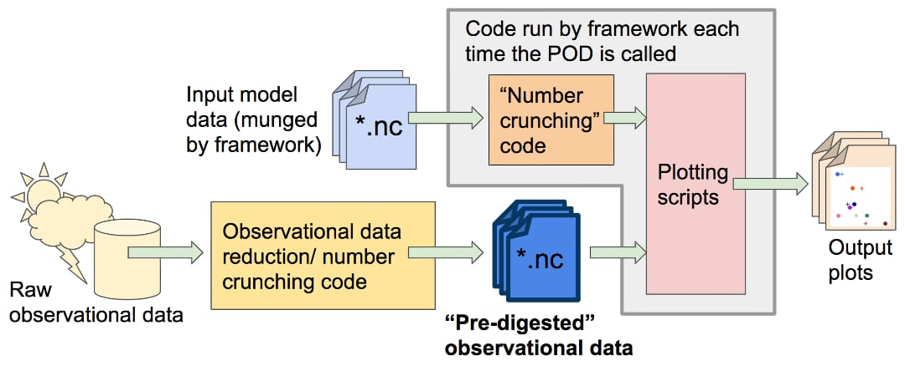

Introduction for POD developers
===============================

This walkthrough contains information for developers wanting to contribute a process-oriented diagnostic (POD) module to the MDTF framework. We assume that you have read the `Getting Started <https://mdtf-diagnostics.readthedocs.io/en/latest/_static/MDTF_getting_started.pdf>`__, and have followed the instructions therein for installing and testing the MDTF package, thus having some idea about the package structure and how it works. We further recommend running the framework on the sample model data with both ``save_ps`` and ``save_nc`` in the configuration input ``src/default_tests.jsonc`` set to ``true``. This will preserve directories and files created by individual PODs, and help you understand how a POD is expected to write output.

Overview of developer documentation
-----------------------------------

For developers already familiar with version 2.0 of the framework, :numref:`ref-dev-migration` summarizes changes from v2.0 to facilitate migration to v3.0. New developers can skip this section, as the rest of this walkthrough is self-contained.

For new developers, :numref:`ref-dev-checklist` provides a to-do list of steps for implementing and integrating a POD into the framework, with more technical details in subsequent sections. :numref:`ref-dev-instruct` discusses the choice of programming languages, managing language and library dependencies through Conda, how to make use of and extend an existing Conda environment for POD development, and create a new Conda environment if necessary. In :numref:`ref-dev-walkthrough`, we walk the developers through the workflow of the framework, focusing on aspects that are relevant for the operation of individual PODs, and using the `Example Diagnostic POD <https://github.com/NOAA-GFDL/MDTF-diagnostics/tree/main/diagnostics/example>`__ as a concrete example to illustrate how a POD works under the framework.

In :numref:`ref-dev-coding-tips` provides coding best practices to address common issues the lead team has seen in POD code that have caused problems. :numref:`ref-dev-settings-quick` serves as a quickstart reference for developers to prepare settings file essential for POD's operation.

We require developers to manage POD codes and submit them through `GitHub <https://github.com/NOAA-GFDL/MDTF-diagnostics>`__. See :numref:`ref-dev-git-intro` for how to manage code through the GitHub website and, for motivated developers, how to manage using the ``git`` command. :numref:`ref-dev-git-intro` lists links to online resources developers may find helpful.

Scope of a process-oriented diagnostic
--------------------------------------

The MDTF framework imposes requirements on the types of data your POD outputs and takes as input. In addition to the scientific scope of process-oriented diagnostics, the analysis that you intend to do needs to fit the following model:

Your POD should accept model data as input and express the results of its analysis in a series of figures, which are presented to the user in a web page. Input model data will be in the form of one NetCDF file (with accompanying dimension information) per variable, as requested in your POD’s :doc:`settings file <dev_settings_quick>`. Because your POD may be run on the output of any model, you should be careful about the assumptions your code makes about the layout of these files (e.g., range of longitude, `positive <http://cfconventions.org/faq.html#vertical_coords_positive_attribute>`__ for vertical coordinates). Supporting data may be in any format and will not be modified by the framework.

The above data sources are your POD’s only input: you may provide options in the settings file for the user to configure when the POD is installed, but these cannot be changed each time the POD is run. Your POD should not access the internet or other networked resources.

To achieve portability, the MDTF cannot accept PODs written in closed-source languages (eg, MATLAB or IDL). We also cannot accept PODs written in compiled languages (eg, C or Fortran): installation would rapidly become impractical if users had to check compilation options for each POD.

The output of your POD should be a series of figures in vector format (.eps or .ps), written to a specific working directory (described below). Optionally, we encourage POD developers to also save relevant output data (e.g., the output data being plotted) as netcdf files, to give users the ability to take the POD’s output and perform further analysis on it.

POD code organization and supporting data
-----------------------------------------

In order to make your code run faster for the users, we request that you separate any calculations that don’t depend on the model data (e.g., pre-processing of observational data), and instead save the end result of these calculations in data files for your POD to read when it is run. We refer to this as “digested observational data,” but it refers to any quantities that are independent of the model being analyzed. For purposes of data provenance, reproducibility, and code maintenance, we request that you include all the pre-processing/data reduction scripts used to create the digested data in your POD’s code base, along with references to the sources of raw data these scripts take as input (yellow box in the figure).

Digested data should be in the form of numerical data, not figures, even if the only thing the POD does with the data is produce an unchanging reference plot. We encourage developers to separate their “number-crunching code” and plotting code in order to give end users the ability to customize output plots if needed. In order to keep the amount of supporting data needed by the framework manageable, we request that you limit the total amount of digested data you supply to no more than a few gigabytes.

In collaboration with PCMDI, a framework is being advanced that can help systematize the provenance of observational data used for POD development. This section will be updated when this data source is ready for public use.

