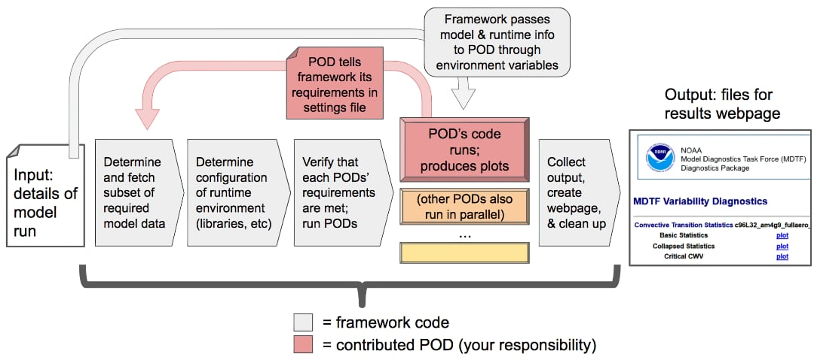

Walkthrough of framework operation
==================================

We now describe in greater detail the actions that are taken when the framework is run, focusing on aspects that are relevant for the operation of individual PODs. The `Example Diagnostic POD <https://github.com/NOAA-GFDL/MDTF-diagnostics/tree/main/diagnostics/example>`__ (short name: ``example``) is used as a concrete example here to illustrate how a POD is implemented and integrated into the framework.

We begin with a reminder that there are 2 essential files for the operation of the framework and POD:

- ``src/default_tests.jsonc``: configuration input for the framework.
- ``diagnostics/example/settings.jsonc``: settings file for the example POD.

To setup for running the example POD, (1) download the necessary `supporting <ftp://ftp.cgd.ucar.edu/archive/mdtf/obs_data.example.tar>`__ and `NCAR-CAM5.timeslice sample data <ftp://ftp.cgd.ucar.edu/archive/mdtf/model.NCAR-CAM5.timeslice.tar>`__ and unzip them under ``inputdata/``, and (2) open ``default_tests.jsonc``, uncomment the whole ``NCAR-CAM5.timeslice`` section in ``case_list``, and comment out the other cases in the list. We also recommend setting both ``save_ps`` and ``save_nc`` to ``true``.

Step 1: Framework invocation
----------------------------

The user runs the framework by executing the framework’s main driver script ``$CODE_ROOT/mdtf``, rather than executing the PODs directly. This is where the user specifies the model run to be analyzed, and chooses which PODs to run via the ``pod_list`` section in ``default_tests.jsonc``.

- Some of the configuration options can be input through command line, see the :doc:`command line reference <ref_cli>` or run ``% $CODE_ROOT/mdtf --help``.

At this stage, the framework also creates the directory ``$OUTPUT_DIR/`` (default: ``mdtf/wkdir/``) and all subdirectories therein for hosting the output files by the framework and PODs from each run.

- If you've run the framework with both ``save_ps`` and ``save_nc`` in ``default_tests.jsonc`` set to ``true``, check the output directory structure and files therein.

Note that when running, the framework will keep collecting the messages relevant to individual PODs, including (1) the status of required data and environment, and (2) texts printed out by PODs during execution, and will save them as log files under each POD's output directory. These ``log`` files can be viewed via the top-level results page ``index.html`` and, together with messages printed in the terminal, are useful for debugging.

Example diagnostic
^^^^^^^^^^^^^^^^^^

Run the framework using the ``NCAR-CAM5.timeslice`` case. After successful execution, open the ``index.html`` under the output directory in a web browser. The ``plots`` links to the webpage produced by the example POD with figures, and ``log`` to ``example.log`` including all example-related messages collected by the framework. The messages displayed in the terminal are not identical to those in the log files, but also provide a status update on the framework-POD operation.

Step 2: Data request
--------------------

Each POD describes the model data it requires as input in the ``varlist`` section of its ``settings.jsonc``, with each entry in ``varlist`` corresponding to one model data file used by the POD. The framework goes through all the PODs to be run in ``pod_list`` and assembles a list of required model data from their ``varlist``. It then queries the source of the model data (``$DATADIR/``) for the presence of each requested variable with the requested characteristics (e.g., frequency, units, etc.).

- The most important features of ``settings.jsonc`` are described in the :doc:`settings documentation <dev_settings_quick>` and full detail on the :doc:`reference page <ref_settings>`.

- Variables are specified in ``varlist`` following `CF convention <http://cfconventions.org/>`__ wherever possible. If your POD requires derived quantities that are not part of the standard model output (e.g., column weighted averages), incorporate necessary preprocessings for computing these from standard output variables into your code. PODs are allowed to request variables outside of the CF conventions (by requiring an exact match on the variable name), but this will severely limit the POD's application.

- Some of the requested variables may be unavailable or without the requested characteristics (e.g., frequency). You can specify a *backup plan* for this situation by designating sets of variables as *alternates* if feasible: when the framework is unable to obtain a variable that has the ``alternates`` attribute in ``varlist``, it will then (and only then) query the model data source for the variables named as alternates.

- If no alternates are defined or the alternate variables are also unavailable, the framework will skip executing your POD, and an ``error log`` will be presented in ``index.html``.

Once the framework has determined which PODs are able to run given the model data, it prepares the necessary environment variables, including directory paths and the requested variable names (as defined in ``src/filedlist_$convention.jsonc``) for PODs' operation.

- At this step, the framework also checks the PODs' observational/supporting data under ``inputdata/obs_data/``. If the directory of any of the PODs in ``pod_list`` is missing, the framework would terminate with error messages showing on the terminal. Note that the framework only checks the presence of the directory, but not the files therein.

Example diagnostic
^^^^^^^^^^^^^^^^^^

The example POD uses only one model variable in its `varlist <https://github.com/NOAA-GFDL/MDTF-diagnostics/blob/main/diagnostics/example/settings.jsonc#L46>`__: surface air temperature, recorded at monthly frequency.

- In the beginning of ``example.log``, the framework reports finding the requested model data file under ``Found files``.

- If the framework could not locate the file, the log would instead record ``Skipping execution`` with the reason being missing data.

Step 3: Runtime environment configuration
-----------------------------------------

The framework reads the other parts of your POD’s ``settings.jsonc``, e.g., ``pod_env_vars``, and generates additional environment variables accordingly (on top of those being defined through ``default_tests.jsonc``).

Furthermore, in the ``runtime_requirements`` section of ``settings.jsonc``, we request that you provide a list of languages and third-party libraries your POD uses. The framework will check that all these requirements are met by one of the Conda environments under ``$CONDA_ENV_DIR/``.

- The requirements should be satisfied by one of the existing generic Conda environments (updated by you if necessary), or a new environment you created specifically for your POD.

- If there isn't a suitable environment, the POD will be skipped.

Note that the framework's information about the Conda environments all comes from the YMAL (.yml) files under ``src/conda/`` (and their contents) by assuming that the corresponding Conda environments have been installed using (thus are consistent with) the YAML files.

- The framework doesn't directly check files under ``$CONDA_ENV_DIR/``, where the Conda environments locate.

- Therefore, it's imperative that you keep the Conda environments and the YAML files consistent at all time so the framework can properly function.

Example diagnostic
^^^^^^^^^^^^^^^^^^

In its ``settings.jsonc``, the example POD lists its `requirements <https://github.com/NOAA-GFDL/MDTF-diagnostics/blob/main/diagnostics/example/settings.jsonc#L38>`__: Python 3, and the matplotlib, xarray and netCDF4 third-party libraries for Python. In this case, the framework assigns the POD to run in the generic `python3_base <https://github.com/NOAA-GFDL/MDTF-diagnostics/blob/main/src/conda/env_python3_base.yml>`__ environment provided by the framework.

- In ``example.log``, under ``Env vars:`` is a comprehensive list of environment variables prepared for the POD by the framework. A great part of them are defined as in `src/filedlist_CMIP.jsonc <https://github.com/NOAA-GFDL/MDTF-diagnostics/blob/main/src/fieldlist_CMIP.jsonc>`__ via setting ``convention`` in ``default_tests.jsonc`` to ``CMIP``. Some of the environment variables are POD-specific as defined under `pod_env_vars <https://github.com/NOAA-GFDL/MDTF-diagnostics/blob/main/diagnostics/example/settings.jsonc#L29>`__ in the POD's ``settings.jsonc``, e.g., ``EXAMPLE_FAV_COLOR``.

- In ``example.log``, after ``--- MDTF.py calling POD example``, the framework verifies the Conda-related paths, and makes sure that the ``runtime_requirements`` in ``settings.jsonc`` are met by the python3_base environment via checking `env_python3_base.yml <https://github.com/NOAA-GFDL/MDTF-diagnostics/blob/main/src/conda/env_python3_base.yml>`__.

Step 4: POD execution
---------------------

At this point, your POD’s requirements have been met, and the environment variables are set. The framework then activates the right Conda environment, and begins execution of your POD’s code by calling the top-level driver script listed in its ``settings.jsonc``.

- See :ref:`ref-using-env-vars` for most relevant environment variables, and how your POD is expected to output results.

- All information passed from the framework to your POD is in the form of Unix/Linux shell environment variables; see `reference <ref_envvars.html>`__ for a complete list of environment variables (another good source is the log files for individual PODs).

- For debugging, we encourage that your POD print out messages of its progress as it runs. All text written to stdout or stderr (i.e., displayed in a terminal) will be captured by the framework and added to a log file available to the users via ``index.html``.

- Properly structure your code/scripts and include *error and exception handling* mechanisms so that simple issues will not completely shut down the POD's operation. Here are a few suggestions:

   A. Separate basic and advanced diagnostics. Certain computations (e.g., fitting) may need adjustment or are more likely to fail when model performance out of observed range. Organize your POD scripts so that the basic part can produce results even when the advanced part fails.

   B. If some of the observational data files are missing by accident, the POD should still be able to run analysis and produce figures for *model* data regardless.

   C. Say a POD reads in multiple variable files and computes statistics for individual variables. If some of the files are missing or corrupted, the POD should still produce results for the rest (note that the framework would skip this POD due to missing data, but PODs should have this robustness property for ease of workarounds or running outside the framework).

- The framework contains additional exception handling so that if a POD experiences a fatal or unrecoverable error, the rest of the tasks and POD-calls by the framework can continue. The error messages, if any, will be included in the POD's log file.

In case your POD requires derived quantities that are not part of the standard model output, and you've incorporated necessary preprocessings into your code (e.g., compute column average temperature from a vertically-resolved temperature field), one might be interested in saving these derived quantities as intermediate output for later use, and you may include this functionality in your code.

- Here we are referring to derived quantities gridded in a similar way to model output, instead of highly-digested data that is just enough for making figures.

- Save these as NetCDF files to the same directory containing the original model files. One file for one variable, following the filename convention spelled out in :doc:`Getting Started <start_config>`.

- You *must* provide an option so that users can choose *not* to save the files (e.g., because of write permission, disk space, or files are accessed via soft links). Include this option through ``pod_env_vars`` in your POD's ``settings.jsonc``, with "not to save" as default. You can remind users about this option by printing out messages in the terminal during runtime, or include a reminder in your POD documentation.

Example diagnostic
^^^^^^^^^^^^^^^^^^

The framework activates the ``_MDTF_python3_base`` Conda environment, and calls the driver script `example-diag.py <https://github.com/NOAA-GFDL/MDTF-diagnostics/blob/main/diagnostics/example/example_diag.py>`__ listed in ``settings.jsonc``. Take a look at the script and the comments therein.

``example-diag.py`` performs tasks roughly in the following order:

   1) It reads the model surface air temperature data at ``input_path``,
   2) computes the model time average,
   3) saves the model time averages to ``$WK_DIR/model/netCDF/temp_means.nc`` for later use,
   4) plots model figure ``$WK_DIR/model/PS/example_model_plot.eps``,
   5) reads the digested data in time-averaged form at ``$OBS_DATA/example_tas_means.nc``, and plots the figure to ``$WK_DIR/obs/PS/example_obs_plot.eps``.

Note that these tasks correspond to the code blocks 1) through 5) in the script.

- When the script is called and running, it prints out messages which are saved in ``example.log``. These are helpful to determine when and how the POD execution is interrupted if there's a problem.

- The script is organized to deal with model data first, and then to process digested observations. Thus if something goes wrong with the digested data, the script is still able to produce the html page with model figures. This won't happen if code block 5) is moved before 4), i.e., well-organized code is more robust and may be able to produce partial results even when it encounters problems.

In code block 7) of ``example-diag.py``, we include an example of exception handling by trying to access a non-existent file (the final block is just to confirm that the *error* would not interrupt the script's execution because of exception-handling).

- The last few lines of ``example.log`` demonstrate the script is able to finish execution despite an error having occurred. Exception handling makes code robust.

.. _ref-output-cleanup:

Step 5: Output and cleanup
--------------------------

At this point, your POD has successfully finished running, and all remaining tasks are handled by the framework. The framework converts the postscript plots to bitmaps according to the following rule:

- ``$WK_DIR/model/PS/filename.eps`` → ``$WK_DIR/model/filename.png``
- ``$WK_DIR/obs/PS/filename.eps`` → ``$WK_DIR/obs/filename.png``

The html template for each POD is then copied to ``$WK_DIR`` by the framework.

- In writing the template file all plots should be referenced as relative links to this location, e.g., "``<A href=model/filename.png>``". See templates from existing PODs.

- Values of all environment variables referenced in the html template are substituted by the framework, allowing you to show the run’s ``CASENAME``, date range, etc. Text you'd like to change at runtime must be changed through environment variables (the v3 framework doesn’t allow other ways to alter the text of your POD’s output webpage at runtime).

- If ``save_ps`` and ``save_nc`` are set to ``false``, the ``.eps`` and ``.nc`` files will be deleted.

Finally, the framework links your POD’s html page to the top-level ``index.html``, and copies all files to the specified output location (``OUTPUT_DIR`` in ``default_tests.jsonc``; same as ``WK_DIR`` by default).

- If ``make_variab_tar`` in ``default_tests.jsonc`` is set to ``true``, the framework will create a tar file for the output directory, in case you're working on a server, and have to move the file to a local machine before viewing it.

Example diagnostic
^^^^^^^^^^^^^^^^^^

Open the html template ``diagnostics/example/example.html`` and the output ``$WK_DIR/example.html`` in a text editor, and compare. All the environment variables in the template have been substituted, e.g., ``{EXAMPLE_FAV_COLOR}`` becomes ``blue`` (defined in ``pod_env_vars`` in settings.jsonc).
